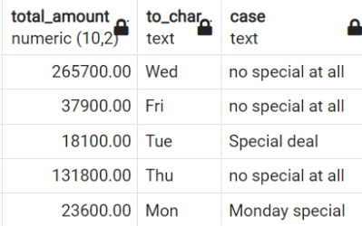

[← Table of Contents](ToC.md)
# Section 5: Conditional Expressions

## Mathematical Functions & Operators
### Operators
| Operator |                   Description                    |          Example          |        Result        |
|:--------:|:------------------------------------------------:|:-------------------------:|:--------------------:|
|    +     |                     addition                     |           4 + 3           |          7           |
|    -     |                   subtraction                    |           5 - 3           |          2           |
|    *     |                  multiplication                  |           4 * 2           |          8           |
|    /     | division (integer division truncates the result) | 8 / 4<br>9 / 4<br>9.0 / 2 | 2<br>2<br>2.25000000 |
|    %     |                module (remainder)                |          10 % 4           |          2           |
|    ^     |                  exponentiation                  |           2 ^ 3           |          8           |

#### Syntax
**multiplication**
```sql
SUM(replacement_cost) * 2
```
**addition**
```sql
SUM (replacement_cost) + 1
```
**division & multiplication**
```sql
SUM (replacement_cost) / SUM (rental_rate)*100
```
### Functions
|   Function   |         Description         |     Example      | Result |
|:------------:|:---------------------------:|:----------------:|:------:|
|   `ABS(x)`   |       absolute value        |     ABS(-7)      |   7    |
| `ROUND(x,d)` | round x to d decimal places | ROUND(4.3543, 2) |  4.35  |
| `CEILING(x)` |  round up to next integer   | CEILING(4.1543)  |   5    |
|  `FLOOR(x)`  | round down to next integer  |  FLOOR(4.9543)   |   4    |

### Examples
```sql
SELECT 
film_id,
rental_rate AS old_rental_rate,
rental_rate + 1 AS new_rental_rate
FROM film
```

```sql
SELECT 
film_id,
rental_rate AS old_rental_rate,
ROUND(rental_rate * 1.3, 2) AS new_rental_rate
FROM film
```

```sql
SELECT 
film_id,
rental_rate AS old_rental_rate,
CEILING(rental_rate * 1.3) - 0.01 AS new_rental_rate
FROM film
```
### Coding Exercise 18: Mathematical Functions & Operators
Return the product with the highest total revenue. Return the product name and its total revenue (alias: total_revenue). You need to use mathematical operators to calculate the total revenue for each product (`quantity_sold * price_per_unit`) and aggregate functions to find the sum of revenues for each product.

**Table Name:** `sales`
**Column Names:** `product_name`, `quantity_sold`, `price_per_unit`

```sql
SELECT 
product_name,
SUM(quantity_sold * price_per_unit) AS total_revenue
FROM sales
GROUP BY product_name
ORDER BY total_revenue DESC
LIMIT 1;
```

### Challenge: Mathematical Functions & Operators
> Your manager is thinking about increasing the prices for films that are more expensive to replace.
For that reason, you should create a list of the films including the relation of rental rate / replacement cost where the rental rate is less than 4% of the replacement cost.
> Create a list of that film_ids together with the percentage rounded to 2 decimal places. For example 3.54 (=3.54%).

**Solution:**
```sql
SELECT 
rental_rate,
replacement_cost,
ROUND((rental_rate / replacement_cost)* 100 , 2) AS percentage
FROM film
WHERE ROUND((rental_rate / replacement_cost)* 100 , 2) < 4
ORDER BY 3 DESC -- 3rd column 
```

## CASE WHEN - Theory
* Like IF/THEN statement:
* Goes through a set of conditions returns a value if a condition is met

### Syntax
```sql
CASE
WHEN condition1 THEN result1
WHEN condition2 THEN result2
WHEN conditionN THEN resultN
ELSE result
END
```
### Examples
**Amounts**
```sql
SELECT
amount,
CASE
WHEN amount < 2 THEN 'low amount'
WHEN amount < 5 THEN 'medium amount'
ELSE 'high amount'
END
FROM payment
```


**No condition met, output = null**
```sql
SELECT
TO_CHAR(book_date,'Dy'),
TO_CHAR(book_date,'Mon'),
CASE
WHEN TO_CHAR(book_date,'Dy')='Mon'THEN 'Monday special'
WHEN TO_CHAR(book_date,'Mon')='Jul' THEN 'July special'
END
FROM bookings
```

```sql
SELECT
TO_CHAR(book_date,'Dy'),
TO_CHAR(book_date,'Mon'),
CASE
WHEN TO_CHAR(book_date,'Dy')='Mon'THEN 'Monday special'
WHEN TO_CHAR(book_date,'Mon')='Jul' THEN 'July special'
ELSE 'no special'
END
FROM bookings
```


```sql
SELECT
total_amount,
TO_CHAR(book_date,'Dy'),
CASE
WHEN TO_CHAR(book_date,'Dy')='Mon'THEN 'Monday special'
WHEN total_amount < 30000 THEN 'Special deal'
ELSE 'no special at all'
END
FROM bookings

```

```sql
SELECT
total_amount,
TO_CHAR(book_date,'Dy'),
CASE
WHEN TO_CHAR(book_date,'Dy')='Mon'THEN 'Monday special'
WHEN total_amount*1.4 < 30000 THEN 'Special deal'
ELSE 'no special at all'
END
FROM bookings
```


```sql
SELECT
total_amount,
TO_CHAR(book_date,'Dy'),
CASE
WHEN TO_CHAR(book_date,'Dy')='Mon'THEN 'Monday special'
WHEN total_amount < 30000 THEN 'Special deal'
ELSE 'no special at all'
END
FROM bookings
```

## CASE WHEN - Hands-on
**Flight Delay calculation**
```sql
SELECT
flight_no,
scheduled_departure,
actual_departure,
actual_departure - scheduled_departure as departure_delay,
CASE
WHEN actual_departure IS NULL THEN 'No Departure Time'
WHEN actual_departure - scheduled_departure < '00:05' THEN 'On Time'
WHEN actual_departure - scheduled_departure < '01:00' THEN 'Late'
ELSE 'Very Late'
END as "departure status"
FROM flights
```
Output:
|flight_no|scheduled_departure|actual_departure      |departure_delay|departure status|
|---------|-------------------|----------------------|---------------|---------|
|PG0405   |2017-07-16 07:35:00+01|2017-07-16 07:44:00+01|00:09:00       |Late     |
|PG0404   |2017-08-05 17:05:00+01|2017-08-05 17:06:00+01|00:01:00       |On Time  |
|PG0405   |2017-08-05 07:35:00+01|2017-08-05 07:39:00+01|00:04:00       |On Time  |
|flight_no|scheduled_departure|actual_departure      |departure_delay|Departure|
|PG0405   |2017-07-16 07:35:00+01|2017-07-16 07:44:00+01|00:09:00       |Late     |
|PG0404   |2017-08-05 17:05:00+01|2017-08-05 17:06:00+01|00:01:00       |On Time  |
|PG0405   |2017-08-05 07:35:00+01|2017-08-05 07:39:00+01|00:04:00       |On Time  |
|PG0405   |2017-08-12 07:35:00+01|2017-08-12 10:41:00+01|03:06:00       |Very Late|


**Flight Delay Grouping**
```sql
SELECT
COUNT(*) AS flights,
CASE
WHEN actual_departure IS NULL THEN 'No Departure Time'
WHEN actual_departure - scheduled_departure < '00:05' THEN 'On Time'
WHEN actual_departure - scheduled_departure < '01:00' THEN 'Late'
ELSE 'Very Late'
END as "departure status"
FROM flights
GROUP BY "departure status"
```
Output:
|flights|departure status |
|-------|-----------------|
|16348  |No Departure Time|
|800    |Very Late        |
|2910   |Late             |
|13063  |On Time          |

### Coding Exercise 19: CASE WHEN
Using the `sales_orders` table, write a SQL query to select the `order_id`, `product_id`, `quantity`, `unit_price`, and a new column named `total_price`. The `total_price` should be calculated as follows:
* If a customer orders more than 1 unit of any product, they get a 10% discount on the total price for those products before adding the shipping fee.
* The `total_price` should include the shipping fee.
You must use `CASE WHEN` to calculate the discounted price where applicable.

**Table Name:** `sales_orders`
**Columns to use:**
* `order_id`
* `product_id`
* `quantity`
* `unit_price`
* `shipping_fee`

```sql
SELECT 
order_id,
product_id,
quantity,
unit_price,
CASE
WHEN quantity > 1 THEN ((unit_price * 0.9) * quantity) + shipping_fee
ELSE (unit_price * quantity) + shipping_fee
END AS total_price
FROM sales_orders
```

### 3 Challenges: CASE WHEN
#### Challenge 1
> You need to find out how many tickets you have sold in the following categories:
    • Low price ticket: total_amount < 20,000
    • Mid price ticket: total_amount between 20,000 and 150,000
    • High price ticket: total_amount >= 150,000
How many high price tickets has the company sold?

**Solution 1:**
```sql
SELECT COUNT(*),
CASE 
WHEN total_amount < 20000 THEN 'Low Price'
WHEN total_amount < 150000 THEN 'Mid Price'
ELSE 'High Price'
END AS ticket_type
FROM bookings
GROUP BY ticket_type
```
|count |ticket_type|
|------|-----------|
|205036|Mid Price  |
|27740 |Low Price  |
|30012 |High Price |

#### Challenge 2
> You need to find out how many flights have departed in the following seasons:
• Winter: December, January, February
• Spring: March, April, May
• Summer: June, July, August
• Autumn: September, October, November

**Solution 2:**
```sql
SELECT 
COUNT(*),
CASE
WHEN EXTRACT(MONTH from scheduled_departure) IN (12, 1, 2) THEN 'winter'
WHEN EXTRACT(MONTH from scheduled_departure) IN (3, 4, 5) THEN 'spring'
WHEN EXTRACT(MONTH from scheduled_departure) IN (6, 7, 8) THEN 'summer'
WHEN EXTRACT(MONTH from scheduled_departure) IN (9, 10, 11) THEN 'autumn' -- "Alternatively ELSE 'autumn'"
END AS season
FROM flights
GROUP BY season
```
|count|season           |
|-----|-----------------|
|7596 |autumn           |
|25525|summer           |


#### Challenge 3
> You want to create a tier list in the following way:
> 1. Rating is 'PG' or 'PG-13' or length is more then 210 min:
   'Great rating or long (tier 1)
> 2. Description contains 'Drama' and length is more than 90min:
   'Long drama (tier 2)'
> 3. Description contains 'Drama' and length is not more than 90min:
   'Short drama (tier 3)'
> 4. Rental_rate less than $1:
   'Very cheap (tier 4)'
   If one movie can be in multiple categories it gets the higher tier assigned.
   How can you filter to only those movies that appear in one of these 4 tiers?

**Solution 3:**
```sql
SELECT 
title, 
rating, 
length,
rental_rate,
CASE
WHEN rating IN ('PG', 'PG-13') OR length > 210 THEN 'Great rating or long (tier 1)'
WHEN description LIKE '%Drama%' AND length > 90 THEN 'Long drama (tier 2)'
WHEN description LIKE '%Drama%' AND length <= 90 THEN 'Short drama (tier 3)'
WHEN rental_rate < 1 THEN 'Very cheap (tier 4)'
END AS tier 
FROM film
-- have to use same CASE statement here as above as an alias cannot be used in a WHERE clause
WHERE CASE
WHEN rating IN ('PG', 'PG-13') OR length > 210 THEN 'Great rating or long (tier 1)'
WHEN description LIKE '%Drama%' AND length > 90 THEN 'Long drama (tier 2)'
WHEN description LIKE '%Drama%' AND length <= 90 THEN 'Short drama (tier 3)'
WHEN rental_rate < 1 THEN 'Very cheap (tier 4)'
END IS NOT NULL
```
|title |rating    |length|rental_rate|tier                         |
|------|----------|------|-----------|-----------------------------|
|AIRPLANE SIERRA|PG-13     |62    |4.99       |Great rating or long (tier 1)|
|ALABAMA DEVIL|PG-13     |114   |2.99       |Great rating or long (tier 1)|
|ALASKA PHANTOM|PG        |136   |0.99       |Great rating or long (tier 1)|
|DATE SPEED|R         |104   |0.99       |Very cheap (tier 4)          |
|ALICE FANTASIA|NC-17     |94    |0.99       |Long drama (tier 2)          |
|ALIEN CENTER|NC-17     |46    |2.99       |Short drama (tier 3)         |
|ALLEY EVOLUTION|NC-17     |180   |2.99       |Long drama (tier 2)          |
|ALONE TRIP|R         |82    |0.99       |Very cheap (tier 4)          |


## CASE WHEN & SUM
**Count number of PG and G rated films**
```sql
SELECT
SUM(CASE
WHEN rating IN ('PG', 'G') THEN 1
ELSE 0
END)
FROM film 
```
| num_ratings_g_or_pg |
|---------------------|
| 372                 |

**Pivoted Table**
```sql
SELECT
SUM(CASE WHEN rating = 'G' THEN 1 ELSE 0 END) AS "G",
SUM(CASE WHEN rating = 'PG' THEN 1 ELSE 0 END) AS "PG",
SUM(CASE WHEN rating = 'PG-13' THEN 1 ELSE 0 END) AS "PG-13",
SUM(CASE WHEN rating = 'NC-17' THEN 1 ELSE 0 END) AS "NC-17",
SUM(CASE WHEN rating = 'R' THEN 1 ELSE 0 END) AS "R"
FROM film
```
Output:
|G     |PG |PG-13|NC-17|R  |
|------|---|-----|-----|---|
|178   |194|223  |210  |195|

### Coding Exercise 20: CASE WHEN & SUM
Write a single SQL query to calculate the total income and total expenses from the transactions table.


Additionally, calculate the net income (total income - total expenses) as a separate column in the result.
Key information for the challenge:
* **Table name:** `transactions`
* **Column names needed:** `amount`, `category`
Use aliases for the total income, total expenses, and net income as `TotalIncome`, `TotalExpenses`, and `NetIncome`, respectively.

```sql
SELECT
SUM(CASE WHEN category = 'Income' THEN amount END) AS TotalIncome,
SUM(CASE WHEN category = 'Expense' THEN amount END) AS TotalExpenses,
SUM(CASE WHEN category = 'Income' THEN amount ELSE -amount END) AS NetIncome
FROM transactions
```
## COALESCE
* Returns first value of a list of values which is **not null**

### Syntax
```sql
COALESCE (actual_arrival, scheduled_arrival)
```

```sql
COALESCE (actual_arrival, '1970-01-01 0:00')
```


### Coding Exercise 21: COALESCE
Consider the following table called transactions:


Write a SQL query to retrieve all transactions, displaying the transaction ID, account ID, transaction type, amount, and description.
For any transactions that do not have a description, display 'Not Provided' in place of the NULL value. Ensure your query is ordered by the transaction ID. Make sure to not forget to use the alias `description`.

Important columns: `transaction_id`, `account_id`, `transaction_type`, `amount`, `description`

```sql
SELECT
transaction_id,
account_id,
transaction_type,
amount,
COALESCE(description, 'Not Provided') AS description
FROM transactions
```
| transaction_id | account_id | transaction_type | amount | description       |
|----------------|------------|------------------|--------|-------------------|
| 1              | 1001       | Deposit          | 500    | Salary            |
| 2              | 1002       | Withdrawal       | 200    | ATM Withdrawal    |
| 3              | 1003       | Deposit          | 1500   | Not Provided      |
| 4              | 1001       | Deposit          | 450    | Freelance Payment |
| 5              | 1002       | Withdrawal       | 100    | Not Provided      |

## CAST
* Changes the data type of a value


### Syntax
```
CAST (value/column AS data type)
```
```
CAST (scheduled_arrival AS data type)
```

### Examples
```sql
CAST (scheduled_arrival AS VARCHAR)
```

```sql
CAST (scheduled_arrival AS DATE)
```

```sql
SELECT
scheduled_arrival,
actual_arrival,
COALESCE(CAST(actual_arrival-scheduled_arrival AS VARCHAR), 'not arrived')
FROM flights
```
| scheduled_arrival      | actual_arrival         | coalesce    |
|------------------------|------------------------|-------------|
| 2017-08-19 10:00:00+01 |                        | not arrived |
| 2017-07-16 08:30:00+01 | 2017-07-16 08:39:00+01 | 00:09:00    |
| 2017-08-05 18:00:00+01 | 2017-08-05 18:01:00+01 | 00:01:00    |
| 2017-08-05 08:30:00+01 | 2017-08-05 08:34:00+01 | 00:04:00    |
| 2017-09-09 11:20:00+01 |                        | not arrived |

```sql
SELECT
LENGTH(CAST(actual_arrival AS VARCHAR))
FROM flights
```

```sql
SELECT
CAST(ticket_no AS bigint)
FROM tickets
```

### Challenge: CAST & COALESCE
```
SELECT 
rental_date,
COALESCE(CAST(return_date AS VARCHAR), 'Not returned')
FROM rental
ORDER BY rental_date DESC
```
| rental_date            | return_date            |
|------------------------|------------------------|
| 2020-02-14 15:16:03+00 | Not returned           |
| 2020-02-14 15:16:03+00 | Not returned           |
| 2020-02-14 15:16:03+00 | Not returned           |
| 2005-08-23 22:50:12+01 | 2005-08-30 01:01:12+01 |
| 2005-08-23 22:43:07+01 | 2005-08-31 21:33:07+01 |
| 2005-08-23 22:42:48+01 | 2005-08-25 02:48:48+01 |

## REPLACE
* Replaces text from a string in a column with another text

**Syntax**
``REPLACE (column, old_text, new_text)``

**Examples**
``REPLACE (flight_no, 'PG', 'FL')``

``REPLACE (flight_no, 'PG', '')``

````sql
SELECT 
passenger_id, 
REPLACE(passenger_id, ' ', '') as SanitisedPID
FROM tickets
````
| passenger_id | sanitisedpid |
|--------------|--------------|
| 8149 604011  | 8149604011   |
| 8499 420203  | 8499420203   |
| 1011 752484  | 1011752484   |
| 4849 400049  | 4849400049   |
| 6615 976589  | 6615976589   |


````sql
SELECT 
passenger_id, 
CAST(REPLACE(passenger_id, ' ', '') AS BIGINT) as "intPID"
FROM tickets
````

| passenger_id | intPID     |
|--------------|------------|
| 8149 604011  | 8149604011 |
| 8499 420203  | 8499420203 |
| 1011 752484  | 1011752484 |
| 4849 400049  | 4849400049 |
| 6615 976589  | 6615976589 |
| 2021 652719  | 2021652719 |
