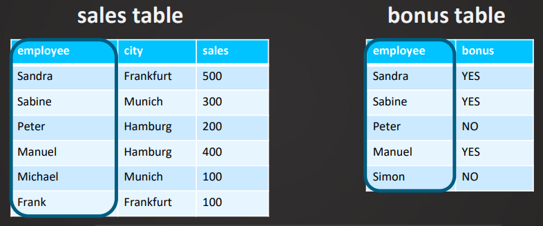
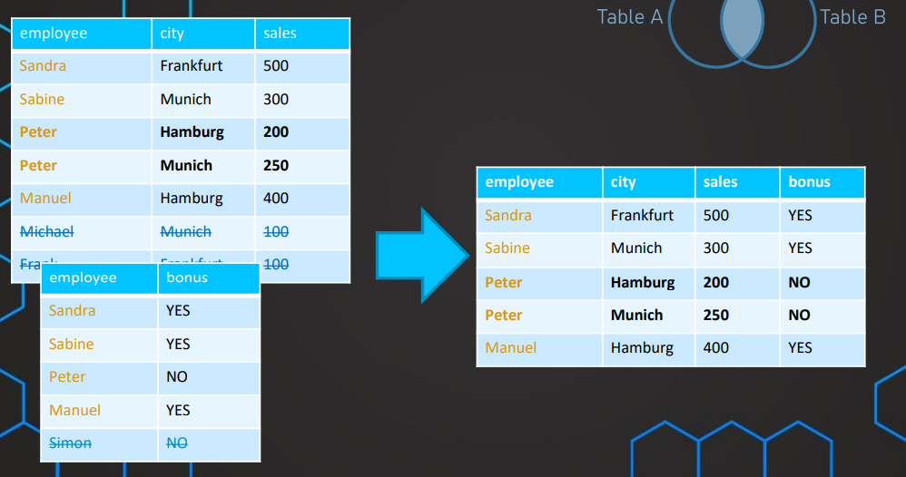
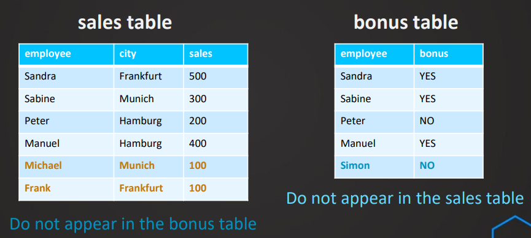
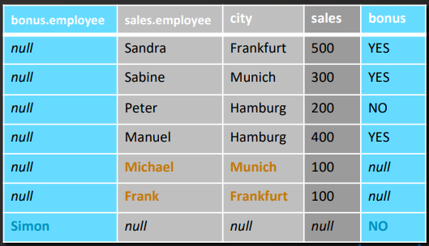
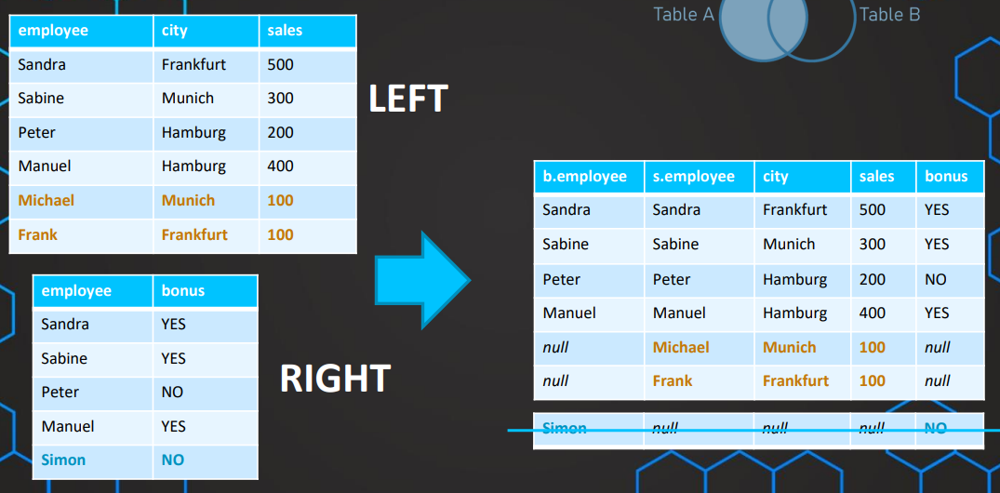
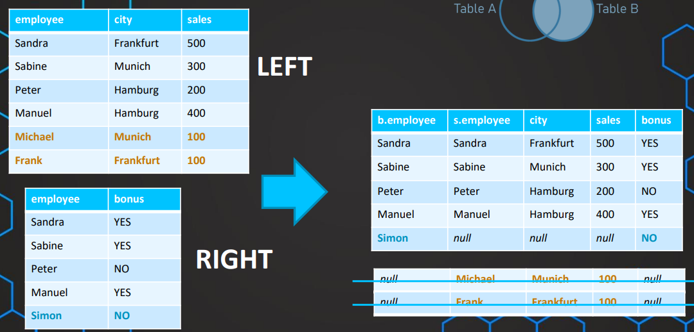
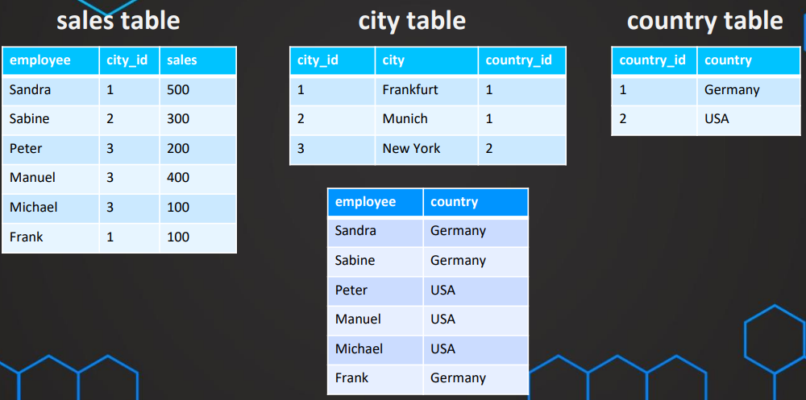

[← Table of Contents](ToC.md)
# Section 6: JOINS

## What are JOINS?
* Combine information from multiple tables in one query


### Types of JOINS
* INNER JOIN
* OUTER JOIN
* LEFT JOIN 
* RIGHT JOIN

## INNER JOIN
* Combine the two tables in one query
* One common column – join column
* Always need a common column / reference
* **Only rows where reference column value is in both tables**
* Order of tables (A and B / B and A) does not matter
* Repeated values in either table will also be repeated




If there are 2 records for a reference column in one of the tables it'll appear in the JOIN result twice


### Syntax
```sql
SELECT * FROM TableA
INNER JOIN TableB
ON TableA.employee = TableB.employee
```

```sql
SELECT * FROM TableB
INNER JOIN TableA
ON TableA.employee = TableB.employee
```

**Aliases**
Aliases help with writing & reading the code more easily
```sql
SELECT * FROM TableA AS A
INNER JOIN TableB AS B
ON A.employee = B.employee
```

Selecting a column needs to also use the alias if it has the same column name in both tables
```sql
SELECT A.employee FROM TableA A
INNER JOIN TableB B
ON A.employee = B.employee
```

```sql
SELECT A.employee, sales FROM TableA A
INNER JOIN TableB B
ON A.employee = B.employee
```

### Practical Examples
**greencycles database**

```sql
SELECT *
FROM payment
INNER JOIN customer
ON payment.customer_id = customer.customer_id
```

```sql
SELECT payment.*, first_name, last_name
FROM payment
INNER JOIN customer
ON payment.customer_id = customer.customer_id
```
Example Output: 

| payment_id | customer_id | staff_id | rental_id | amount | payment_date                  | first_name | last_name |
|------------|-------------|----------|-----------|--------|-------------------------------|------------|-----------|
| 16050      | 269         | 2        | 7         | 1.99   | 2020-01-24 21:40:19.996577+00 | CASSANDRA  | WALTERS   |
| 16051      | 269         | 1        | 98        | 0.99   | 2020-01-25 15:16:50.996577+00 | CASSANDRA  | WALTERS   |
| 16052      | 269         | 2        | 678       | 6.99   | 2020-01-28 21:44:14.996577+00 | CASSANDRA  | WALTERS   |
| 16053      | 269         | 2        | 703       | 0.99   | 2020-01-29 00:58:02.996577+00 | CASSANDRA  | WALTERS   |

```sql
SELECT payment_id, 
payment.customer_id,
amount,
first_name, 
last_name
FROM payment
INNER JOIN customer
ON payment.customer_id = customer.customer_id
```
Example Output:

| payment_id | customer_id | amount | first_name | last_name |
|------------|-------------|--------|------------|-----------|
| 16050      | 269         | 1.99   | CASSANDRA  | WALTERS   |
| 16051      | 269         | 0.99   | CASSANDRA  | WALTERS   |
| 16052      | 269         | 6.99   | CASSANDRA  | WALTERS   |
| 16053      | 269         | 0.99   | CASSANDRA  | WALTERS   |

**Using Aliases**
```sql
SELECT payment_id, 
pa.customer_id,
amount,
first_name, 
last_name
FROM payment pa
INNER JOIN customer cu
ON pa.customer_id = cu.customer_id
```
Order doesn't matter
```sql
SELECT payment_id, 
pa.customer_id,
amount,
first_name, 
last_name
FROM customer cu
INNER JOIN payment pa
ON pa.customer_id = cu.customer_id
```

**Staff information**
```sql
SELECT payment.*, first_name, last_name, email 
FROM payment
INNER JOIN staff
ON staff.staff_id = payment.staff_id
```

**Filtering Data**
```sql
SELECT payment.*, first_name, last_name, email 
FROM payment
INNER JOIN staff
ON staff.staff_id = payment.staff_id
WHERE staff.staff_id = 1
```

### Challenge: INNER JOIN
> The airline company wants to understand in which category they sell most tickets.
> How many people choose seats in the category
> - Business
> - Economy or
> - Comfort?
>
> You need to work on the `seats` table and the `boarding_passes` table.

**Solution based on slides**
```sql
SELECT s.fare_conditions, COUNT(*)
FROM seats s
INNER JOIN boarding_passes bp
ON s.seat_no = bp.seat_no
GROUP BY s.fare_conditions
```

**Solution based on lecture video**
```sql
SELECT
    s.fare_conditions AS "Fare Conditions",
    COUNT(*) AS "Count"
FROM
    boarding_passes bp
INNER JOIN
    flights f ON bp.flight_id = f.flight_id
INNER JOIN
    seats s ON f.aircraft_code = s.aircraft_code AND bp.seat_no = s.seat_no
GROUP BY
    s.fare_conditions
ORDER BY "Count" DESC;
```
_Explanation:_
1. **Joins:**
   * `boarding_passes` **and** `flights`: This join connects each boarding pass to its corresponding flight using the `flight_id`. It ensures that each boarding pass is matched with the correct flight details.
   * `flights` **and** `seats`: This join links flights to seats based on the `aircraft_code` and matches the `seat_no` from the`boarding_passes` with the `seat_no` in the `seats` table. This is crucial as it ensures that the seat number is associated with the correct aircraft, thus accurately aligning the seat number with its fare class.

2. **Grouping and Counting:**
   * The results are grouped by the `fare_conditions` field from the `seats` table, which indicates the class of the seat (e.g., Economy,Business).
   * A count is performed for each group to determine the number of seats sold per fare class.

3. **Ordering:**
   * The final results are ordered by the count in descending order to highlight the most frequently sold fare classes first.

## FULL OUTER JOIN
* **ALL rows from both tables**


**Example**


_Result:_


### Syntax
```sql
SELECT * FROM TableA
FULL OUTER JOIN TableB
ON TableA.employee = TableB.employee
```
_Order doesn't matter_
```sql
SELECT * FROM TableB
FULL OUTER JOIN TableA
ON TableA.employee = TableB.employee
```
_Filtering_
```sql
SELECT * FROM TableB
FULL OUTER JOIN TableA
ON TableA.employee = TableB.employee
WHERE condition
```

### Examples
**Tickets that exist but there's no boarding pass record**
```sql
SELECT *
FROM tickets t
FULL OUTER JOIN boarding_passes b
ON t.ticket_no = b.ticket_no
WHERE b.ticket_no IS NULL
```

**Check if there are any boarding passes with no related ticket**
```sql
SELECT *
FROM tickets t
FULL OUTER JOIN boarding_passes b
ON t.ticket_no = b.ticket_no
WHERE t.ticket_no IS NULL
```

## LEFT OUTER JOIN 
* _ALL_ of the rows from Table A and _ONLY_ the overlapping rows from Table B
* Returns all from the LEFT table even if columns in the RIGHT table are NULL




### Syntax
```sql
SELECT * FROM TableA
LEFT OUTER JOIN TableB
ON TableA.employee = TableB.employee
```

Can also be abbreviated as ``LEFT JOIN``
```sql
SELECT * FROM TableA
LEFT JOIN TableB
ON TableA.employee = TableB.employee
```

### Examples
List all aircrafts regardless of if they're used for a flight
```sql
SELECT * 
FROM aircrafts_data ad
LEFT JOIN flights f 
ON ad.aircraft_code = f.aircraft_code
```

Check if any aircrafts are not used for any flights
```sql
SELECT * 
FROM aircrafts_data ad
LEFT JOIN flights f 
ON ad.aircraft_code = f.aircraft_code
WHERE f.flight_no IS NULL
```

### Challenge: LEFT OUTER JOIN
> The flight company is trying to find out what their most popular seats are.
> 1. Try to find out which seat has been chosen most frequently. Make sure all seats are included even if they have never been booked.
> 
> 2. Are there seats that have never been booked?
> 
> 3. Try to find out which line (A, B, …, H) has been chosen most frequently

**Solution 1:**

```sql
SELECT s.seat_no, COUNT(*)
FROM seats s
LEFT JOIN boarding_passes bp
ON s.seat_no = bp.seat_no
GROUP BY s.seat_no
ORDER BY COUNT(*) DESC
```

**Solution 2:**

```sql
SELECT s.seat_no
FROM seats s
LEFT JOIN boarding_passes bp
ON s.seat_no = bp.seat_no
WHERE bp.seat_no IS NULL
```

**Solution 3:**

```sql
SELECT RIGHT(s.seat_no, 1), COUNT(*)
FROM seats s
LEFT JOIN boarding_passes bp
ON s.seat_no = bp.seat_no
GROUP BY RIGHT(s.seat_no, 1)
ORDER BY COUNT(*) DESC
```

## RIGHT OUTER JOIN
* All rows from Table B included





### Syntax
```sql
SELECT * FROM TableA -- left table
RIGHT OUTER JOIN TableB -- right table
ON TableA.employee = TableB.employee
```

Can also be abbreviated as ``RIGHT JOIN``
```sql
SELECT * FROM TableA -- left table
RIGHT JOIN TableB -- right table
ON TableA.employee = TableB.employee
```

### Examples
```sql
SELECT * FROM flights f 
RIGHT JOIN aircrafts_data a
ON a.aircraft_code = f.aircraft_code
WHERE f.aircraft_code IS NULL 
```
| flight_id | flight_no | scheduled_departure | scheduled_arrival | departure_airport | arrival_airport | status | aircraft_code | actual_departure | actual_arrival | aircraft_code-2 | model                                               | range |
|-----------|-----------|---------------------|-------------------|-------------------|-----------------|--------|---------------|------------------|----------------|-----------------|-----------------------------------------------------|-------|
|           |           |                     |                   |                   |                 |        |               |                  |                | 320             | {"en": "Airbus A320-200", "ru": "Аэробус A320-200"} | 5700  |

### Challenge: JOINS
> The company wants to run a phone call campaign on all customers in Texas (=district).
> 1. What are the customers (first_name, last_name, phone number and their district) from Texas?
>
> 2. Are there any (old) addresses that are not related to any customer?

**Solution 1:**
```sql
SELECT first_name, last_name, phone, district
FROM customer c
INNER JOIN address a 
ON c.address_id = a.address_id
WHERE a.district LIKE '%Texas%'
```

**Solution 2:**
```sql
SELECT * FROM address a
LEFT JOIN customer c
ON a.address_id = c.address_id
WHERE c.address_id IS NULL
```

## Multiple JOIN Conditions

### Syntax
```sql
SELECT * FROM TableA a
INNER JOIN TableB b
ON a.first_name = b.first_name
AND a.last_name = b.last_name
```

**Can also be used to filter the data**
This has more efficient performance than using a ``WHERE`` clause
```sql
SELECT * FROM TableA a
INNER JOIN TableB b
ON a.first_name = b.first_name
AND a.last_name = 'Jones'
```

### Challenge
> Get the average price (amount) for the different seat no

**Solution:**
```sql
SELECT seat_no, ROUND(AVG(amount), 2) AS avg
FROM ticket_flights tf
INNER JOIN boarding_passes bp
ON tf.ticket_no = bp.ticket_no
AND tf.flight_id = bp.flight_id
GROUP BY seat_no
ORDER BY avg DESC
```

## Joining Multiple Tables


### Syntax
```sql
SELECT employee, co.country FROM sales s
INNER JOIN city ci
ON s.city_id = ci.city_id
INNER JOIN country co
ON ci.country_id = co.country_id
```
OR (_Table order doesn't matter!_)
```sql
SELECT employee, co.country FROM sales s
INNER JOIN country co
ON ci.country_id = co.country_id
INNER JOIN city ci
ON s.city_id = ci.city_id
```

### Examples
**Display ticket_no, flight_id, passenger_name, scheduled_departure & scheduled arrival**
```sql
SELECT t.ticket_no, tf.flight_id, t.passenger_name, f.scheduled_departure, f.scheduled_arrival
FROM tickets t
INNER JOIN ticket_flights tf
ON t.ticket_no = tf.ticket_no
INNER JOIN flights f
ON f.flight_id = tf.flight_id
```

### Challenge: Joining Multiple Tables
> The company wants customize their campaigns to customers depending on the country they are from.
> Which customers are from Brazil?
> Write a query to get first_name, last_name, email and the country from all customers from Brazil.

**Solution:**
```sql
SELECT first_name, last_name, email, country 
FROM customer cust
INNER JOIN address ad
ON ad.address_id = cust.address_id
INNER JOIN city
ON city.city_id = ad.city_id
INNER JOIN country 
ON country.country_id = city.country_id
WHERE country = 'Brazil'
```

## More Challenges
1. Which passenger (passenger_name) has spent most amount in their bookings (total_amount)?

Answer: ALEKSANDR IVANOV with 80964000.
```sql
SELECT passenger_name, SUM(total_amount) AS amount
FROM bookings b
LEFT JOIN tickets t
ON t.book_ref = b.book_ref
GROUP BY passenger_name
ORDER BY amount desc
```

2. Which fare_condition has ALEKSANDR IVANOV used the most?
   
Answer: Economy 2131 times.
```sql
SELECT passenger_name, fare_conditions, COUNT(*) FROM tickets t
INNER JOIN bookings b
ON t.book_ref=b.book_ref
INNER JOIN ticket_flights tf
ON t.ticket_no=tf.ticket_no
WHERE passenger_name = 'ALEKSANDR IVANOV'
GROUP BY fare_conditions, passenger_name
```

3. Which title has GEORGE LINTON rented the most often?

Answer: CADDYSHACK JEDI - 3 times.


```sql
SELECT first_name, last_name, title, COUNT(*) as count
FROM customer cu
INNER JOIN rental re
ON cu.customer_id = re.customer_id
INNER JOIN inventory inv
ON inv.inventory_id=re.inventory_id
INNER JOIN film fi
ON fi.film_id = inv.film_id
WHERE first_name='GEORGE' and last_name='LINTON'
GROUP BY title, first_name, last_name
ORDER BY count DESC
```