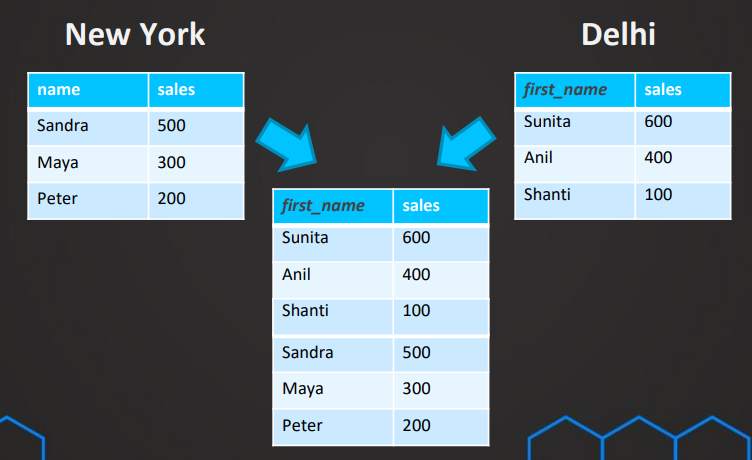
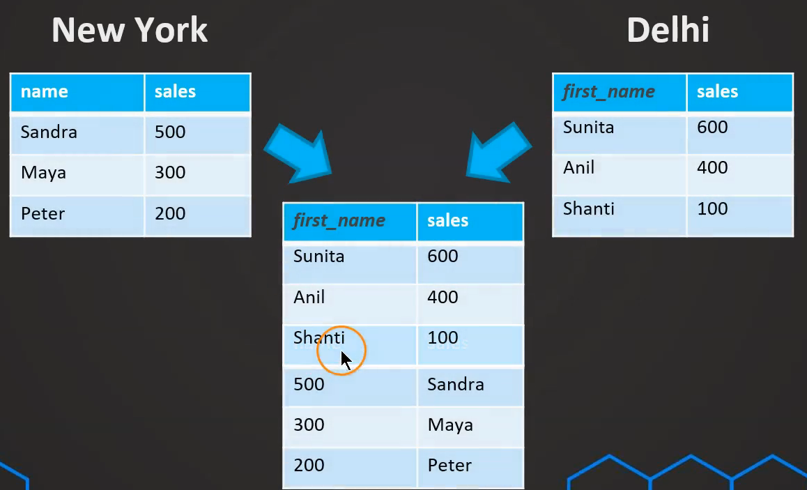
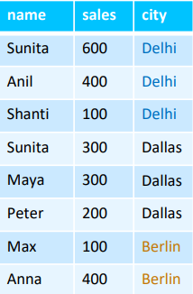
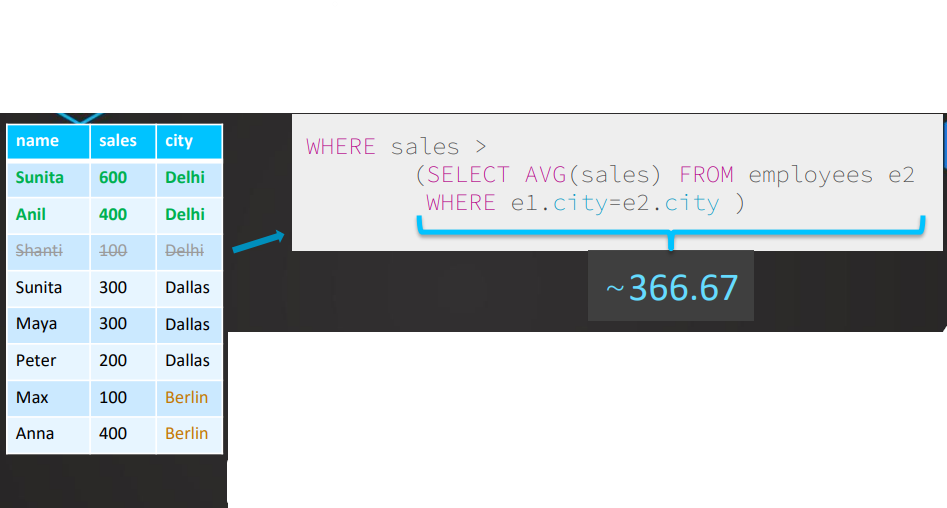

[← Table of Contents](ToC.md)
# Section 7: UNION & Subqueries

## `UNION`
* Combines rows
* Combining multiple select statements

### Syntax
```sql
SELECT first_name, sales FROM galway
UNION
SELECT first_name, sales FROM dublin
```

### 3 Things to Remember
1. **The order matches the column!**
    _Example:_
    ```sql
        SELECT first_name, sales FROM delhi
        UNION
        SELECT name, sales FROM vancouver
    ```
    

   Must be aware of the order in the match
   _Example:_
    ```sql
        SELECT first_name, sales FROM delhi
        UNION
        SELECT sales, first_name FROM vancouver
    ```
    

2. **Data type must match!**
   * The query would fail to execute
   * No. of columns must also match 

3. **Duplicated are decoupled!**
   * Duplicated wont be present in the result set
   * If you want to include duplicated you can use `UNION ALL`
   ```sql
         SELECT first_name, sales FROM delhi
         UNION ALL
         SELECT first_name, sales FROM vancouver 
   ```
   
### Examples
**UNION**

```sql
SELECT first_name, 'actor' AS source FROM actor
UNION
SELECT first_name, 'customer' FROM customer
ORDER BY first_name
```
No duplicates
Output:

| first_name | source   |
|------------|----------|
| AARON      | customer |
| ADAM       | actor    |
| ADAM       | customer |
| ADRIAN     | customer |
| AGNES      | customer |

**UNION ALL**
```sql
SELECT first_name, 'actor' AS source FROM actor
UNION ALL
SELECT first_name, 'customer' FROM customer
ORDER BY first_name
```
Duplicates included
Output:

| first_name | source   |
|------------|----------|
| AARON      | customer |
| ADAM       | customer |
| ADAM       | actor    |
| ADAM       | actor    |
| ADRIAN     | customer |
| AGNES      | customer |

**Multiple UNIONs**
```sql
SELECT first_name, 'actor' AS source FROM actor
UNION
SELECT first_name, 'customer' FROM customer
UNION
SELECT first_name, 'staff' FROM staff
ORDER BY source DESC
-- ORDER BY 2 DESC - alternative to above line
```

| first_name | source   |
|------------|----------|
| Jon        | staff    |
| Mike       | staff    |
| MATHEW     | customer |
| ROBERTO    | customer |
| JENNIFER   | actor    |
| JUDE       | actor    |
| KENNETH    | actor    |

## Subqueries in WHERE
### Examples
**Getting payment amounts that are greater than the average**
```sql
SELECT 
* 
FROM payment
WHERE amount > (SELECT AVG(amount) FROM payment)
```

**Get all payments made by customer(s) with first_name "ADAM"**
```sql
SELECT 
* 
FROM payment
WHERE customer_id = (SELECT customer_id FROM customer 
WHERE first_name = 'ADAM')
```

**Get all payments made by customer(s) where first_name starts with "A"**
```sql
SELECT 
* 
FROM payment
WHERE customer_id IN (SELECT customer_id FROM customer 
WHERE first_name LIKE 'A%')
```

### Challenge 1: Subqueries in WHERE
> Select all of the films where the length is longer than the average of all films

**Solution:**
```sql
SELECT film_id, title, length 
FROM film
WHERE length > (SELECT AVG(length) FROM film)
ORDER BY length DESC
```

### Challenge 2: Subqueries in WHERE
> Return all the films that are available in the inventory in store 2 more than 3 times

**Solution:**
```sql
SELECT film_id, title
FROM film
WHERE film_id IN (SELECT film_id from inventory
WHERE store_id = 2
GROUP BY film_id
HAVING  COUNT(*)  > 3)
```

### More Challenges: Subqueries in WHERE
> Return all customers first and last names that have made a payment on 2020-01-25

**Solution:**
```sql
SELECT first_name, last_name 
FROM customer
WHERE customer_id IN (SELECT customer_id FROM payment
                      WHERE payment_date 
                      BETWEEN'2020-01-25' AND '2020-01-26')
```
OR
```sql
SELECT first_name, last_name 
FROM customer
WHERE customer_id IN (SELECT customer_id FROM payment
                      WHERE DATE(payment_date) = '2020-01-25')
```
> Return all customers first names and email addresses that have spent more than $30

**Solution:**
```sql
SELECT first_name, email 
FROM customer
WHERE customer_id IN (SELECT customer_id
                     FROM payment 
                     GROUP BY customer_id
                     HAVING SUM(amount)  > 30)
```

> Return all the customers first and last names that are from Californian and have spent more than $100 in total

**Solution:**
```sql
SELECT first_name, last_name 
FROM customer
WHERE address_id IN (SELECT address_id 
                     FROM address 
                     WHERE district = 'California')
AND customer_id IN (SELECT customer_id
                    FROM payment 
                    GROUP BY customer_id
                    HAVING SUM(amount)  > 100)
```
OR 
```
SELECT first_name, last_name 
FROM customer
WHERE customer_id IN (SELECT customer_id 
                     FROM customer
					 INNER JOIN address
					 ON address.address_id = customer.address_id
                     WHERE district = 'California')
AND customer_id IN (SELECT customer_id
                    FROM payment 
                    GROUP BY customer_id
                    HAVING SUM(amount)  > 100)
```

## Subqueries in FROM
### Examples
**Average spend per customer**
```sql
SELECT ROUND(AVG(total_amt),2) AS avg_lifetime_spend
FROM(SELECT customer_id, SUM(amount) as total_amt
	FROM payment
	GROUP BY customer_id) subquery
```
OR
```
SELECT ROUND(AVG(total_amt),2) AS avg_lifetime_spend
FROM(SELECT  SUM(amount) as total_amt
	FROM payment
	GROUP BY customer_id)
```

### Challenge: Subqueries in FROM
> What is the average total amount spent per day (average daily revenue)?

**Solution:**
```sql
SELECT 
ROUND(AVG(amt_per_day) , 2) AS daily_revenue_average
FROM 
(SELECT 
SUM(amount) AS amt_per_day,
DATE(payment_date)
FROM payment
GROUP BY DATE(payment_date)) 
```

## Subqueries in SELECT
### Examples
```sql
SELECT
*, 
(SELECT ROUND(AVG(amount), 2) as average_amt FROM payment)
FROM PAYMENT
```

```sql
SELECT
*, 
(SELECT amount FROM payment LIMIT 1)
FROM PAYMENT
```

### Challenge: Subqueries in SELECT
> Show all the payments together with how much the payment amount is below the maximum payment amount

**Solution:**
```sql
SELECT
*, 
(SELECT MAX(amount) FROM payment) - amount as difference
FROM PAYMENT
```

## Correlated Subqueries in WHERE
* Subquery gets evaluated for **every** single row
* Subquery does **not** work independently

### Examples
**Get all people that are above average of their city**

```sql
SELECT first_name, sales FROM employees e1
WHERE sales > 
   (SELECT AVG(sales) FROM employees e2
   WHERE e1.city = e2.city)
```


**Show only those payments that have the highest amount per customer**
```sql
SELECT * FROM payment p1
WHERE amount = (SELECT MAX(amount) 
FROM payment p2
WHERE p1.customer_id = p2.customer_id)
ORDER BY customer_id
```

### Challenge 1: Correlated Subqueries in WHERE
> Show only those movie titles, their associated film_id and replacement_cost with the lowest replacement_costs for in each rating category – also show the rating

```sql
SELECT title, film_id, replacement_cost, rating
FROM film f1
WHERE replacement_cost = 
   (SELECT MIN(replacement_cost) FROM film f2
   WHERE f1.rating = f2.rating)
```

### Challenge 2: 
> Show only those movie titles, their associated film_id and the length that have the highest length in each rating category - also show the rating

```sql
SELECT title, film_id, length, rating
FROM film f1
WHERE length = 
   (SELECT MAX(length) FROM film f2
   WHERE f1.rating = f2.rating)
```

## Correlated Subquery in SELECT

### Syntax
```sql
SELECT first_name, sales,
   (SELECT MIN(sales) FROM employees e3 .
   WHERE e1.city=e3.city ) .
FROM employees e1
WHERE sales >
   (SELECT AVG(sales) FROM employees e2
   WHERE e1.city=e2.city)
```

### Examples
**Show the maximum amount each customer has spent**

```sql
SELECT customer_id, 
amount,	
(SELECT MAX(amount) FROM payment p2 
WHERE p1.customer_id = p2.customer_id) AS max_spend
FROM payment p1
ORDER BY customer_id
```

## More Challenges: Correlated Subqueries
> Show all the payments plus the total amount for every customer as well as the number of payments of each customer.
     
**Solution:**
```sql
SELECT *,
(SELECT SUM (amount) 
FROM payment p2
WHERE p1.customer_id = p2.customer_id) AS "TotalAmount",
(SELECT COUNT(*) 
FROM payment p3
WHERE p1.customer_id = p3.customer_id) AS "TotalNumberOfPayments"
FROM payment p1
ORDER BY customer_id
```


> Show only those films with the highest replacement costs in their rating category plus show the average replacement cost in their rating category.

**Solution:**
```sql
SELECT *,
ROUND((SELECT AVG(replacement_cost) 
FROM film f3 WHERE f1.rating = f3.rating), 2) AS "AverageReplacementCostForRating"
FROM film f1
WHERE replacement_cost = (SELECT MAX(replacement_cost) FROM film f2
WHERE f1.rating = f2.rating)
```


> Q1 - Show only those payments with the highest payment for each customer showing first name & the payment_id of that payment.
  Q2 - How would you solve it if you would not need to see the payment_id?

**Q1 Solution:**
```sql
SELECT first_name, amount, payment_id 
FROM payment p1
INNER JOIN customer c
ON p1.customer_id = c.customer_id
WHERE amount = (SELECT MAX(amount) FROM payment p2
				WHERE p1.customer_id = p2.customer_id)
```

**Q2 Solution:**
```sql
SELECT first_name, MAX(amount)
FROM payment p1
INNER JOIN customer c
ON p1.customer_id = c.customer_id
GROUP BY first_name
```