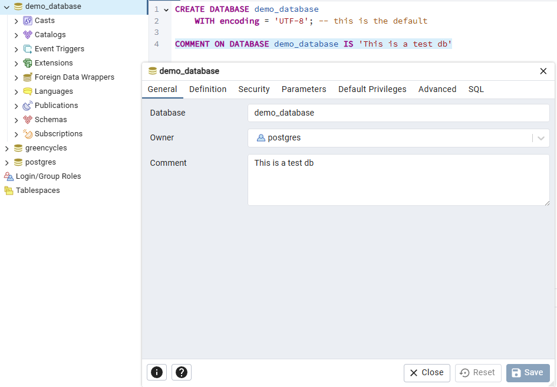
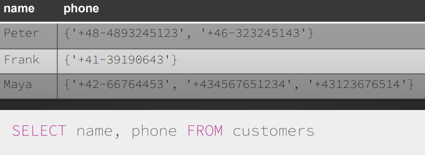
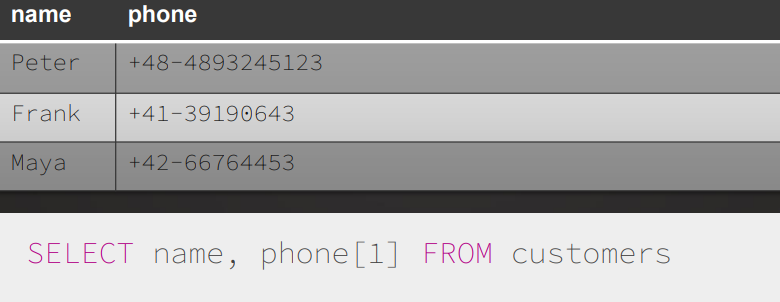
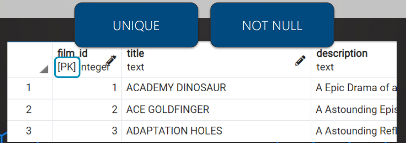
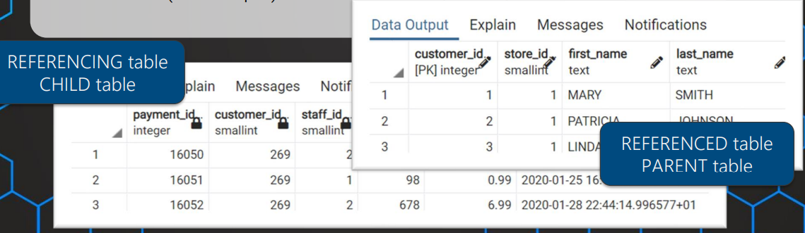
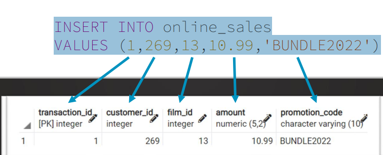
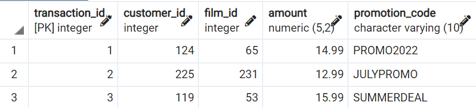
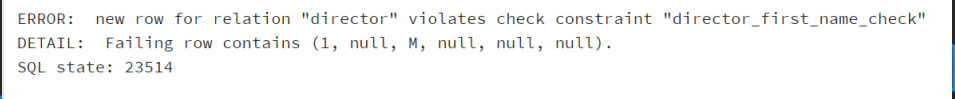
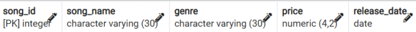
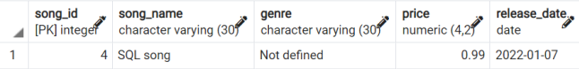

[← Table of Contents](ToC.md)
# Section 9: Managing Tables & Databases
## Managing Databases & Tables

| Data Definition (Data Structures) | Data Manipulation (Data Itself) |
|:---------------------------------:|:-------------------------------:|
|             `CREATE`              |            `INSERT`             |
|              `ALTER`              |            `UPDATE`             |
|              `DROP`               |            `DELETE`             |


## CREATE & DROP DATABASE
### Creating Database
```sql
CREATE DATABASE <database_name>;
```

### Example
```sql
CREATE DATABASE demo_database
	WITH encoding = 'UTF-8'; -- this is the default

COMMENT ON DATABASE demo_database IS 'This is a test db'
```



### Drop Database
```sql
DROP DATABASE <database_name>;
```

### Coding Exercise 22: CREATE & DROP DATABASE
Create a database called "customer" and then drop that same database again.
Write both commands together in the solution.
Use ";" to declare the end of the commands.

```sql
CREATE DATABASE customer;
DROP DATABASE customer;
```

## Data Types
* Important when creating tables
* Differences - Storage size, Allowed values, Possible operations
* [Postgresql Data Types](https://www.postgresql.org/docs/current/datatype.html)

### Numeric
|    Type    | Storage Size |                                            Range                                            |                                                               Notes                                                               |
|:----------:|:------------:|:-------------------------------------------------------------------------------------------:|:---------------------------------------------------------------------------------------------------------------------------------:|
|   `INT`    |   4 bytes    |                                 -2147483648 to +2147483647                                  |                                                          Typical choice                                                           |
| `SMALLINT` |   2 bytes    |                                      -32768 to +32767                                       |                                                          Small integers                                                           |
|  `BIGINT`  |   8 bytes    |                        -9223372036854775808 to +9223372036854775807                         |                                                          Large integers                                                           |
| `DECIMAL`  |   variable   | up to 131072 digits before the decimal point<br/>up to 16383 digits after the decimal point | User-defined precision,<br/>`DECIMAL(4,2)` would have an example value of `24.99`<br/>i.e. 4 digits in total and 2 decimal places<br/> `numeric(precison, scale)` OR `decimal(precison, scale)`|
|  `SERIAL`  |   variable   |                                       1 to 2147483647                                       |                                                     autoincrementing integer                                                      |


### Strings
|                   Type                    |        Storage Size        |         Example         |            Notes             |
|:-----------------------------------------:|:--------------------------:|:-----------------------:|:----------------------------:|
| `character varying(n)`,<br/> `varchar(n)` | variable-length with limit | Any text,<br/>`"Hello"` |   Less flexible to change    |
|      `character(n)`,<br/> `char(n)`       | fixed-length, blank padded |     `"M"` or `"F"`      |         Space-padded         |
|                  `text`                   | variable unlimited length  | Any text,<br/>`"Hello"` | Most flexible, Best choice!! |

### Date/Time
|                Type                 |      Description       |           Example            |
|:-----------------------------------:|:----------------------:|:----------------------------:|
|               `date`                | Just date without time |         `2022-11-28`         |
|   `time` (with/without timezone)    | Just time without date |       `'01:02:03.678`        |
| `timestamp` (with/without timezone) |     Date and time      | `2022-11-28 01:02:03.678+02` |
|             `intervals`             |     Time interval      |    `3 days 01:02:03.678`     |

### Others
|   Type    |             Description             |             Example             |          Range          |
|:---------:|:-----------------------------------:|:-------------------------------:|:-----------------------:|
| `boolean` |       state of true or false        |          `is_in_stock`          | `TRUE`, `FALSE`, `NULL` |
|  `enum`   | A value of a list of ordered values |         `movie_raring`          |      User-defined       |
|  `array`  |       Store a list of values        |       `text[]` or `int[]`       |    Depending on type    |

#### Enum Example
```sql
CREATE TYPE mppa_rating AS ENUM ('G','PG', […])
```

#### Array Examples
**List all**


**Get 1st array element**


**Search for value**
```sql
SELECT name, phone[1] FROM customers
WHERE '+42-66764453' = ANY (phones)
```

### Quiz 3: Data Types

#### Question 1:
You want to create a payment table. The payment amount range from 0 to 9999.99.
Which data type would be the best choice?

**Answer:** 
`numeric(6,2)`

#### Question 2:
Examples for the values in your transaction amount column are:
22.9334 or 353.3145.
The values range up to 1000 and we need only 4 decimal places.
What would be an appropriate scale of your numeric data type?

**Answer:**
4
`numeric(precison, scale)` OR `decimal(precison, scale)`

#### Question 3:
What data type would you choose if you want to go with the one that has the smallest space to save a positive number that will be at most 100 and accept decimal accuracy of 0.1.

**Answer:**
`numeric(4,1)`
The precision is 4 which gives you a total of 4 digits maximum - including the decimal part and 1 digit reserved for the decimals.
That can store values up to 999.9

#### Question 4:
How should you store country codes like 49 for Germany, 91 for India or  1 for United States?

**Answer:**
A string datatype like `varchar(5)`
The country codes don't have numerical meaning so it's better to store them as strings

#### Question 5:
How many movies contain the special feature of 'Behind the Scenes'?

**Answer**
538
```sql
select COUNT(*) FROM film
WHERE 'Behind the Scenes' = ANY (special_features)
```

## Constraints
* Defined when table is created
* Used to define rules for the data in the table
* Prevent insertion of invalid data
* Can be defined on column or table level

### Types of Constraints
#### Column Constraints
|     Name      |                                 Description                                 |
|:-------------:|:---------------------------------------------------------------------------:|
|  `NOT NULL`   |               Ensures that a column cannot have a NULL value                |
|   `UNIQUE`    |              Ensures that all values in a column are different              |
|   `DEFAULT`   |         Sets a default value for a column if no value is specified          |
| `PRIMARY KEY` | A combination of NOT NULL & UNIQUE, Uniquely identifies each row in a table |
| `REFERENCES`  |  Ensures referential integrity (only values of another column can be used)  |
|    `CHECK`    |      Ensures that the values in a column satisfy a specific condition       |

#### Table Constraints
```sql
PRIMARY KEY ( column [, ... ] ) -- primary key on multiple columns
UNIQUE ( column [, ... ] )
CHECK ( search_condition )
```

### Quiz 4: Constraints
#### Question 1:
What constraint should be used when setting up a default value for a column?

**Answer:**
`DEFAULT 0`

#### Question 2:
What constraint should be used to not allow duplicates in column?

**Answer:**
`UNIQUE`

## Primary Key & Foreign Key
### Primary Key
* One (or multiple) columns that uniquely identify each row in a table
* Needs to be `UNIQUE` and `NOT NULL`


### Foreign Key
* One (or multiple) columns that refers to the primary key in another table


### Notes
1. Foreign key does not need to be unique
2. Primary key and foreign keys are usually the columns to join tables
3. Can be created also in table creation process

### Quiz 5: Primary & Foreign Keys
#### Question 1:
A primary implies which two other constraints?

**Answer:**
`NOT NULL` & `UNIQUE`

#### Question 2:
What violates a foreign key (REFERENCES) constraint?

**Answers:**
Values are not occurring in the reference column

## CREATE TABLE

### Syntax
**Simple table**
```sql
CREATE TABLE <table_name>(
column_name1 TYPE,
column_name2 TYPE
)
```
i.e.
```sql
CREATE TABLE staff(
staff_id INT,
name VARCHAR(50)
)
```
**Constraints**
```sql
CREATE TABLE <table_name>(
column_name1 TYPE [CONSTRAINT],
column_name2 TYPE [CONSTRAINT]
)
```
i.e.
```sql
CREATE TABLE staff(
staff_id SERIAL PRIMARY KEY, -- SERIAL autoincrements 
name VARCHAR(50) UNIQUE NOT NULL
)
```
or
```sql
CREATE TABLE staff(
staff_id SERIAL PRIMARY KEY, -- SERIAL autoincrements 
name VARCHAR(50) NOT NULL
UNIQUE(name, staff_id)
)
```
### Examples
**Greencycles Database Director table**

```sql
CREATE TABLE director (
director_id SERIAL PRIMARY KEY,
director_account_name VARCHAR(20) UNIQUE,
first_name VARCHAR(50),
last_name VARCHAR(50) DEFAULT 'Not Specified',
date_of_birth DATE,
address_id INT REFERENCES address(address_id))

```

### Assignment 1: `CREATE TABLE`
Create a table called `online_sales` with the following columns:
1. `transaction_id` 
2. `customer_id` 
3. `film_id` 
4. `amount` 
5. `promotion_code`

`transaction_id` should be the primary key.
The columns `customer_id` and `film_id` should be foreign keys to the relevant tables.
The `amount` column can contain values from `0.00` to `999.99` - nulls should not be allowed.
The column `promotion_code` contains a promotion code of at maximum 10 characters. If there is no value you should set the default value 'None'.

Create that table and choose appropriate data types and constraints!

```sql
CREATE TABLE online_sales (
transaction_id SERIAL PRIMARY KEY,
customer_id INT REFERENCES customer(customer_id),
film_id INT REFERENCES film(film_id),
amount DECIMAL(5, 2) NOT NULL,
promotion_code VARCHAR(10) DEFAULT 'None'
)
```

## `INSERT`
### Syntax
```sql
INSERT INTO <table>
VALUES (value1,value2[,…])
```

### Examples


**Insert single record**
```sql
INSERT INTO online_sales
(customer_id, film_id,amount)
VALUES (269,13,10.99)
```

**Insert multiple records**
```sql
INSERT INTO online_sales
(customer_id, film_id,amount)
VALUES (269,13,10.99),(270,12,22.99)
```

### Assignment 2: `INSERT`
Insert these values in the table online _sales:



```
INSERT INTO online_sales
VALUES (1,124,65, 14.99, 'PROMO2022')

INSERT INTO online_sales
VALUES (2,225,231, 12.99, 'JULYPROMO')

INSERT INTO online_sales
VALUES (3,119,53, 15.99, 'SUMMERDEAL2022')
```
**Questions for this assignment**
Q: Why doesn't it work to insert 'SUMMERDEAL2022' in the column promotion_code?
A: Violates column character limit
    `ERROR:  value too long for type character varying(10)`

## `ALTER TABLE`
* ADD, DELETE columns
* ADD, DROP constraints
* RENAME columns
* ALTER data types

### Syntax 
```sql
ALTER TABLE <table_name>
ALTER_ACTION
```

### Drop Column
```sql
ALTER TABLE <table_name>
DROP COLUMN <column_name>
```
```sql
ALTER TABLE staff
DROP COLUMN first_name
```
```sql
ALTER TABLE staff
DROP COLUMN IF EXISTS first_name
```

### Add Column
```sql
ALTER TABLE <table_name>
ADD COLUMN <column_name>
```
```sql
ALTER TABLE staff
ADD COLUMN date_of_birth DATE
```
```sql
ALTER TABLE staff
ADD COLUMN IF NOT EXISTS date_of_birth DATE
```

### Alter Column
```sql
ALTER TABLE <table_name>
ALTER COLUMN <column_name> TYPE NEW_TYPE
```
```sql
ALTER TABLE staff
ALTER COLUMN address_id TYPE SMALLINT
```

### Rename Column
```sql
ALTER TABLE <table_name>
RENAME COLUMN <old_column_name> TO <new_column_name>
```
```sql
ALTER TABLE staff
RENAME COLUMN first_name TO name
```

### Set/Drop Default
```sql
ALTER TABLE <table_name>
ALTER COLUMN <column_name> SET DEFAULT <value>
```

```sql
ALTER TABLE staff
ALTER COLUMN store_id SET DEFAULT 1
```

```sql
ALTER TABLE <table_name>
ALTER COLUMN <column_name> DROP DEFAULT
```

### Set/Drop NOT NULL
```sql
ALTER TABLE <table_name>
ALTER COLUMN <column_name> SET NOT NULL
```
```sql
ALTER TABLE <table_name>
ALTER COLUMN <column_name> DROP NOT NULL
```
### Constraints
```sql
ALTER TABLE <table_name>
ADD CONSTRAINT <constraint_name> UNIQUE(column1)
```

```sql
ALTER TABLE <table_name>
ADD CONSTRAINT <constraint_name>
UNIQUE(column1,column2[,…])
```

### Primary Key
```sql
ALTER TABLE <table_name>
ADD CONSTRAINT <constraint_name>,
ADD PRIMARY KEY(column1,column2[,…])
```

### Summary - Multiple Steps
```sql
ALTER TABLE director
ALTER COLUMN director_account_name SET DEFAULT 3,
ALTER COLUMN first_name TYPE TEXT,
ALTER COLUMN last_name TYPE TEXT,
ADD COLUMN middle_name TEXT,
ADD CONSTRAINT constraint_1 UNIQUE(account_name)
```

**Note:** `RENAME` has to be performed in a single action! Can't be used with other steps.
```sql
ALTER TABLE old_table_name
RENAME TO new_table_name
```

### Challenge: `ALTER TABLE`
Changes to be made to the director table in the greencycles db
1. director_account_name to VARCHAR(30)
2. drop the default on the last_name
3. add the constraint not null to the last_name
4. add the column email of data type VARCHAR(40)
5. rename director_account_name column to account_name
6. rename table from director to directors

```sql
ALTER TABLE director
ALTER COLUMN director_account_name TYPE VARCHAR(30),
ALTER COLUMN last_name DROP DEFAULT,
ALTER COLUMN last_name SET NOT NULL,
ADD COLUMN IF NOT EXISTS email VARCHAR(40)

-- Rename needs to be a seperate step
ALTER TABLE director
RENAME COLUMN director_account_name TO account_name

-- Rename needs to be a seperate step
ALTER TABLE director
RENAME TO directors
```

## `DROP` & `TRUNCATE`
* `DROP TABLE <table_name>` - Deletes Table
* `DROP SCHEMA <schema_name>` - Deletes Object
* `TRUNCATE TABLE <table_name>` or `TRUNCATE <table_name>` - Deletes all data in table

```sql
-- Create table
CREATE TABLE emp_table 
(
	emp_id SERIAL PRIMARY KEY,
	emp_name TEXT
)

-- SELECT table
SELECT * FROM emp_table

-- Drop table
DROP TABLE emp_table

-- Insert rows
INSERT INTO emp_table
VALUES
(1,'Frank'),
(2,'Maria')

-- SELECT table
SELECT * FROM emp_table

-- Truncate table
TRUNCATE emp_table
```

## `CHECK`
* Limit the value range that can be placed in a column

### Syntax
```sql
CREATE TABLE <table_name> (
<column_name> TYPE CHECK(condition))
```

### Examples
```sql
CREATE TABLE director (
name TEXT CHECK (length(name)>1))
```
Default name is always set as: `<table>_<column>_check`
i.e. `director_name_check`
The column name in the constraint name comes from the condition **not** the column it's applied to



```sql
CREATE TABLE director (
name TEXT,
date_of_birth DATE,
start_date DATE,
end_date DATE CHECK(start_date > '01-01-2000'))
```
Default name: `director_start_date_check`

If there's 2+ columns in the check they're not used in the name
```sql
CREATE TABLE director (
name TEXT,
date_of_birth DATE,
start_date DATE,
end_date DATE CHECK(start_date > date_of_birth))
```
Default name: `director_check`


**Naming the Constraint**
```sql
CREATE TABLE director(
name TEXT CONSTRAINT name_length CHECK (length(name)>1))
```

**Add Constraint to existing table**
```sql
ALTER TABLE director
ADD CONSTRAINT date_check CHECK(start_date < end_date )
```

**Drop Constraint**
```sql
ALTER TABLE director
DROP CONSTRAINT date_check
```

**Modify Constraint**
```sql
-- Drop it first
ALTER TABLE director
DROP CONSTRAINT date_check

-- Add it again 
ALTER TABLE director
ADD CONSTRAINT date_check CHECK(start_date < end_date )
```

**Rename Constraint**
```sql
ALTER TABLE director
RENAME CONSTRAINT date_check TO data_constraint
```

### Challenge: `CHECK`
Create a table called songs with the following columns:


1. During creation add the DEFAULT 'Not defined' to the genre.
2. Add the not null constraint to the song_name column
3. Add the constraint with default name to ensure the price is at least 1.99.
4. Add the constraint date_check to ensure the release date is between today and 01-01-1950.
5. Try to insert a row like this:
    
6. Modify the constraint to be able to have 0.99 allowed as the lowest possible price.
7. Try again to insert the row.

**Solution:**
```sql
-- Step 1 - 4
CREATE TABLE songs (
song_id SERIAL PRIMARY KEY,
song_name VARCHAR(30) NOT NULL,
genre VARCHAR(30) DEFAULT 'Not defined',
price DECIMAL(4,2) CHECK(price >= 1.99),
release_date DATE CONSTRAINT date_check CHECK(release_date BETWEEN '01-01-1950' AND CURRENT_DATE))

-- Step 5
INSERT INTO songs(song_name, price, release_date)
VALUES('SQL Song', 0.99, '2021-01-07')

-- Step 6
ALTER TABLE songs
DROP CONSTRAINT songs_price_check

ALTER TABLE songs
ADD CONSTRAINT price_check CHECK(price >= 0.99)

-- Step 7
INSERT INTO songs(song_name, price, release_date)
VALUES('SQL Song', 0.99, '2021-01-07')

SELECT * FROM songs
```