[🔙 Home](../home.md)

# Test Results

For reference
:white_check_mark: = `:white_check_mark:`
:x: = `:x:`

Incorrect Answers Explained in the following format
> **Question**
> ?

> **Answer**
> A:

> **Justification**
> J:


| Test # | Exam            | Result | Open Book          | Link to Exam Paper(s)                                                                                                                                                                                                                                                                             |
|--------|-----------------|--------|--------------------|---------------------------------------------------------------------------------------------------------------------------------------------------------------------------------------------------------------------------------------------------------------------------------------------------|
| 1      | SET A v2.1      | 35/40  | :white_check_mark: | Q:[ISTQB CTFL40 Questions SET A v2.1 - Attempt 1.pdf](attempts/ISTQB%20CTFL40%20Questions%20SET%20A%20v2.1%20-%20Attempt%201.pdf)<br>A:[ISTQB CTFL40 Sample Exam Answers SET A v2.1.pdf](exams/ISTQB%20CTFL40%20Sample%20Exam%20Answers%20SET%20A%20v2.1.pdf)                                     |
| 2      | Patshala Test 1 | 27     | :x:                | [Test 1](https://istqb.patshala.com/tests/mode.php?tn=17)                                                                                                                                                                                                                                         |
| 3      | SET B v1.3.2    | 30     | :x:                | Q:[ISTQB CTFL40 Sample Exam Questions SET B v1.3.2 - Attempt 1.pdf](attempts/ISTQB%20CTFL40%20Sample%20Exam%20Questions%20SET%20B%20v1.3.2%20-%20Attempt%201.pdf)<br>A:[ISTQB CTFL40 Sample Exam Answers SET B v1.3.2.pdf](exams/ISTQB%20CTFL40%20Sample%20Exam%20Answers%20SET%20B%20v1.3.2.pdf) |

## Test 1
Didn't save annotated PDF

## Test 2 - Incorrect answers and clarifications

### Incorrect answer 1

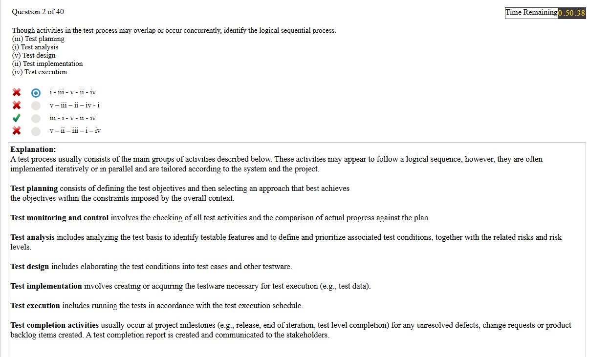

**Notes**

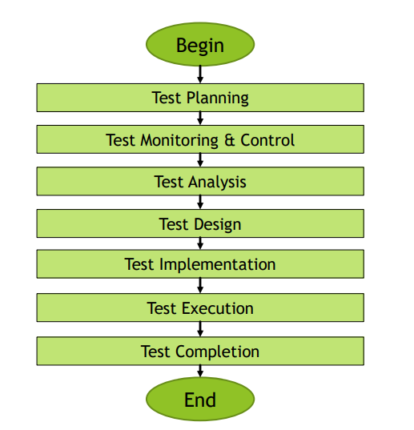

### Incorrect answer 2

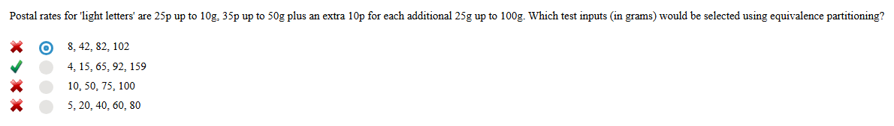

**Notes**


| Valid (25p)  | Valid (35p)      | Valid (45p)      | Valid (55p)   | Invalid |
| ------------ | ---------------- | ---------------- |---------------| ------- |
| 0.00 - 9.99g | 10.00g -> 49.99g | 50.00g -> 74.99g | 75.0 > 99.99g | 100g +  |

### Incorrect answer 3

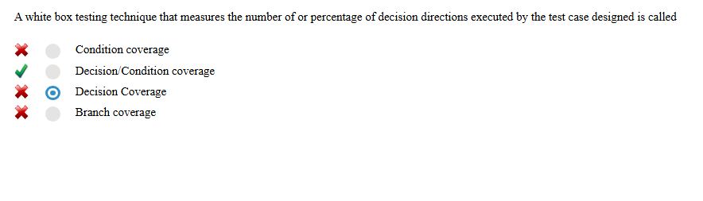

**Notes**

Not sure about this one, seems to be a flakey question as no mention of "Decision/Condition coverage" in the course

### Incorrect answer 4

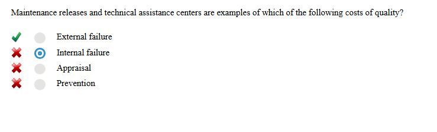

Not sure about this one, no mention in the course.

### Incorrect answer 5

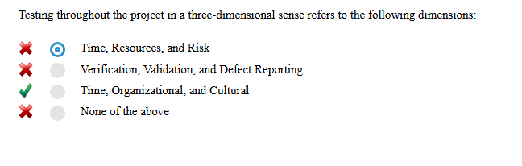

Not sure about this one, no mention in the course.

### Incorrect answer 6

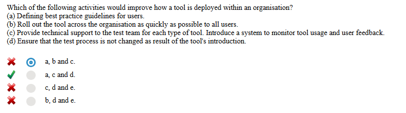

Silly mistake, read answers properly!!!! B is obviously not correct

### Incorrect answer 7

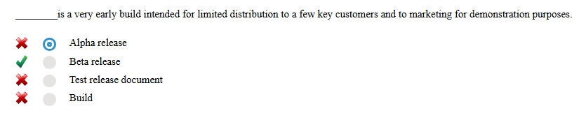

No explanation of Alpha or Beta in course, from the internet:

> **Alpha testing** happens in-house, in a controlled environment, where developers focus on fixing critical bugs.
> **Beta testing** involves real users in real-world conditions

### Incorrect answer 8

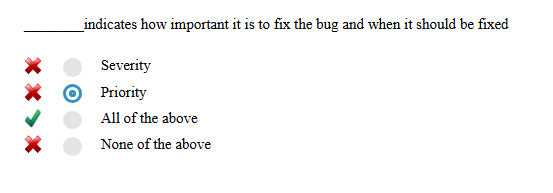

Obvious!!
[Severity vs. Priority](https://www.geeksforgeeks.org/severity-in-testing-vs-priority-in-testing/)

> **Severity**
>
> The extent to which a particular defect can create an impact on the software. Severity is a parameter to denote the implication and the impact of the defect on the functionality of the software.
>
> * A higher effect of the bug on system functionality will lead to a higher severity level.
> * A QA engineer determines the severity level of a bug.
>
> **Types of Severity:**
> Severity in software testing can be classified into 4 categories:
>
> * **Critical:** This severity level implies that the process has been completely shut off and no further action can be taken.
> * **Major:** This is a significant flaw that causes the system to fail. However, certain parts of the system remain functional.
> * **Medium:** This flaw results in unfavorable behaviour but the system remains functioning.
> * **Low:** This type of flaw won’t cause any major breakdown in the system.

> **Priority**
>
> Parameter that decides the order in which a defect should be fixed. Defects having a higher priority should be fixed first.
>
> * Defects/ bugs that leave the software unstable and unusable are given higher priority over the defects that cause a small functionality of the software to fail.
> * It refers to how quickly the defect should be rectified.
>
> **Types of Priorities:**
>
> Priority in software testing can be divided into 3 categories:
>
> * **Low:** The defect is irritant but a repair can be done once the more serious defects can be fixed.
> * **Medium:** The defect should be resolved during the normal course of the development, but it can wait until a new version is created.
> * **High:** The defect must be resolved as soon as possible as it affects the system severely and cannot be used until it is fixed.

### Incorrect answer 9

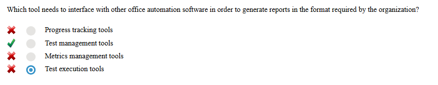

I suppose an example of a Test Management tool report would be a TestRails report included in a test progress or completion report

### Incorrect answer 10

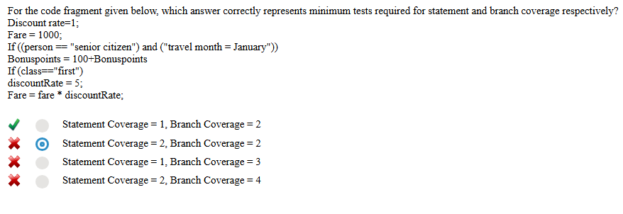
Writing it out so it looks nicer


```java
fareRate = 1;
Fare = 1000;
if((person = "senior citizen") && (travelMonth = "January")){
    Bonuspoints += 100;  
}
if(class = "first"){
    fareRate= 5;  
}
Fare = fare * fareRate;
```
Don't really understand why as there's no else branches, Crap example really

### Incorrect answer 11

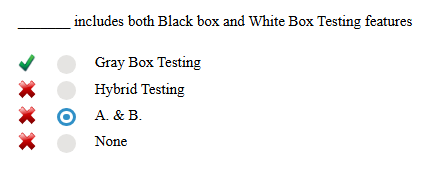

> **Gray-box testing** is a combination of white-box testing and black-box testing.

### Incorrect answer 12

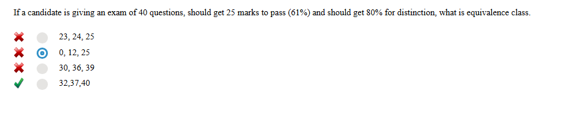

> Equivalent partitions are also known as equivalence classes

32, 37 & 40 are all part of 1 class (distinction)

| Fail         | Pass        | Distinction   |
|--------------|-------------|---------------|
| 0 - 24 marks | 25-31 marks | 32 - 40 marks |

### Incorrect answer 13

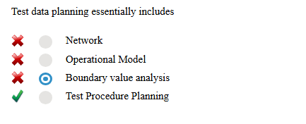

Not to sure about this
> Testware from Test Implementation activity include test procedures and test data

## Test 3 - Incorrect answers and clarifications
### Question 3 - Clarification
> **Question**
> Which of the following statements about quality assurance (QA) and/or
> quality control (QC) is correct?

> **Answer**
> Testing is a part of QC
 
> **Justification**
> FL-1.2.2. (K1) Recall the relation between testing and quality assurance [CTFL 4.0]
> 
> CORRECT – Testing is a form of quality control. (see [CTFL 4.0], Section 1.2.2, 1st paragraph, last sentence)

### Question 6 - Incorrect Answer

> **Question**
> Consider the following testing activities:
> 1. Selecting regression tests
> 2. Evaluating completeness of test execution
> 3. Identifying which user stories have open defect reports
> 4. Evaluating whether the number of tests for each requirement is consistent with the level of product risk
>
> Consider the following ways traceability can help testing:
   A. Improve understandability of test status reports to include status
   of test basis items
   B. Make testing activities auditable
   C. Provide information to assess process quality
   D. Analyze the impact of changes
>   
> Which of the following best matches the testing activity with how
   traceability can assist that activity?

> **Answer**
> 1D, 2B, 3A, 4C

> **Justification**
> FL-1.4.4 (K2) Explain the value of maintaining traceability 
> 
> Traceability assists with:
> * Selecting regression tests in terms of analyzing the impact of changes (1D)
> * Evaluating completeness of test execution which makes testing auditable (2B)
> * Identifying which user stories have open defect reports which improves understandability of test status reports to include status of test basis items (3A)
> * Evaluating whether the number of tests for each requirement is consistent with the level of product risk which provides information to assess test process quality (i.e., alignment of test effort with risk) (4C)

### Question 13 - Incorrect Answer

> **Question**
> Which of the following is MOST likely to be performed as part of system testing?

> **Answer**
> A: End-to-end security testing of a credit management system by an independent test team.

> **Justification** 
> FL-2.2.1 (K2) Distinguish the different test levels [CTFL 4.0]
> 
> System testing examines the behavior and capabilities of the entire system
and includes non-functional testing of quality characteristics, including IT security testing.
System testing is often performed by an independent test team based on system
specifications. (see [CTFL 4.0], section 2.2.1, 3rd bullet point)

### Question 14 - Incorrect Answer
> **Question**
> Which of the following decisions should NOT trigger maintenance testing?

> **Answer**
> A: The decision to test the maintainability of the software

> **Justification**
> FL-2.3.1 (K2) Summarize maintenance testing and its triggers [CTFL 4.0] 
> 
>  Maintainability is a quality attribute that does not depend on code execution
([CTFL 4.0], Section 3.1.3, 1st paragraph, 5th bullet point). Therefore, it is NOT a trigger
for maintenance testing, which is performed as dynamic testing in response to changes in
the code or environment (see [CTFL 4.0], Section 2.3, 3rd paragraph including bullet
points). 

### Question 18 - Incorrect Answer
> **Question**
> The generic review process recognizes the following roles, among others:
> 1. Scribe
> 2. Review leader
> 3. Facilitator
> 4. Manager
> In the context of reviews, these roles can take on the following
responsibilities:
A. Ensures the effective running of review meetings and the setting up of a safe review environment
B. Records review information, such as decisions and new anomalies found during the review meeting
C. Decides what is to be reviewed and provides resources, such as staff and time for the review
D. Takes overall responsibility for the review such as organizing when and where the review will take place

> **Answer**
> A: 1B, 2D, 3A, 4C

> **Justification**
> FL-3.2.3 (K1) Recall which responsibilities are assigned to the principal roles when
performing reviews [CTFL 4.0]
> 
> Considering each of the listed roles:
> 1. **Scribe (or Recorder)** – responsible for gathering feedback from reviewers and
   documenting review information, such as decisions made, and any new anomalies
   identified during the review meeting. (Records review information, such as decisions and
   new anomalies found during the review meeting - B) (see [CTFL 4.0], section 3.2.3, 4th
   bullet point)
> 2. **Review Leader** – responsible for overseeing the review process, such as selecting the
   review team members, scheduling review meetings, and ensuring that the review is
   completed successfully. (Takes overall responsibility for the review such as organizing
   when and where the review will take place - D) (see [CTFL 4.0], section 3.2.3, 6th bullet
   point)
> 3. **Facilitator (or Moderator)** – responsible for ensuring that the review meetings run
   effectively, including managing time, mediating discussions, and creating a safe
   environment where everyone can voice their opinions freely. (Ensures the effective
   running of review meetings and the setting up of a safe review environment - A) (see
   [CTFL 4.0], section 3.2.3, 3rd bullet point)
> 4. **Manager** – responsible for deciding what needs to be reviewed and allocating resources,
   such as staff and time, for the review. (Decides what is to be reviewed and provides
   resources, such as staff and time for the review - C) (see [CTFL 4.0], section 3.2.3, 1st
   bullet point) 

### Question 20 - Incorrect Answer
> **Question**
> Customers of the TestWash car wash chain have cards with a record of the number of washes they have bought so far. The initial value is 0. After entering the car wash, the system increases the number on the card by one. 
> This value represents the number of the current wash. Based on this number the system decides what discount the customer is entitled to.
For every tenth wash the system gives a 10 % discount, and for every twentieth wash, the system gives a further 40 % discount (i.e., a 50 % discount in total).

>Which of the following sets of input data (understood as the numbers of the current wash) achieves the highest equivalence partition coverage?

> **Answer**
> A: 19, 20, 30

> **Justification**
> FL-4.2.1 (K3) Use equivalence partitioning to derive test cases [CTFL 4.0]
> 
>  19 covers the “no discount” partition, 20 covers the “50 % discount” partition,
and 30 covers the “10 % discount” partition. These three values cover all three of the valid
equivalence partitions.

### Question 30 - Incorrect Answer
> **Question**
> Your team follows the process, which uses a continuous integration and delivery (CI/CD) pipeline with a shift-left approach. 
> 
> The first three steps in this process are:
> 1. Develop and deploy code
> 2. Submit code into a version control system and merge it into the “test” branch
> 3. Perform component testing for the submitted code
> 
> Which of the following  criteria is BEST suited as an entry criterion for step (2) of this pipeline?

> **Answer**
> A: The Static analysis does not report any defect or no high severity warnings for the submitted code

> **Justification**
> FL-5.1.3 (K2) Compare and contrast entry criteria and exit criteria [CTFL 4.0]
> 
> The CI-CD approach together with the shift-left approach promotes early testing so that developers are encouraged to deliver their high-quality code together with the unit tests and static analysis (see [CTFL 4.0], section 2.1.4 and 2.1.5). 
> Therefore, the results of the static analysis are a useful and measurable input criterion before integrating the code into the CI-CD pipeline, comparable to a smoke test (see [CTFL 4.0], section 5.1.3, 2nd paragraph).

### Question 31 - Incorrect Answer
> **Question**
> You want to estimate the test effort for a new project using estimation based on ratios.

| Project | Development Effort ($) | Test Effort ($) |
|---------|------------------------|-----------------|
| P1      | 800,000                | 40,000          |
| P2      | 1,200,000              | 130,000         |
| P3      | 600,000                | 70,000          |
| P4      | 1,000,000              | 120,000         |


> **Answer**
> A: $80,000

> **Justification**
> FL-5.1.4 (K3) Use estimation techniques to calculate the required test effort [CTFL 4.0]
> 
> The average test-to-development effort ratio is 1:10 ($90,000 : $900,000), which means that historically, on average, the test effort is 10 % of the development effort. So if the development effort is estimated to be $800,000, the estimated test effort is estimated as:
> 10 % * $800,000 = 0.1 * $800,000 = $80,000.
> 
> Basically add all get average dev cost and average test cost for a ratio

### Question 33 - Clarification
> **Question**
> According to the testing quadrants model, which of the following items is assigned to quadrant Q1 (“technology facing” and “support the team”)?

> **Answer**
> A: Component integration tests

> **Justification**
> FL-5.1.7 (K2) Summarize the testing quadrants and their relationships with test levels and test types [CTFL 4.0]
> Component integration testing is technology facing testing that supports the team

### Question 34 - Incorrect Answer
> **Question**
> ?

> **Answer**
> A:

> **Justification**
> ? 

### Question 35 - Incorrect Answer
> **Question**
> ?

> **Answer**
> A:

> **Justification**
> ?

### Question 40 - Incorrect Answer
> **Question**
> ?

> **Answer**
> A:

> **Justification**
> ?