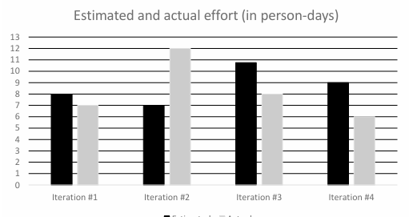
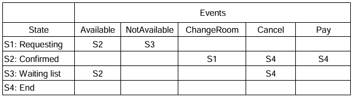
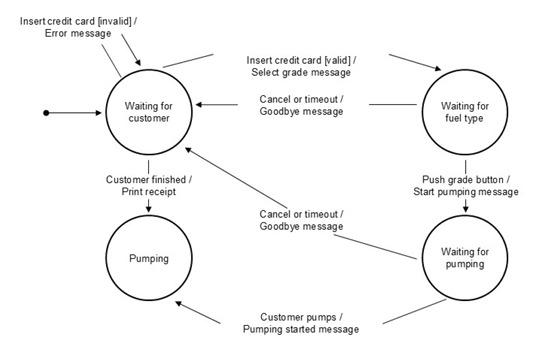

[🔙 Home](../home.md)

# Test Results

For reference
:white_check_mark: = `:white_check_mark:`
:x: = `:x:`

Incorrect Answers Explained in the following format
<b> Question X </b>
> **Question**
> 

> **Answer**
> 

> **Justification**
> 


<details>
<summary><b>Test Results</b></summary>

| Test # | Time Started | Time Finished | Exam            | Result | Open Book          |                                                                                                                                                                                                                                                           
|--------|--------------|---------------|-----------------|--------|--------------------|
| 1      | N/A          | N/A           | SET A v2.1      | 35/40  | :white_check_mark: | 
| 2      | N/A          | N/A           | Patshala Test 1 | 27     | :x:                | 
| 3      | N/A          | N/A           | SET B v1.3.2    | 30     | :x:                | 
| 4      | 13:33        | 13:55         | SET C v1.5      | 26     | :x:                | 
| 5      | 17:52        | 18:19         | SET D v1.4      | 24     | :x:                |    
| 6      | 12:00        | 12:25         | SET E v1.2      | 30     | :x:                |     
| 7      | 14:18        | 14:45         | SET F v1. 1     | 28     | :x:                | 
</details>


<details>
<summary><b>Test 2 - Incorrect answers and clarifications</b></summary>

Incorrect answer 1


**Notes**


Incorrect answer 2


**Notes**


| Valid (25p)  | Valid (35p)      | Valid (45p)      | Valid (55p)   | Invalid |
| ------------ | ---------------- | ---------------- | ------------- | ------- |
| 0.00 - 9.99g | 10.00g -> 49.99g | 50.00g -> 74.99g | 75.0 > 99.99g | 100g +  |

Incorrect answer 3


**Notes**

Not sure about this one, seems to be a flakey question as no mention of "Decision/Condition coverage" in the course

Incorrect answer 4


Not sure about this one, no mention in the course.

Incorrect answer 5


Not sure about this one, no mention in the course.

Incorrect answer 6


Silly mistake, read answers properly!!!! B is obviously not correct

Incorrect answer 7


No explanation of Alpha or Beta in course, from the internet:

> **Alpha testing** happens in-house, in a controlled environment, where developers focus on fixing critical bugs.
> **Beta testing** involves real users in real-world conditions

Incorrect answer 8


Obvious!!
[Severity vs. Priority](https://www.geeksforgeeks.org/severity-in-testing-vs-priority-in-testing/)

> **Severity**
>
> The extent to which a particular defect can create an impact on the software. Severity is a parameter to denote the implication and the impact of the defect on the functionality of the software.
>
> * A higher effect of the bug on system functionality will lead to a higher severity level.
> * A QA engineer determines the severity level of a bug.
>
> **Types of Severity:**
> Severity in software testing can be classified into 4 categories:
>
> * **Critical:** This severity level implies that the process has been completely shut off and no further action can be taken.
> * **Major:** This is a significant flaw that causes the system to fail. However, certain parts of the system remain functional.
> * **Medium:** This flaw results in unfavorable behaviour but the system remains functioning.
> * **Low:** This type of flaw won’t cause any major breakdown in the system.

> **Priority**
>
> Parameter that decides the order in which a defect should be fixed. Defects having a higher priority should be fixed first.
>
> * Defects/ bugs that leave the software unstable and unusable are given higher priority over the defects that cause a small functionality of the software to fail.
> * It refers to how quickly the defect should be rectified.
>
> **Types of Priorities:**
>
> Priority in software testing can be divided into 3 categories:
>
> * **Low:** The defect is irritant but a repair can be done once the more serious defects can be fixed.
> * **Medium:** The defect should be resolved during the normal course of the development, but it can wait until a new version is created.
> * **High:** The defect must be resolved as soon as possible as it affects the system severely and cannot be used until it is fixed.

Incorrect answer 9


I suppose an example of a Test Management tool report would be a TestRails report included in a test progress or completion report

Incorrect answer 10


Writing it out so it looks nicer

```java
fareRate = 1;
Fare = 1000;
if((person = "senior citizen") && (travelMonth = "January")){
    Bonuspoints += 100;  
}
if(class = "first"){
    fareRate= 5;  
}
Fare = fare * fareRate;
```

Don't really understand why as there's no else branches, Crap example really

Incorrect answer 11


> **Gray-box testing** is a combination of white-box testing and black-box testing.

Incorrect answer 12


> Equivalent partitions are also known as equivalence classes

32, 37 & 40 are all part of 1 class (distinction)


| Fail         | Pass        | Distinction   |
| ------------ | ----------- | ------------- |
| 0 - 24 marks | 25-31 marks | 32 - 40 marks |

Incorrect answer 13


Not to sure about this

> Testware from Test Implementation activity include test procedures and test data
</details>


<details>
<summary><b>Test 3 - Incorrect answers and clarifications</b></summary>

Question 3 - Clarification

> **Question**
> Which of the following statements about quality assurance (QA) and/or
> quality control (QC) is correct?

> **Answer**
> Testing is a part of QC

> **Justification**
> FL-1.2.2. (K1) Recall the relation between testing and quality assurance [CTFL 4.0]
>
> CORRECT – Testing is a form of quality control. (see [CTFL 4.0], Section 1.2.2, 1st paragraph, last sentence)

Question 6 - Incorrect Answer

> **Question**
> Consider the following testing activities:
>
> 1. Selecting regression tests
> 2. Evaluating completeness of test execution
> 3. Identifying which user stories have open defect reports
> 4. Evaluating whether the number of tests for each requirement is consistent with the level of product risk
>
> Consider the following ways traceability can help testing:
> A. Improve understandability of test status reports to include status of test basis items
> B. Make testing activities auditable
> C. Provide information to assess process quality
> D. Analyze the impact of changes
>
> Which of the following best matches the testing activity with how
> traceability can assist that activity?

> **Answer**
> 1D, 2B, 3A, 4C

> **Justification**
> FL-1.4.4 (K2) Explain the value of maintaining traceability
>
> Traceability assists with:
>
> * Selecting regression tests in terms of analyzing the impact of changes (1D)
> * Evaluating completeness of test execution which makes testing auditable (2B)
> * Identifying which user stories have open defect reports which improves understandability of test status reports to include status of test basis items (3A)
> * Evaluating whether the number of tests for each requirement is consistent with the level of product risk which provides information to assess test process quality (i.e., alignment of test effort with risk) (4C)

Question 13 - Incorrect Answer

> **Question**
> Which of the following is MOST likely to be performed as part of system testing?

> **Answer**
> A: End-to-end security testing of a credit management system by an independent test team.

> **Justification**
> FL-2.2.1 (K2) Distinguish the different test levels [CTFL 4.0]
>
> System testing examines the behavior and capabilities of the entire system
> and includes non-functional testing of quality characteristics, including IT security testing.
> System testing is often performed by an independent test team based on system
> specifications. (see [CTFL 4.0], section 2.2.1, 3rd bullet point)

Question 14 - Incorrect Answer

> **Question**
> Which of the following decisions should NOT trigger maintenance testing?

> **Answer**
> A: The decision to test the maintainability of the software

> **Justification**
> FL-2.3.1 (K2) Summarize maintenance testing and its triggers [CTFL 4.0]
>
> Maintainability is a quality attribute that does not depend on code execution
> ([CTFL 4.0], Section 3.1.3, 1st paragraph, 5th bullet point). Therefore, it is NOT a trigger
> for maintenance testing, which is performed as dynamic testing in response to changes in
> the code or environment (see [CTFL 4.0], Section 2.3, 3rd paragraph including bullet
> points).

Question 18 - Incorrect Answer

> **Question**
> The generic review process recognises the following roles, among others:
>
> 1. Scribe
> 2. Review leader
> 3. Facilitator
> 4. Manager
>    
> In the context of reviews, these roles can take on the following responsibilities:
> 
> A. Ensures the effective running of review meetings and the setting up of a safe review environment
> B. Records review information, such as decisions and new anomalies found during the review meeting
> C. Decides what is to be reviewed and provides resources, such as staff and time for the review
> D. Takes overall responsibility for the review such as organizing when and where the review will take place

> **Answer**
> A: 1B, 2D, 3A, 4C

> **Justification**
> FL-3.2.3 (K1) Recall which responsibilities are assigned to the principal roles when
> performing reviews [CTFL 4.0]
>
> Considering each of the listed roles:
>
> 1. **Scribe (or Recorder)** – responsible for gathering feedback from reviewers and
>    documenting review information, such as decisions made, and any new anomalies
>    identified during the review meeting. (Records review information, such as decisions and
>    new anomalies found during the review meeting - B) (see [CTFL 4.0], section 3.2.3, 4th
>    bullet point)
> 2. **Review Leader** – responsible for overseeing the review process, such as selecting the
>    review team members, scheduling review meetings, and ensuring that the review is
>    completed successfully. (Takes overall responsibility for the review such as organizing
>    when and where the review will take place - D) (see [CTFL 4.0], section 3.2.3, 6th bullet
>    point)
> 3. **Facilitator (or Moderator)** – responsible for ensuring that the review meetings run
>    effectively, including managing time, mediating discussions, and creating a safe
>    environment where everyone can voice their opinions freely. (Ensures the effective
>    running of review meetings and the setting up of a safe review environment - A) (see
>    [CTFL 4.0], section 3.2.3, 3rd bullet point)
> 4. **Manager** – responsible for deciding what needs to be reviewed and allocating resources,
>    such as staff and time, for the review. (Decides what is to be reviewed and provides
>    resources, such as staff and time for the review - C) (see [CTFL 4.0], section 3.2.3, 1st
>    bullet point)

Question 20 - Incorrect Answer

> **Question**
> Customers of the TestWash car wash chain have cards with a record of the number of washes they have bought so far. The initial value is 0. After entering the car wash, the system increases the number on the card by one.
> This value represents the number of the current wash. Based on this number the system decides what discount the customer is entitled to.
> For every tenth wash the system gives a 10 % discount, and for every twentieth wash, the system gives a further 40 % discount (i.e., a 50 % discount in total).

> Which of the following sets of input data (understood as the numbers of the current wash) achieves the highest equivalence partition coverage?

> **Answer**
> A: 19, 20, 30

> **Justification**
> FL-4.2.1 (K3) Use equivalence partitioning to derive test cases [CTFL 4.0]
>
> 19 covers the “no discount” partition, 20 covers the “50 % discount” partition,
> and 30 covers the “10 % discount” partition. These three values cover all three of the valid
> equivalence partitions.

Question 30 - Incorrect Answer

> **Question**
> Your team follows the process, which uses a continuous integration and delivery (CI/CD) pipeline with a shift-left approach.
>
> The first three steps in this process are:
>
> 1. Develop and deploy code
> 2. Submit code into a version control system and merge it into the “test” branch
> 3. Perform component testing for the submitted code
>
> Which of the following  criteria is BEST suited as an entry criterion for step (2) of this pipeline?
> 
> a) The Static analysis does not report any defect or no high severity warnings for the submitted code
b) The Version control does not report any conflicts when compiling and integrating the code into the “test” branch
c) The Component tests are compiled and ready to run in the “Test” branch
d) The Statement coverage of the component test is at least 80%

> **Answer**
> A: The Static analysis does not report any defect or no high severity warnings for the submitted code

> **Justification**
> FL-5.1.3 (K2) Compare and contrast entry criteria and exit criteria [CTFL 4.0]
>
> The CI-CD approach together with the shift-left approach promotes early testing so that developers are encouraged to deliver their high-quality code together with the unit tests and static analysis (see [CTFL 4.0], section 2.1.4 and 2.1.5).
> Therefore, the results of the static analysis are a useful and measurable input criterion before integrating the code into the CI-CD pipeline, comparable to a smoke test (see [CTFL 4.0], section 5.1.3, 2nd paragraph).

Question 31 - Incorrect Answer

> **Question**
> You want to estimate the test effort for a new project using estimation based on ratios.


| Project | Development Effort ($) | Test Effort ($) |
| ------- | ---------------------- | --------------- |
| P1      | 800,000                | 40,000          |
| P2      | 1,200,000              | 130,000         |
| P3      | 600,000                | 70,000          |
| P4      | 1,000,000              | 120,000         |

> **Answer**
> A: $80,000

> **Justification**
> FL-5.1.4 (K3) Use estimation techniques to calculate the required test effort [CTFL 4.0]
>
> The average test-to-development effort ratio is 1:10 ($90,000 : $900,000), which means that historically, on average, the test effort is 10 % of the development effort. So if the development effort is estimated to be $800,000, the estimated test effort is estimated as:
> 10 % * $800,000 = 0.1 * $800,000 = $80,000.
>
> Basically add all get average dev cost and average test cost for a ratio

Question 33 - Clarification

> **Question**
> According to the testing quadrants model, which of the following items is assigned to quadrant Q1 (“technology facing” and “support the team”)?

> **Answer**
> A: Component integration tests

> **Justification**
> FL-5.1.7 (K2) Summarize the testing quadrants and their relationships with test levels and test types [CTFL 4.0]
> Component integration testing is technology facing testing that supports the team

Question 34 - Incorrect Answer

> **Question**
> In the context of risk management, identify the statement that NOT accurately depict the relationship between product risk and test planning?

> **Answer**
> A: The required quality of the network module is ambiguous, resulting in the execution of additional risk analyses in this area.

> **Justification**
> FL-5.2.4 (K2) Explain what measures can be taken in response to analyzed product risks [CTFL 4.0]
>
> If the quality of a module is unclear, additional risk analysis is necessary, but this is not a task of risk control. Test planning should aim to eliminate uncertainties and ensure quality (see [CTFL 4.0], Section 5.2.4).

Question 35 - Incorrect Answer

> **Question**
> Which of the following is a product quality metric?

> **Answer**
> A: Mean time to failure

> **Justification**
> FL-5.3.1 (K1) Recall metrics used for testing [CTFL 4.0]
>
> CORRECT – Product quality metrics measure quality characteristics. Mean time to failure measures maturity, so it is a product quality metric (see [CTFL4.0], section 5.3.1, 3rd bullet point)

Question 40 - Incorrect Answer

> **Question**
> Which of the following is MOST likely to apply to test automation?

> **Answer**
> A: Test automation provides measurement of more complex coverage criteria.

> **Justification**
> FL-6.2.1 (K1) Recall the benefits and risks of test automation [CTFL 4.0]
>
> CORRECT – Test automation can provide measures that are too complicated for humans to derive, such as white-box test coverage measures for all but the most trivial code (see[CTFL4.0], section 6.2, bullet point 3)
</details>

<details>
<summary><b>Test 4 - Incorrect answers and clarifications</b></summary>

Question 1
> **Question**
> Which of the following is a typical test objective?
a) Validating that documented requirements are met
b) Causing failures and identifying defects
c) Initiating errors and identifying root causes
d) Verifying the test object meets user expectations

> **Answer**
> b) Causing failures and identifying defects

> **Justification**
> a) Is not correct. Validating that documented requirements are met is incorrect as validation is concerned with meeting user requirements and expectations, while verification is concerned with meeting specified requirements, so this would be correct if we replaced ‘validating’ with ‘verifying’
> 
> b) **Is correct. Causing failures and identifying defects is probably the most common objective of dynamic testing**
>
> c) Is not correct. Initiating errors and identifying root causes is incorrect because testers do not initiate errors, they try to cause failures. Errors are typically made by developers (and cannot really be initiated) and result in defects, which testers attempt to identify either directly through static testing or indirectly through failures with dynamic testing. Identifying root causes is useful but is part of debugging, which is a separate activity to testing
>
> d) Is not correct. Verifying the test object meets user expectations is incorrect as verification is concerned with checking specified(documented) requirements are met, while validation is concerned with meeting user requirements and expectations, so this would be correct if we replaced ‘verifying’ with ‘validating’
> 
> **Verification → "Ver for Verify the specs"** 
> **Validation → "Val for Value to the customer"**


Question 2
> **Question**
> Which of the following statements BEST describes the difference between testing and debugging?
a) Testing causes failures while debugging fixes failures
b) Testing is a negative activity while debugging is a positive activity  
c) Testing determines that defects exist while debugging removes defects
d) Testing finds the cause of defects while debugging fixes the cause of defects

> **Answer**
> c) Testing determines that defects exist while debugging removes defects

> **Justification**
> a) Is not correct. Dynamic testing does cause failures (from which defects can then be located and fixed). However, debugging is concerned with locating defects and fixing these defects. Therefore, debugging does not fix failures
> 
>b) Is not correct. Both testing and debugging contribute to improving the quality of the test object, so should really both be considered positively. Debugging is generally considered to be a positive activity as it is fixing something. Dynamic testing does involve intentionally causing the test object to fail, which is why some people consider it a negative activity, but that is a very narrow view (and not one typically held by testers). Both positive and negative test cases are possible. Positive test cases check that the test object correctly performs what it is supposed to do, while negative testing checks that the test object does not do what it is not supposed to do
>
>c) **Is correct. Testing determines that defects exist either directly through observation of the defect in reviews (or by a tool in static analysis), or indirectly by causing a failure in dynamic testing. Debugging is a separate activity from testing (normally performed by developers) and is concerned with locating defects (only for dynamic testing) and fixing the defects**
>
>d) Is not correct. The causes of defects are typically human errors. Testing finds defects either directly through static testing, or indirectly by causing failures in dynamic testing, and debugging fixes defects. So, testing does not find the cause of defects and debugging does not fix the causes of defects

Question 3
> **Question**
> The ‘absence-of-defects fallacy’ is one of the principles of testing. Which of the following is an example of addressing this principle in practice?
> 
>a) Explaining that it is not possible for testing to show the absence of defects
b) Supporting the end users to perform acceptance testing  
c) Ensuring that no implementation defects remain in the delivered system
d) Modifying tests that cause no failures to ensure few defects remain

> **Answer**
> b) Supporting the end users to perform acceptance testing

> **Justification**
> The ‘absence-of-defects fallacy’ is concerned with the idea that ensuring correctness in accordance with the requirements (i.e., verifying the absence of implementation defects) does not guarantee user satisfaction with the system. To address this it is also necessary to validate that the system meets users' needs and expectations, fulfills business objectives, and outperforms competing systems.
> 
>a) Is not correct. The ‘testing shows the presence, not the absence of defects’ principle explains that while testing can detect the existence of defects in the test object, it is not possible to demonstrate that there are no defects and, therefore, guarantee its correctness. Therefore, explaining that it is not possible for testing to show the absence of defects would partially address this principle, not the ‘absence-ofdefects’ fallacy
>
>b) **Is correct. By supporting the end user to perform acceptance testing it should be possible to validate that the system meets users' needs and expectations**
>
>c) Is not correct. It is not possible to ensure that no implementation defects remain in the delivered system as the ‘testing shows the presence, not the absence of defects’ principle explains that while testing can detect the existence of defects in the test object, it is not possible to demonstrate that there are no defects and, therefore, guarantee its correctness
>
>d) Is not correct. Modifying tests that cause no failures to ensure few defects remain is one way to address the ‘tests wear out’ principle. This principle is concerned with the idea that repeating identical tests on unaltered code is unlikely to uncover novel defects and therefore, modifying tests may be essential. This will not validate that the system meets users' needs and expectations
> 

Question 4
> **Question**
>Which of the following test activities are MOST likely to involve the application of boundary value analysis and equivalence partitioning?
> 
> a) Test implementation
b) Test design
c) Test execution
d) Test monitoring
e) Test analysis
**Select TWO options.**

> **Answer**
> b) Test design & e) Test analysis

> **Justification**
> Given the following description of test analysis:
To identify the features that require testing, the test basis is analyzed and defined as test conditions, which are then prioritized along with related risks. The systematic identification of test conditions as coverage items often involves using test techniques both during test analysis and as part of the test design activity. From the above description, it can be seen that test techniques are often used in the test analysis and test design activities. Boundary value analysis and equivalence partitioning are test techniques.
> 
>a) Is not correct. Test implementation is not likely to involve the use of test techniques as it is mostly concerned with assembling test cases into test procedures, while test techniques create test cases
> 
>b) **Is correct. Test design is likely to involve the use of test techniques to create test cases from test conditions and coverage items**
> 
>c) Is not correct. Test execution is not likely to involve the use of test techniques as it is mostly concerned with executing test procedures(and so test cases), while test techniques create test cases
>
> d) Is not correct. Test monitoring is not likely to involve the use of test techniques. Test monitoring is mostly concerned with ongoing checks to ensure the plan is being followed, while test techniques create test cases 
> 
> **e) Is correct. Test analysis is likely to involve the use of test techniques to identify test conditions**


Question 5
> **Question**
> Given the following testware:
>     1. Coverage items
>     2. Change requests
>     3. Test execution schedule
>     4. Prioritized test conditions  
   And the following test activities
      A. Test analysis  
      B. Test design  
      C. Test implementation  
      D. Test completion  
   Which of the following BEST shows the testware produced by the activities?

> **Answer**
> a) 1B, 2D, 3C, 4A

> **Justification**
>Considering each of the listed test activities and their output testware:

>A. Test analysis - prioritized test conditions (4) (e.g., acceptance criteria), and defect reports for defects identified in the test basis

>B. Test design - prioritized test cases, test charters, coverage items(1), test data requirements, and test environment requirements

>C. Test implementation - test procedures, automated test scripts, test suites, test data, test execution schedule (3), and test environment elements such as stubs, drivers, simulators, and service virtualizations

>D. Test completion - test completion report, documented lessons learned, action items for improvement, and change requests (2)(as product backlog items)


Question 13
> **Question**
>Which of the following test levels is MOST likely being performed if the testing is focused on validation and is not being performed by testers?

>a) Component testing
b) Component integration testing
c) System integration testing
d) Acceptance testing

> **Answer**
> d) Acceptance testing

> **Justification**
> a) Is not correct. Component testing (also called unit testing) involves testing individual components in isolation and is mostly verification against a specification, rather than validation against user needs. However, this testing is not normally performed by testers, as developers usually carry out this testing in their development environment

>b) Is not correct. Component integration testing involves testing the interfaces and interactions between components and is mostly verification against a specification, rather than validation against user needs. However, this testing is not normally performed by testers, as developers usually carry out this testing

>c) Is not correct. System integration testing examines the interfaces with other systems and external services and is mostly verification against a specification, rather than validation against user needs. This type of testing is also most often performed by testers

>d) **Is correct. Acceptance testing focuses on validating that the system meets the user's business needs and is ready for deployment. Ideally, this testing is carried out by the end users**

Question 18
> **Question**
> Which of the following is a factor that contributes to a successful review?

>a) Ensure management participate as reviewers
b) Split large work products into smaller parts
c) Set reviewer evaluation as an objective
d) Plan to cover one document per review
Select ONE option.

> **Answer**
> b) Split large work products into smaller parts


> **Justification**
> a) Is not correct. To ensure successful reviews, it's important to secure management's support for the review process, however that does not mean that they should participate as reviewers

>b) **Is correct. To ensure successful reviews, it's important to break the work product into parts that are small enough to be reviewed in a reasonable timescale to prevent reviewers from losing focus during individual review or review meetings**

>c) Is not correct. To ensure successful reviews, it's important to clearly define objectives and measurable exit criteria, without evaluating participants

>d) Is not correct. To ensure successful reviews, it's important to break down the review into smaller chunks to prevent reviewers from losing focus during individual review or review meetings. So you should not plan to cover one document per review

Question 21
> **Question**
> A developer was asked to implement the following business rule:

````
INPUT: value (integer number)
IF (value ≤ 100 OR value ≥ 200) THEN write “value incorrect”
ELSE write “value OK”
````

>You design the test cases using 2-value boundary value analysis.
>
>Which of the following sets of test inputs achieves the greatest coverage?
a) 100,  150,  200,  201
b) 99,  100,  200,  201
c) 98,  99,  100,  101
d) 101,  150,  199,  200
Select ONE option.

> **Answer**
> d) 101,  150,  199,  200

> **Justification**
> The equivalence partitions are: {…, 99, 100}, {101, 102, …, 198, 199}, {200, 201, …}.
Thus, there are 4 boundary values, which are: 100, 101, 199 and 200. In 2-value BVA, for each boundary value there are two coverage items (the boundary value and its closest neighbor belonging to the adjacent partition). As the closest neighbors are also boundary values in the adjacent partition, then there are just four coverage items.
> 
>Thus:
a) Is not correct. Only 100 and 200 are valid coverage items for 2-value BVA, so we achieve 50% coverage
>
>b) Is not correct. Only 100 and 200 are valid coverage items for 2-value BVA, so we achieve 50% coverage
> 
>c) Is not correct. Only 100 and 101 are valid coverage items for 2-value BVA, so we achieve 50% coverage
> 
>d) **Is correct. 101, 199 and 200 are valid coverage items for 2-value BVA, so we achieve 75% coverage**

Question 22
> **Question**
> You are working on a project to develop a system to analyse driving test results. You have been asked to design test cases based on the following decision table.

> What test data will show that there are contradictory rules in the decision table?
   a) C1 = T,  C2 = T,  C3 = F
   b) C1 = T,  C2 = F,  C3 = T
   c) C1 = T,  C2 = T,  C3 = T and C1 = F, C2 = T, C3 = T
   d) C1 = F,  C2 = F,  C3 = F
Select ONE option.

> **Answer**
> d) C1 = F,  C2 = F,  C3 = F

> **Justification**
> a) Is not correct. The combination (T, T, F) does not match any rule. This is an example of omission, not a contradiction
>
>b) Is not correct. The combination (T, F, T) matches only one column, R2, so there is no contradiction
>
>c) Is not correct. Both combinations (T, T, T) and (F, T, T) match only one column, R1, so there is no contradiction
>
>d) **Is correct. The combination (F, F, F) matches both R2 and R3, but R2 and R3 have different actions, so this shows a contradiction between R2 and R3.**

Question 25
> **Question**
> How can white-box testing be useful in support of black-box testing?
>
>a) White-box coverage measures can help testers evaluate black-box tests in terms of the code coverage achieved by these black-box tests
>
>b) White-box coverage analysis can help testers identify unreachable fragments of the source code
>
>c) Branch testing subsumes black-box test techniques, so achieving full branch coverage guarantees achieving full coverage of any black-box technique
>
>d) White-box test techniques can provide coverage items for black-box techniques
>
>Select ONE option.

> **Answer**
> a) White-box coverage measures can help testers evaluate black-box tests in terms of the code coverage achieved by these black-box tests

> **Justification**
>a) **Is correct. Performing only black-box testing does not provide a measure of actual code coverage. White-box coverage measures provide an objective measurement of coverage and provide the necessary information to allow additional tests to be generated to increase this coverage, and subsequently increase confidence in the code**
> 
>b) Is not correct. This statement is correct, but it has nothing to do with black-box testing
> 
>c) Is not correct. In general there are no subsumes relationships between white-box and black-box techniques
> 
>d) Is not correct. White-box techniques are used to design tests based on the test object itself, while black-box techniques are used to design tests based on the specification. Therefore, there is no relation between coverage items derived from these two types of techniques

Question 26
> **Question**
Consider the following list:
   • Correct input not accepted
   • Incorrect input accepted
   • Wrong output format
   • Division by zero
What test technique is MOST PROBABLY used by the tester who uses this list when performing
testing?
   a) Exploratory testing
   b) Fault attack
   c) Checklist-based testing
   d) Boundary value analysis

> **Answer**
> b) Fault attack

> **Justification**
> a) Is not correct. Exploratory testing uses test charters, not a list of possible defects/failures. Although exploratory testing can incorporate the use of other test techniques, in this case fault attack is the most likely option
> 
>b) Is correct. This is a list of possible failures. Fault attacks are a methodical approach to the implementation of error guessing and require the tester to create or acquire a list of possible errors, defects and failures, and to design tests that will identify defects associated with the errors, expose the defects, or cause the failures
> 
>c) Is not correct. The tester is using a checklist of items to support their testing. Both error guessing and checklist-based testing use such lists, however, the list here is of possible failures, not test conditions, and so the MOST PROBABLE test technique is fault attack, which focuses on errors, defects and failures
> 
> d) Is not correct. BVA is based on an analysis of boundary values of equivalence partitions. The above list does not mention equivalence partitions or their boundaries

Question 31
> **Question**
>At the beginning of each iteration, the team estimates the amount of work (in person-days) they will need to complete during the iteration. Let E(n) be the estimated amount of work for iteration n, and let A(n) be the actual amount of work done in iteration n. From the third iteration, the team uses the following estimation model based on extrapolation:
> 
> $E(n) = \frac{3 \times A(n-1) + A(n-2)}{4}$
> 
> The graph shows the estimated and actual amount of work for the first four iterations.
> 
> 
> 
>  What is the estimated amount of work for iteration #5?
a) 10.5 person-days
b) 8.25 person-days
c) 6.5 person-days
d) 9.4 person-days

> **Answer**
> c) 6.5 person-days

> **Justification**
> From the graph we have:
A(4)=6 and A(3)=8 (the last two gray boxes).
> 
> $E(n) = \frac{3 \times 6 + 8}{4} = \frac{26}{4}$ = 6.5 person-days
> 
> Note: I completely overcomplicated this one, need to concentrate on the question and remember it's related to TESTING!!!

Question 35
> **Question**
>Which of the following is an example of how product risk analysis may influence the thoroughness and scope of testing?
> 
>a) Continuous risk monitoring allows us to identify emerging risk as soon as possible
b) Risk identification allows us to implement risk mitigation activities and reduce the risk level
c) The assessed risk level helps us to select the rigor of testing
d) Risk analysis allows us to derive coverage items
> 
>Select ONE option.

> **Answer**
> c) The assessed risk level helps us to select the rigor of testing


> **Justification**
>a) Is not correct. Risk monitoring is part of risk control, not risk analysis
> 
>b) Is not correct. Risk identification itself does not allow us to implement risk mitigation activities. The mitigating actions are defined during the risk control phase 
> 
> **c) Is correct. This is an example of how risk analysis influences the thoroughness and scope of testing**
> 
>d) Is not correct. Coverage items are derived using test techniques, not through risk analysis


Question 38
> **Question**
> Consider the following defect report for a web-based shopping application:
>
>What is the MOST important information that is missing from this report?

>a) Name of the tester and date of the report
b) Test environment elements and their version numbers
c) Identification of the test object
d) Impact on the interests of stakeholders

>Select ONE option.


> **Answer**
> b) Test environment elements and their version numbers

> **Justification**
>  a) Is not correct. This is important, but not as important as test environment elements
> 
>b) **Is correct. The important thing that is missing is the identification of the browser and device used for the testing. The browser and device information are important because such a defect can be browser- or device-specific. For example, a login button may work fine on one browser (or one version of a specific browser) but not on another. Therefore, the browser and device information can help the developers to reproduce the issue and find the root cause of the problem more quickly**
> 
> c) Is not correct. The test object is identified (WebShop v0.99)
> 
> d) Is not correct. The impact is included – this is severity (high)

</details>

<details>
<summary><b>Test 5 - Incorrect answers and clarifications</b></summary>
<b> Question 1 </b>

> **Question**
> Which of the following is a typical test objective?
      a) Finding and fixing defects in the test object
      b) Maintaining effective communications with developers
      c) Validating that legal requirements have been met
      d) **Building confidence in the quality of the test object**
Select ONE option.

> **Answer**
>  **d) Building confidence in the quality of the test object**

> **Justification**
>a) Is not correct. Finding and fixing defects in the test object is not a typical test objective as although identifying defects is an objective of testing, fixing defects is not a testing activity
b) Is not correct. Maintaining effective communications with developers is not a typical test objective as although it is useful in achieving other objectives of testing, such as providing stakeholders with information that enables them to make informed decisions, it is not a primary reason for performing testing
c) Is not correct. Validating that legal requirements have been met is not a typical test objective because validation is concerned with checking whether the system meets users’ and other stakeholders’ needs in its operational environment. Checking that legal requirements have been met is a form of verification
d) **Is correct. Building confidence in the quality of the test object is achieved by executing tests that pass**

<b> Question 2 </b>

> **Question**
>A designer documents a design for a user interface that does not suitably address disabled users because the designer is tired. The programmer implements the user interface in line with the design but as they are working under severe time pressure, they do not include suitable exception handling in their program code for bonus calculations. When the operational system is used, complaints are made by some disabled users about the interface and the company is subsequently fined by the relevant regulatory authority. No one notices that bonus calculations are sometimes incorrect.
> 
>Which of the following statements is CORRECT?
a) The miscalculation of bonuses is a defect that occasionally occurs
b) The fine received for failing to address some disabled users is a failure
c) **The programmer working under severe time pressure is a root cause**
d) The design of the user interface includes a designer error

> **Answer**
> **c) The programmer working under severe time pressure is a root cause**

> **Justification**
> a) Is not correct. The **miscalculation of bonuses is a failure** by the system, not a defect
b) Is not correct. The system **not suitably supporting disabled users is a failure which eventually results in a fine**, but the fine itself is not a failure(it appears to be the correct functioning ofthe regulatory system)
c) **Is correct. The error is made by the programmer and this mistake is caused by them working under severe time pressure, which is the root cause of the subsequent defect**
d) Is not correct. The poor design of the user interface, which does not suitably address disabled users, **is a design defect caused by the designer error**. Thus the design of the user interface includes a design defect not a designer error

<b> Question 4 </b>

> **Question**
>Given the following test tasks:
> 1. Derive test cases from test conditions
> 2. Identify reusable testware
> 3. Organize test cases into test procedures
> 4. Evaluate test basis and test object
   And the following test activities:
A. Test analysis
B. Test design
C. Test implementation
D. Test completion

> Which of the following BEST matches the tasks with the activities?
   a) 1B,  2A,  3D,  4C
   b) 1B,  2D,  3C,  4A
   c) 1C,  2A,  3B,  4D
   d) 1C,  2D,  3A,  4B

> **Answer**
> **b) 1B,  2D,  3C,  4A**

> **Justification**
> Considering each of the listed test activities and their tasks:
A. Test analysis - To identify the features that require testing, the test basis is analyzed and defined as test conditions, which are then prioritized along with related risks. During this test analysis, defects in the test basis are typically uncovered, and the test object's testability may also be assessed. (Task 4)
B. Test design - Involves using test conditions to create test cases and other necessary testware, such as test data requirements and test charters for exploratory testing. (Task 1)
C. Test implementation - Test procedures, such as manual and automated test scripts, are created from test cases and may be assembled into test suites. Test procedures are prioritized and arranged in a test execution schedule. (Task 3)
D. Test completion - Occurs at project milestones, such as release, end of iteration or end of test level. Testware is identified and archived or handed to the appropriate teams for reuse, the test environment is shut down, and the test activities are analyzed for lessons learned and future improvements. (Task 2)

>Thus:
a) Is not correct
b) **Is correct. The CORRECT match is: 1B, 2D, 3C, 4A**
c) Is not correct
d) Is not correct


<b> Question 9 </b>

> **Question**
>Which of the following is a good testing practice that applies to all software development lifecycles?
a) Each test level has specific and distinct test objectives
b) Test implementation and execution for a given test level should start during the corresponding development phase
c) Testers should start test design as soon as drafts of the relevant work products become available
d) Every dynamic testing activity has a corresponding static testing activity
Select ONE option.

> **Answer**
> **a) Each test level has specific and distinct test objectives**

> **Justification**
>a) **Is correct. Each test level has specific and distinct test objectives as a different form of test object (e.g., single component, complete system) is tested at each test level and overlapping test objectives would lead to unnecessary duplication**
b) Is not correct. Test analysis and design for a given test level should start during the corresponding development phase to facilitate early testing(e.g., acceptance test analysis and design should begin during requirements analysis). Test implementation will generally start later, and test execution will start during the test level
c) Is not correct. Test design for a given test level should start during the corresponding development phase to facilitate early testing, however test design (e.g., test case generation) needs to be based on an agreed test basis, not an early draft, otherwise significant test effort may be wasted on creating test cases for a design that later changes
d) Is not correct. Quality control applies to all development activities, meaning that every software development activity has a corresponding test activity. However, the same symmetry does not apply to dynamic and static testing. There are some static testing activities (e.g., static analysis) for which there is no obvious corresponding dynamic testing activity

<b> Question 13 </b>

> **Question**
>Which of the following tests is MOST likely to be performed as part of functional testing?
> 
>  a) The test checks that the sort function puts the elements of the list or array in ascending order
   b) The test checks whether the sort function completes sorting within one second of starting
   c) The test checks how easily the sort function can be changed from sorting ascending to sorting descending
   d) The test checks that the sort function still functions correctly when moved from a 32-bit to a 64-bit architecture
> 
> Select ONE option.

> **Answer**
> **a) The test checks that the sort function puts the elements of the list or array in ascending order**

> **Justification**
> **a) Is correct. Checking that the sort function puts the elements of the list or array in ascending order is evaluating the functional correctness of the sort function, which is part of functional testing**
> 
> b) Is not correct. Assessing whether the sort function meets its nonfunctional requirement to complete within one second is part of testing its performance efficiency, which is part of non-functional testing
> 
> c) Is not correct. Evaluating the ease with which the sort function can be modified from sorting ascending to sorting descending is testing its modifiability, a form of non-functional maintainability testing, which is part of non-functional testing
> 
> d) Is not correct. Assessing that the sort function still functions correctly when moved from a 32-bit to a 64-bit architecture is testing its adaptability, a form of portability testing, which is part of non-functional testing

<b> Question 14 </b>

> **Question**
> Which of the following is MOST likely to be a trigger that leads to maintenance testing of a
currency exchange system?

> a) The developers reported that changing the currency exchange system was difficult and the testers decided to check if this was true
> 
> b) The refund option of the currency exchange system was removed as it did not always repay the correct amount to customers
> 
> c) The agile team has started developing a user story that adds a new customer loyalty feature to the currency exchange system
> 
> d)  The language support option of the currency exchange system was used to enable both English and local language currency transactions
> 
> Select ONE option.

> **Answer**
> **b) The refund option of the currency exchange system was removed as it did not always repay the correct amount to customers**

> **Justification**
>a) Is not correct. Assuming that testers could check the ease of changing the currency exchange system then it would be done by maintainability testing rather than maintenance testing, so this is not a trigger for maintenance testing
> 
> **b) Is correct. A system modification (such as a fix or enhancement) is an example of a trigger for maintenance testing. The removal of the refund option of the currency exchange system was a fix that would lead to maintenance testing**
> 
> c) Is not correct. If the agile team has started developing a user story that adds a new customer loyalty feature to the currency exchange system, then this will result in them testing the new feature, and then they would perform regression testing. No maintenance testing is required in this situation
> 
> d) Is not correct. Reconfiguration of the currency exchange system to support both the local language and English currency transactions is not a system modification, a change to the operational environment, or a system retirement, which are the three triggers for maintenance testing

<b> Question 16 </b>

> **Question**
> Question #16 (1 Point)
Which of the following statements about the value of static testing is CORRECT?
> 
> a) The defect types found by static testing are different from the defect types that can be found by dynamic testing
> 
> b) Dynamic testing can detect the defect types that can be found by static testing plus some additional defect types
> 
> c) Dynamic testing can identify some of the defects that can be found by static testing but not all of them
> 
> d) Static testing can identify the defect types that can be found by dynamic testing as well as some extra defect types
> 
> Select ONE option.

> **Answer**
> **c) Dynamic testing can identify some of the defects that can be found by static testing but not all of them**

> **Justification**
> Some defect types that can only be detected by static testing, such as unreachable code, design patterns not implemented as desired and defects in non-executable work products. Some defect types that can be found by both static testing and dynamic testing, such as a programming defect that can be observed by a reviewer in a code review and which causes an observable failure during dynamic testing. And some defect types that can only be detected by dynamic testing, such as performance issues or memory issues that can only be observed when executing the code or system.
> 
> Thus:
a) Is not correct
b) Is not correct
c) Is correct
d) Is not correct


<b> Question 17 </b>

> **Question**
> Given the following descriptions of review activities:
> 
> 1. Detected anomalies are deliberated upon, and determinations are reached regarding their status, ownership, and any further steps needed
> 2. Issues are recorded, and any needed updates are addressed prior to the acceptance of the work product
> 3. Reviewers employ techniques to come up with suggestions and questions about the work product and to spot anomalies
> 4. The objective of the review and its schedule are established to ensure a focused and efficient review
> 5. Participants are provided with access to the item being reviewed Which of the following is the CORRECT sequence in the review process of the activities that correspond to the descriptions?
>
>   a) 4 – 3 – 5 – 2 – 1
   b) 4 – 5 – 3 – 1 – 2
   c) 5 – 4 – 1 – 3 – 2
   d) 5 – 4 – 3 – 2 – 1
>
>   Select ONE option.

> **Answer**
> **b) 4 – 5 – 3 – 1 – 2**

> **Justification**
> The five listed descriptions and the corresponding review process activities are:
> 1. This describes part of the ‘communication and analysis’ activity
> 2. This describes part of the ‘fixing and reporting’ activity
> 3. This describes part of the ‘individual review’ activity
> 4. This describes part of the ‘planning’ activity
> 5. This describes part of the ‘review initiation’ activity
   The generic review process from ISO/IEC 20246, which is outlined in the syllabus, comprises the following activities in this logical order:
>   - Planning (4)
>   - Review initiation (5)
>   - Individual review (3)
>   - Communication and analysis (1)
>   - Fixing and reporting (2)
   Thus:
   a) Is not correct
   b) Is correct. The correct sequence of activities is: 4 – 5 – 3 – 1 – 2
   c) Is not correct
   d) Is not correct

<b> Question 20 </b>

> **Question**
> The system for selling cinema tickets calculates the discount type based on the client’s birth year (BY) and on the current year (CY) as follows:
Let D be the difference between CY and BY, that is, D = CY – BY
> - If D < 0 then print the error message “birth year cannot be greater than current year”
> - If 0 ≤ D < 18 then apply the student discount
> - If 18 ≤ D < 65 then apply no discount
> - If D ≥ 65 then apply the pensioner discount
> 
> Your test suite already contains two test cases:
> - BY = 1990,  CY = 2020,  expected result: no discount
> - BY = 2030,  CY = 2029,  expected result: print the error message
Which of the following test data sets should be added to achieve full valid equivalence partitioning coverage for the discount type?
a) BY = 2001, CY = 2065
b) BY = 1900, CY = 1965  
c) BY = 1965, CY = 1900
d) BY = 2011, CY = 2029
e) BY = 2000, CY = 2000  
Select TWO options.

> **Answer**
> **b) BY = 1900, CY = 1965, e) BY = 2000, CY = 2000**

> **Justification**
> There are two equivalence partitions that are not yet covered, which correspond to “student discount” and “pensioner discount”.
a) Is not correct. CY – BY = 64, so these inputs correspond to the already covered “no discount” partition
b) **Is correct. CY – BY = 65, so these inputs correspond to a partition that is not yet covered (“pensioner discount”)**
c) Is not correct. CY – BY = –65, so these inputs correspond to the already covered “error message” partition
d) Is not correct. CY – BY = 18, so these inputs correspond to the already covered “no discount” partition
e) **Is correct. CY – BY = 0, so these inputs correspond to a partition that is not yet covered (“student discount”)**

<b> Question 23 </b>

> **Question**
> You are applying state transition testing to the hotel room reservation system modeled by the following state transition table, with 4 states and 5 different events:
> 
> Assuming all test cases start in the ‘Requesting’ state, which of the following test cases, represented as sequences of events, achieves the highest valid transitions coverage?
> a) NotAvailable, Available, ChangeRoom, NotAvailable, Cancel
b) Available, ChangeRoom, NotAvailable, Available, Pay
> c) Available, ChangeRoom, Available, ChangeRoom, NotAvailable
> d) NotAvailable, Cancel, ChangeRoom, Available, Pay

> **Answer**
> **b) Available, ChangeRoom, NotAvailable, Available, Pay**


> **Justification**
> a) Is not correct. This sequence of five events covers 4 different valid transitions (both “NotAvailable” events correspond to the same transition between S1 and S3). This test case covers 4 out of 7 valid transitions
**b) Is correct. This sequence of five events covers 5 different transitions(the first “Available” event corresponds to a transition between S1 and S2, and the second “Available” event corresponds to a transition between S3 and S2, so two different transitions are covered). This test case covers 5 out of 7 valid transitions and achieves the highest valid transitions coverage**
c) Is not correct. This sequence of five events covers 3 different transitions(both “Available” events correspond to the same transition from S1 to S2; both “ChangeRoom” events correspond to the same transition from S2 to S1). This test case covers 3 out of 7 valid transitions
>d) Is not correct. This sequence of five events does not represent a feasible test case, because after “Cancel” the system ends up

<b> Question 25 </b>

> **Question**
> Why does white-box testing facilitate defect detection even when the software specification is vague, outdated or incomplete?
a) Test cases are designed based on the structure of the test object rather than the specification
b) For each white-box test technique the coverage can be well-defined and easily measured  
c) White-box test techniques are very well designed to detect omissions in the requirements
d) White-box test techniques can be used in both static testing and dynamic testing

> **Answer**
> **a) Test cases are designed based on the structure of the test object rather than the specification**

> **Justification**
> a) **Is correct. A fundamental strength that all white-box test techniques share is that the entire software implementation is taken into account during testing, which facilitates defect detection even when the software specification is vague, outdated or incomplete. This means white-box testing can find defects such as an extra feature added to the code(either accidentally or deliberately) that is not supposed to be there, which black-box testing cannot detect** 
b) Is not correct. The fact that the coverage can be precisely defined is not the right reason. The achieved level of coverage would have much more impact than the possibility to measure the coverage
c) Is not correct. If the software does not implement one or more requirements, white-box testing is unlikely to detect the resulting defects of omission
d) Is not correct. While this is true, this is not the right answer, because there is no connection between the capability to be used in both static testing and dynamic testing and the claim that white-box testing facilitates defect detection with poor specifications

<b> Question 28 </b>

> **Question**
> Which collaborative user story writing practice enables the team to achieve a collective understanding of what needs to be delivered?
a) Planning poker, so that a team can achieve consensus on the effort needed to implement a user story
b) Reviews, so that a team can detect inconsistencies and contradictions in a user story
c) Iteration planning, so that user stories with the highest business value for a customer can be prioritized for implementation
d) Conversation, so that team members can understand how the software will be used

> **Answer**
> **d) Conversation, so that team members can understand how the software will be used**


> **Justification**
> a) Is not correct. Planning poker can estimate effort for a user story that is already written. It does not help in understanding what should be delivered
b) Is not correct. Reviews are not a collaborative user story writing practice
c) Is not correct. Iteration planning is a project-related practice, used to plan the work, not to understand what needs to be delivered
d) **Is correct. Conversation explains how the software will be used and often allows the team to define meaningful acceptance criteria, thus obtaining a shared vision of what should be delivered**


<b> Question 31 </b>

> **Question**
> The team wants to estimate the time needed for one tester to execute four test cases for a software component. The team has gathered the following measures of the effort used to execute a single test case:
> - Best-case scenario: 1 hour
> - Worst-case scenario: 8 hours
> - Most likely scenario: 3 hours
Given that the three-point estimation technique is being used, what is the final estimate of the time needed to execute all four test cases?
a) 14 hours
b) 3.5 hours
c) 16 hours
d) 12 hours
Select ONE option.

> **Answer**
> **a) 14 hours**

> **Justification**
> Using the three-point estimation technique, the final estimate (E) is calculated as:
            E = (a + 4*m + b) / 6,
where a is the most optimistic estimate, m is the most likely estimate, and b is the most pessimistic estimate.
Thus:
a) Is correct. In this case, the estimate for executing a single test case is:
E = (1h + 4*3h + 8h) / 6 = 3.5 hours
So, the total time needed for the tester to execute 4 test cases is:
3.5h * 4 = 14 hours


<b> Question 33 </b>

> **Question**
> How can the testing quadrants be beneficial for testing?
a) They help in test planning by dividing the test process into four stages, corresponding to the four basic test levels: component, integration, system, and acceptance testing
b) They help in assessing the high-level coverage (e.g., requirements coverage) based on low-level coverage (e.g., code coverage)
c) They help non-technical stakeholders to understand the different types of tests and that some test types are more relevant to certain test levels than others
d) They help agile teams to develop a communication strategy based on classifying people according to four basic psychological types, and on modelling the relations between them

> **Answer**
> **c) They help non-technical stakeholders to understand the different types of tests and that some test types are more relevant to certain test levels than others**

> **Justification**
> a) Is not correct. Testing quadrants have nothing to do with describing the relationships between test levels
b) Is not correct. Testing quadrants cannot help in assessing any type of coverage
c) **Is correct. Testing quadrants allow managers and other stakeholders to understand the relationships between test types, the activities they support (team support or product critique), and the viewpoint they are focused on (business- or technology-facing)**
d) Is not correct. Testing quadrants is not a psychological model

<b> Question 34 </b>

> **Question**
> Question #34 (1 Point)
For a given risk, its risk level is $1,000 and its risk likelihood is estimated as 50%.
What is the risk impact?
a) $500
b) $2,000
c) $50,000
d) $200
Select ONE options.

> **Answer**
> **b) $2,000**

> **Justification**
> Risk assessment can use a quantitative or qualitative approach, or a mix of them. In the quantitative approach the risk level is calculated as the multiplication of risk likelihood and risk impact. 
So, Risk level = Risk likelihood * Risk impact
Then, Risk impact = Risk level / Risk likelihood.
In our case, Risk impact = $1,000 / 50% = $1,000 / 0.5 = $2,000.
Thus:
a) Is not correct
b) Is correct
c) Is not correct
d) Is not correct

<b> Question 35 </b>

> **Question**
> Which of the following are product risks?
a) Scope creep
b) Poor architecture
c) Cost-cutting
d) Poor tool support
e) Response time too long
Select TWO options.

> **Answer**
> **b) Poor architecture, e) Response time too long**

> **Justification**
> a) Is not correct. Scope creep is an example of a project risk related to technical issues
**b) Is correct. Poor architecture is an example of a product risk since it refers to a product characteristic**
c) Is not correct. Cost-cutting is an example of a project risk, related to organizational issues
d) Is not correct. Poor tool support is an example of a project risk related to technical issues
**e) Is correct. Response time too long is an example of a product risk since it refers to a product characteristic**

</details>

<details>
<summary><b>Test 6 - Incorrect answers and clarifications</b></summary>
<b> Question 4 </b>

> **Question**
> Which of the following is an example of a task that can be carried out as part of the test implementation of the test process?
> a) Analyzing a defect
> b) Designing test data
> c) Assigning a version to a test item
> d) Writing a user story

> **Answer**
> **b) Designing test data**

> **Justification**
>  Creating test data is a test implementation task

<b> Question 10 </b>

> **Question**
> Which of the following described development approaches does NOT define testing as a driver of software development?
> a) Tests are created first. Then the code is written
> b) Test cases drive the coding
> c) The desired behavior of an application is defined by test cases
> d) Tests are derived from acceptance criteria and partially automated

> **Answer**
> **d) Tests are derived from acceptance criteria and partially automated**

> **Justification**
> This approach does not define test-driven development because in this statement, the test cases are designed and automated based on acceptance criteria, but not necessarily before development (see [CTFL 4.0], Section 2.1.3, 1st paragraph, 2nd sentence). The tests do not necessarily have an explicit influence on development, so it is not an effective approach.

<b> Question 17 </b>

> **Question**
>Which of the review types listed below is BEST suited when the review is to be conducted in accordance with the full general review process and with the aim of finding as many anomalies as possible?
> a) Informal Review
> b) Technical Review
> c) Inspection
> d) Walkthrough


> **Answer**
> **c) Inspection**

> **Justification**
> Inspection utilizes the full general review process with the aim of uncovering as many anomalies or deviations as possible, among other objectives (see[CTFL 4.0], Section 3.2.4, 3rd paragraph, 4th bullet point).

<b> Question 18 </b>

> **Question**
> During a phase of intense project overtime, an extensive system architecture specification is sent to various project participants, along with additional information and the announcement of a technical review in three days. The technical review was not originally scheduled. No further adjustments are made to the assigned tasks of the project participants who are to act as reviewers during the technical review.
> 
> Based on the information provided, which of the following success
factors for reviews is missing, based solely on the information given?
> a) Appropriate type of review
> b) Sufficient time for preparation
> c) Setting clear goals and measurable end criteria
> d) Well-led review session

> **Answer**
> **b) Sufficient time for preparation**

> **Justification**
> Sufficient preparation time is an important success factor for reviews, but the project participants are already working overtime and have no additional time for an"Individual Review" since their assigned tasks are not reduced. In short: Adequate preparation time is not scheduled (see [CTFL 4.0], Section 3.2.5, 1st paragraph, 5th bullet point). Sufficient preparation time is crucial to ensure that the reviewers can thoroughly examine the system architecture specification and provide high-quality feedback. Without sufficient preparation time, the effectiveness of the review may be compromised.

<b> Question 20 </b>

> **Question**
> A daily radiation recorder for plants produces a sunshine score based on a combination of the number of hours a plant is exposed to the sun(below 3 hours, 3 to 6 hours or above 6 hours) and the average intensity of the sunshine (very low, low, medium, high).
Given the following test cases:

|        | **Hours** | **Intensity** | **Score** |
|--------|-----------|---------------|-----------|
| **T1** | 1.5       | very low      | 10        |
| **T2** | 7.0       | medium        | 60        |
| **T3** | 0.5       | very low      | 10        |
 
>What is the minimum number of additional test cases that are needed to
ensure full coverage of ALL VALID INPUT equivalence partitions?
Select ONE option! (1 out of 4)
   a) 1
   b) 2
   c) 3
   d) 4

> **Answer**
> **b) 2**

> **Justification**
> The following valid input equivalence partitions can be identified:
> - Hours
> 1. Below 3 hours
> 2. 3 to 6 hours
> 3. Above 6 hours
>- Intensity
> 4. Very low
> 5. Low
> 6. Medium
> 7. High
> Thus, the missing valid input equivalence partitions are: (2), (5) and (7). These can be covered by two test cases, as (2) can be combined with either (5) or (7).
>
|        | **Hours** | **Intensity** | **Score** |
|--------|-----------|---------------|-----------|
| **T4** | 4         | low           | 30        |
| **T5** | 4         | high          | 80        |


<b> Question 21 </b>

> **Question**
> A smart home app measures the average temperature in the house over the previous week and provides feedback to the occupants on their environmental friendliness based on this temperature.
The feedback for different average temperature ranges (to the nearest °C)should be:
> * Up to 10°C - Icy Cool!
> * 11°C to 15°C - Chilled Out!
> * 16°C to 19°C - Cool Man!
> * 20°C to 22°C - Too Warm!
> * Above 22°C - Hot & Sweaty!
Using BVA (only Min- and Max values), which of the following sets of test inputs provides the highest level of boundary coverage?
Select exactly ONE correct option! (1 out of 4)
> a) 0°C, 11°C, 20°C, 22°C, 23°C
> b) 9°C, 15°C, 19°C, 23°C, 100°C
> c) 10°C, 16°C, 19°C, 22°C, 23°C
> d) 14°C, 15°C, 18°C, 19°C, 21°C 22°C

> **Answer**
> **c) 10°C, 16°C, 19°C, 22°C, 23°C**

> **Justification**
> For the input equivalence partitions given, the above used boundary value technique yields the following 8 coverage items:
10°C, 11°C, 15°C, 16°C, 19°C, 20°C, 22°C, 23°C.
> 
> Hence, the options have the following boundary value coverage:
a) FALSE – 4 out of 8 (11, 20 ,22 and 23)
b) FALSE – 3 out of 8 (15, 19 and 23)
c) **CORRECT – 5 out of 8 (10, 16, 19, 22 and 23)**
d) FALSE – 3 out of 8 (15, 19 and 22)

<b> Question 23 </b>

> **Question**
> Consider the following state transition diagram for a credit-card only, unattended gasoline pump:
> 
> Assume that you want to develop the minimum number of tests to cover each transition in the state transition diagram. Assume further that each test must start at the beginning state, waiting for customer, and each test ends when a transition arrives at the beginning state.
How many tests do you need?
Select ONE option! (1 out of 4)
a) 4
b) 7
c) 1
d) Infinite


> **Answer**
> **a) 4**

> **Justification**
> Each transition must be traversed at least once. To do so, the first test can cover the happy path, a successful purchase, the next test cancels, or timeout from waiting for pumping, the next test cancels, or timeout from waiting for fuel type, and the last test the insertion of an invalid credit card. While the order is immaterial, fewer than four tests fail to cover one of the transitions inbound to waiting for customer or violates the rules about where a test starts or ends. More than four tests include tests that re-traverse already-covered transitions.

<b> Question 24 </b>

> **Question**
>Which of the following descriptions of statement coverage applies?
Select ONE option! (1 out of 4)

>a) Statement coverage is a measure of the number of source code lines (excluding comments) that were executed during the test.  
b) Statement coverage is a measure of the percentage of instructions in the source code that were executed during the test.  
c) Statement coverage is a measure of the percentage of source code lines(excluding comments) that were executed during the test.  
d) Statement coverage is a measure of the number of instructions in the source code that were executed during the test.

> **Answer**
> **b) Statement coverage is a measure of the percentage of instructions in the source code that were executed during the test.**

> **Justification**
> Coverage is measured as the number of statements executed by the test cases divided by the total number of statements in the code and expressed as a percentage.
> 
> – The percentage of statements is the proportion of executed statements in the test to all statements, that is, the number of statements executed by the test divided by the total number of statements, expressed as a percentage

<b> Question 28 </b>

> **Question**
> An agile development team has formulated the following user story: "As a user, I want the volume of the electronic egg timer's alarm to be adjustable so that I can always hear it."
> 
>Which of the following acceptance criteria is BEST suited from a testing perspective for designing clear acceptance tests?
> 
>Select ONE option! (1 out of 4)

>a) The volume is easy to adjust for every person, i.e., the adjustment buttons must have a usable size.  
b) The tester can hear the alarm tone well even at the lowest level.
c) The volume can be adjusted within a range of 40 to 80 decibels.
d) The volume adjustment works correctly in the best-selling models of this egg timer.

> **Answer**
> **c) The volume can be adjusted within a range of 40 to 80 decibels**

> **Justification**
> Acceptance criteria are considered as test conditions and should therefore support a check for correctness or adequacy (see [CTFL 4.0], Sections 4.5.2 and 2.2.2). This is the case here, as the adjustment range is clearly defined, and the assigned volume is measurable (and corresponds to the general limits of "quiet" to "loud").

<b> Question 29 </b>

> **Question**
> Please consider the following user story:
"As a system administrator, I want to be able to monitor the server's performance to ensure that the system is running efficiently."
>
>Which test case is BEST suited for an acceptance test-driven development of the user story?
Select ONE option! (1 out of 4)
>
>a) 1. Login as system administrator; select the server; check the server
performance.
GIVEN: I am logged in as a system administrator
AND
GIVEN: I have selected the server,
WHEN I select "Check server performance",
THEN I am shown an overview of the server's performance.
>
>b) 2. Login as user; perform a task; check the server performance.
GIVEN: I am logged in as a user
AND
GIVEN: I have performed a task,
WHEN I select "Check server performance",
THEN I am shown an overview of the server's performance.
>
>c) 3. Login as system administrator; select the server; perform a performance test.
GIVEN: I am logged in as a system administrator
AND
GIVEN: I have selected the server,
WHEN I select "Perform performance test",
THEN a performance test is performed and I receive an overview of the results.
>
>d) 4. Login as system administrator; perform a performance test; check the server
performance.
GIVEN: I am logged in as a system administrator
AND
GIVEN: I have performed a performance test,
WHEN I select "Check server performance",
THEN I am shown an overview of the server's performance.

> **Answer**
> c) **3. Login as system administrator; select the server; perform a performance test.
GIVEN: I am logged in as a system administrator
AND
GIVEN: I have selected the server,
WHEN I select "Perform performance test",
THEN a performance test is performed and I receive an overview of the results.**

> **Justification**
> SUITABLE - This option includes **both the role of the system administrator** AND the **specific actions of selecting the server and performing a performance test**, which corresponds to the user story

</details>