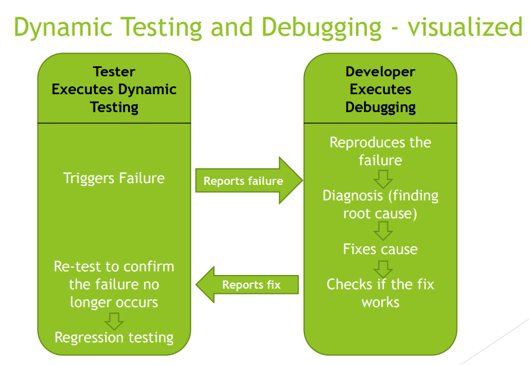
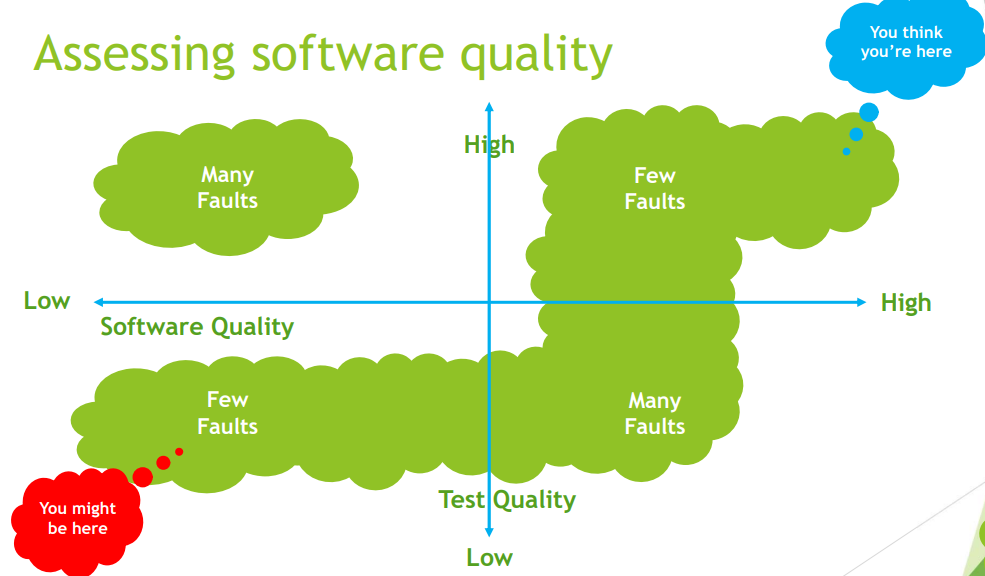

[🔙 Back to Index](../index.md)

# Introduction
## What is Software Testing?

* The process in the SDLC that evaluates the quality of a component, system or related work products:
  * Meets the business and technical requirements that guided its design and development
  * Works as expected
  * Can be implemented with the same characteristics
  
* Software Testing:
  * Assesses the quality of the software
  * Reduces the risk of software failure in operation

## Misconceptions about Software Testing
* **Software testing is a set of activities to discover defects and evaluate the quality of test
objects**

* **Misconceptions**:
  * Only focused on executing tests
  * Only focused on verifying the test object
    * Also involves validation
  * Can be fully automated
    * It is an intellectual process and it requires:
      * Specialised knowledge
      * Use of analytical skill
      * Application of critical thinking
  * Proves that the software is correct and has no faults

## Typical Test Objectives

* Evaluate work products
* Triggering failures & finding defects
* Ensuring required coverage of test object
* Reduce risk of software not being of high enough quality
* Verify conformance to requirements
* Verify compliance to contractual, legal/regulatory requirements
* Provide adequate information to stakeholders
* Build confidence in the quality of the test object
* Validate whether the test object is complete and works as expected

## Testing & Debugging
### Testing 
Testing can:
* Trigger failures that are caused by defects (dynamic testing)
* Find defects in the test object (static testing)

### Debugging
* Debugging is an activity that finds, analyses and eliminates the cause of the failure/defect found in dynamic testing
* Debugging a defect found in static testing, debugging is simply removing the
defect, no reproduction or diagnosis is needed.

## Why is testing necessary?
* Helps in achieving agreed upon goals
* NOT limited to the Test Team
* Testing Contributes to success
  * Cost-effective way to find defects
  * Evaluation of quality leads to well-informed decisions
  * Testers represent the users in the development project
  * Can be required (contractually, legally, industry-specific)

### Testing reduces risk
* Reduce risk of software failure in operation by:
  * Being involved in reviews & refinements - prevent defects
  * Working with designers - prevent design defects through early test identification
  * Working with developers - increase understanding of code - reduce code and test defects
  * Verify and validate before production release - detect and fix failures and more effectively fulfill stakeholder requirements

### How much testing is enough?
* **It's never enough**
* When you are confident that the system works correctly
* It depends on the risks for your system
  * Risk of missing important faults
  * Risk of incurring failure costs
  * Risk of releasing untested or under-tested software
  * Risk of losing credibility or market share
  * Risk of missing market window
  * Risk of ineffective over-testing

### Risk Based Testing
* Test time will always be limited
* Use RISK to determine
  * What to test first
  * What to test most
  * How thoroughly to test each item
  * What not to test (this time)
* Use RISK to
  * Allocate the time available for testing by prioritizing testing

**Prioritise tests so that at any time, whenever you stop testing, you have done the best testing in the time available.**
