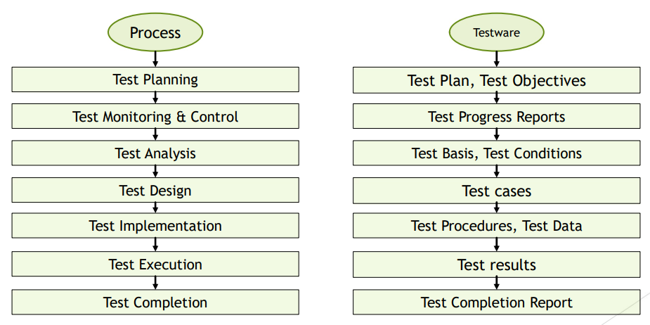
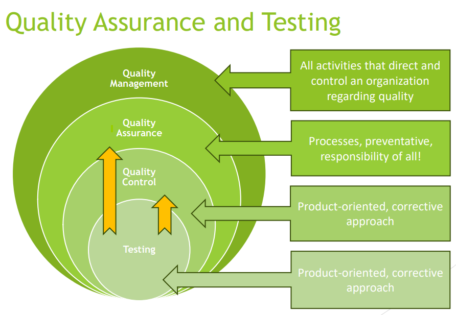
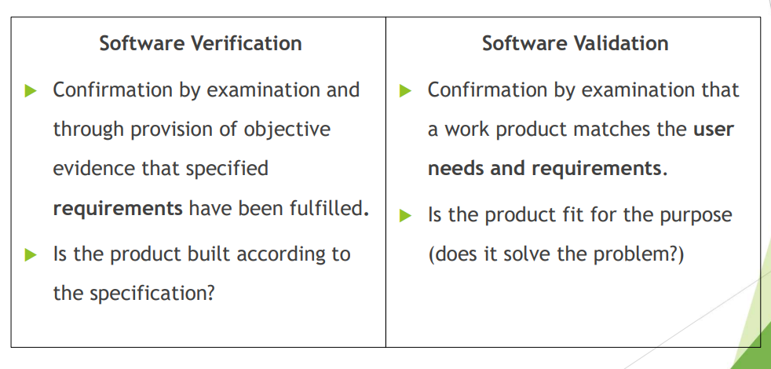
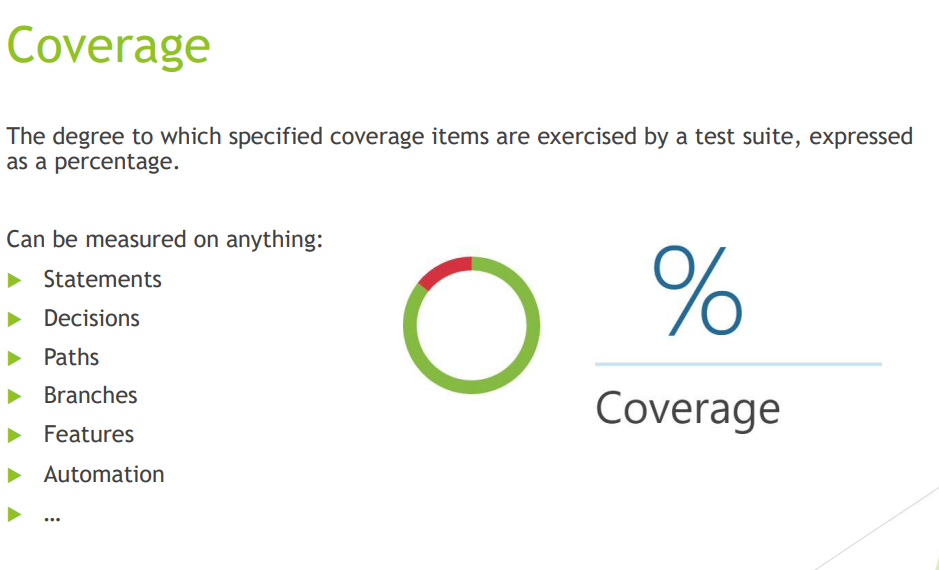

[🔙 Back to Index](../index.md)

# Summary

## Keywords Explained
* Error - A human action (mistake) that produces an incorrect result.
* Defect - An imperfection or deficiency in a work product where it does not meet its requirements or specifications (aka bug, fault)
* Failure - An event in which a component or system does not perform a required function within specified limits.
* Debugging - The process of finding, analyzing and removing the causes of failures in a component or system.
* Root Cause - A source of a defect such that if it is removed, the occurrence of the defect type is decreased or removed.

