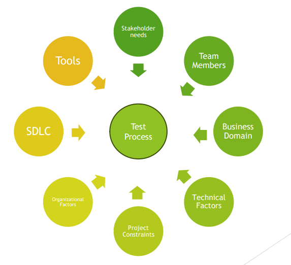
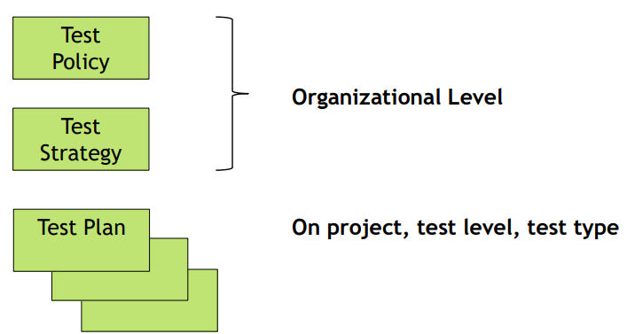

# Test Activities & Testware

### Test Process

* Set of common test activities
* Test strategy should state test process followed
* Not having common test activities = less likely to reach the test objectives
* Decisions on Test Activities are made in Test Planning
* In order to be effective, the need to be fully integrated with development activities

**The essential goal is not to find bugs, but to help fulfill the stakeholder’s business needs**

### Test Process in Context

* Test Strategy
* Test Techniques used
* Degree of Test Automation
* Required Level of Coverage
* Level of Detail of Test Documentation
* Reporting

### Testware

Artifacts produced during the test process required to plan, design, and execute tests, such as documentation, scripts,
inputs, expected results, set-up and clear-up procedures, files, databases, environment, and any additional software or utilities used in testing.

* Created as part of the test activities in the test process
* Each test activity creates test work products (aka testware)
* Types of work products vary as the test process varies
* Much testware can be captured and managed using
  * Test Management Tools
  * Defect Management Tools

Proper Configuration Management should be in place to ensure thorough and consistent testware

### Fundamental Testware

### Fundamental Test Process

## Test Activites & Testware - Test Planning

### Test Planning – Test Activities and Tasks

* Define objectives of testing
* Selecting approach that best achieves objectives
* Starts at the beginning of the software development project
* Must regularly be checked and may be updated and adjusted based on feedback from the monitoring & control activities

### Test Planning – Testware

* Test Plan(s)
* Includes Information on
  * Test Basis
  * Traceability information
  * Exit Criteria (that's used in test monitoring & control)

### Test Plan - ISO/IEC/IEEE 29119 Standard

| Item                            | Details                                                                                              |
|---------------------------------|------------------------------------------------------------------------------------------------------|
| Context of testing              | Type of Test Plan Test Items Test Scope Assumptions and Constraints Stakeholders |
| Testing Lines of Communication  |                                                                                                  |
| Risk Register                   | Risks                                                                                                |
| Testing Activites and Estimates |                                                                                                      |
| Staffing                        | Roles Tasks Responsibilites Training Needs Hiring Needs                          |
|                                 |                                                                                                      |