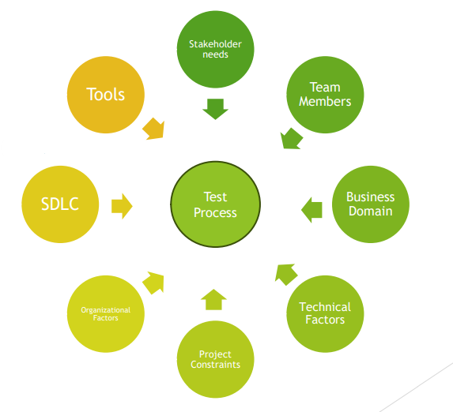
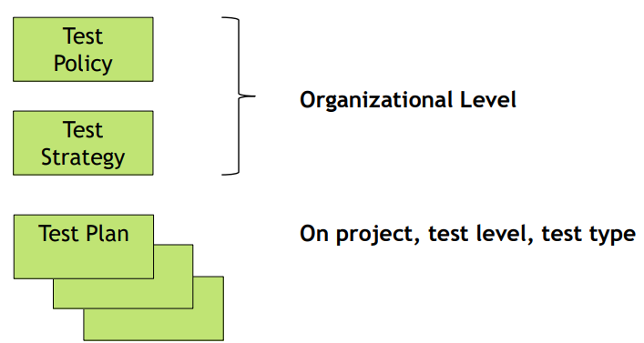

[🔙 Back to Index](../index.md)

# Test Activities & Testware

### Test Process

* Set of common test activities
* Test strategy should state test process followed
* Not having common test activities = less likely to reach the test objectives
* Decisions on Test Activities are made in Test Planning
* In order to be effective, the need to be fully integrated with development activities

**The essential goal is not to find bugs, but to help fulfill the stakeholder’s business needs**

### Test Process in Context

* Test Strategy
* Test Techniques used
* Degree of Test Automation
* Required Level of Coverage
* Level of Detail of Test Documentation
* Reporting

### Testware

Artifacts produced during the test process required to plan, design, and execute tests, such as documentation, scripts,
inputs, expected results, set-up and clear-up procedures, files, databases, environment, and any additional software or utilities used in testing.

* Created as part of the test activities in the test process
* Each test activity creates test work products (aka testware)
* Types of work products vary as the test process varies
* Much testware can be captured and managed using
  * Test Management Tools
  * Defect Management Tools

Proper Configuration Management should be in place to ensure thorough and consistent testware

### Fundamental Testware

### Fundamental Test Process

## Test Activities & Testware - Test Planning

### Test Planning – Test Activities and Tasks

* Define objectives of testing
* Selecting approach that best achieves objectives
* Starts at the beginning of the software development project
* Must regularly be checked and may be updated and adjusted based on feedback from the monitoring & control activities

### Test Planning – Testware

* Test Plan(s)
* Includes Information on
  * Test Basis
  * Traceability information
  * Exit Criteria (that's used in test monitoring & control)

### Test Plan - ISO/IEC/IEEE 29119 Standard
| Item                            | Details                                                                                                                                                                                                                                                                                                                          |
| ------------------------------- | -------------------------------------------------------------------------------------------------------------------------------------------------------------------------------------------------------------------------------------------------------------------------------------------------------------------------------- |
| Context of testing              | Type of Test Plan Test Items Test Scope Assumptions and Constraints Stakeholders                                                                                                                                                                                                                             |
| Testing Lines of Communication  | -                                                                                                                                                                                                                                                                                                                                |
| Risk Register                   | Risks                                                                                                                                                                                                                                                                                                                            |
| Testing Activites and Estimates | -                                                                                                                                                                                                                                                                                                                                |
| Staffing                        | Roles Tasks Responsibilites Training Needs Hiring Needs                                                                                                                                                                                                                                                      |
| Schedule                        | -                                                                                                                                                                                                                                                                                                                                |
| Test Strategy (of the project)  | Test Sub-processes Test Deliverables Test Design Techniques Test completions criteria Metrics to be collected Test Data requirements Test Environment requirements Retesting & regression testing Suspension & resumption criteria Deviations from the organisational test strategy |

## Test Activities & Testware - Test Monitoring & Control
### Test Monitoring & Control - Test Activities and Tasks
#### Test Monitoring
* **Ongoing** check of all test activities
* **Ongoing** comparison of actual progress vs the test plan using metrics

#### Test Control
* Taking actions needed to meet the objectives of testing
* Updating the Test Plan according to feedback

#### Monitoring and Control are supported by the evaluation of exit criteria (definition of done), which may include:
* Checking of test results and logs against coverage criteria
* Assessing component or system quality based on the test results and logs
* Determining if more tests are needed

**Progress, deviations and information needed to determine to stop testing is reported in Test Progress Reports, Documentation of Control Directives and Risk information**

### Test Monitoring & Control - Testware
* Various type of **Test Reports** such as:
  * Test Progress Reports
  * Test Summary Reports
  * Documentation of Control Directives
  * Risk Information
* These reports provide relevant information on the test progress and a summary of test execution results 

### Test Progress Report – ISO/IEC/IEEE 29119 Standard
* Reporting Period
* Progress against the test plan
* Factors blocking progress
* Test Measures
* New and changed risks
* Planned testing

## Test Activities & Testware - Test Analysis
### Test Analysis - Test Activities and Tasks
* Answers "what to test?" using measurable coverage criteria
* Major activities are:

  1. Analysing the test basis to:
    * Identify testable features
    * Test basis include Requirement Specifications, Design and Implementation information, implementation of the component itself, Risk Analysis reports, etc.
  
  2. Evaluating the Test Basis and test objects to identify defects and their testability such as:
     * Ambiguities
     * Omissions
     * Inconsistencies
     * Inaccuracies
     * Contradictions
     * Redundant statements
     
  3. Defining & Prioritizing test conditions, their risks and risk levels per feature based on:
     * Analysis of the Test Basis
     * Consideration on functional, non-functional and structural characteristics
     * Business & technical factors
     * Levels of risk

     Black Box, White Box and Experience Based test techniques can be useful in Test Analysis to define more precise and accurate test conditions and not miss important test conditions

### Test Analysis - Testware
* Defined and prioritised test conditions (such as Acceptance Criteria)
* Defect reports regarding defects in the test basis

### Test Design Specification – ISO/IEC/IEEE 29119 Standard
| Item            | Details                                                                                          |
|-----------------|--------------------------------------------------------------------------------------------------|
| Feature Sets    | Overview Unique Identifier Objective Priority Specific Strategy Traceability |
| Test Conditions | Overview Unique Identifier Description Priority Traceability                     |

## Test Activities & Testware - Test Design
### Test Design - Test Activities and Tasks
* The test conditions are used to create high level test cases and other testware, often involving test design techniques
* Answers "How to test?"
* Includes the following major activities:
  * Identify coverage items
  * Designing test cases and sets of test cases
  * Defining the test data requirements to support test cases
  * Designing the test environment
  * Identifying required infrastructure and tools
* Identification of defects during Test Design is a potential benefit

#### A good test case is:
* Effective - finds faults
* Exemplary - represents others
* Evolvable - easy to maintain
* Economic - cheap to use

#### Abstract (logical) vs Concrete test cases
**Example:**
* Application for calculating end-of-year bonuses
* Bonuses depend on the time employees work for the company

  |Time at Company|Bonus|
  |--|--|
  |Less than 3 years|0%|
  |More than 3 years|50%|
  |More than 5 years|75%|
  |More than 8 years|100%|

**Abstract (logical) test case**

|Test Case #|Input x (time in company|Bonus|
|-|-|-|
|1|x<=3|0|
|2|3<x<=5|50|
|3|5<x<=8|75|
|4|x>8|100|

**Concrete test case**

|Test Case #|Input x (time in company|Bonus|
|-|-|-|
|1|2|0|
|2|4|50|
|3|7|75|
|4|12|100|

### Test Design - Testware
* Prioritised test cases and sets of test cases
* Other work products may include:
  * Test Charters
  * Coverage Items
  * Test environment requirements
  * Test data requirements
* Good practice to first design high level (abstract) test cases:
  * Without concrete values for input & expected output
  * Can be reused across multiple test cycles with different data
* Each test case should be bi-directionally traceable to the test conditions it covers

### Test Case Specification – ISO/IEC/IEEE 29119 Standard
| Item            | Details                                                                                                                                         |
|-----------------|-------------------------------------------------------------------------------------------------------------------------------------------------|
| Test Coverage Items   | Overview Unique Identifier Description Priority Traceability                                                                    |
| Test Cases | Overview Unique Identifier Objective Priority Traceability Preconditions Inputs Expected Results Actual Results |

## Test Activities & Testware - Test Implementation
### Test Implementation – Test Activities and Tasks
* In the test implementation phase, testware necessary for test execution is created/acquired
* ‘Do we now have everything in place to run the tests?’

Ideally, all these tasks are completed before test execution as otherwise precious test execution time might be lost on test implementation tasks.

* Includes the following major activities:
  * Organising test cases into priorities test procedures
  * Creating test suites needed for test execution
  * Arranging test procedures within a test execution schedule for efficient execution
  * Creating manual and automated test scripts
  * Building and verifying the test environment
  * Preparing test data 
  * Verifying and updating bidirectional traceability between the test bases, test conditions, test cases, test procedures and test steps

### Test Implementation – Testware
* Testware coming from the test implementation phase include:
  * Test procedures
  * Manual and automated test scripts
  * Test suites
  * Test execution schedule
  * Test data
  * Test environment elements e.g:
    * Stubs
    * Drivers
    * Simulators
    * Service virtualizations

### Test Procedure Specification – ISO/IEC/IEEE 29119 Standard
| Item            | Details                                                                                                                                                                     |
|-----------------|-----------------------------------------------------------------------------------------------------------------------------------------------------------------------------|
| Test Coverage Items   | Overview Unique Identifier Objective Priority ContentsTraceability                                                                                          |
| Test Cases | Overview Unique Identifier Objective Priority Test cases to be executed (Traceability) Start-up Reationships to other procedures Stop & wrap-up |

### Test Data Requirements – ISO/IEC/IEEE 29119 Standard
* Overview
* Unique Identifier
* Description
* Responsibility
* Period needed
* Resetting needs
* Archiving or disposal

### Test Environment Requirements – ISO/IEC/IEEE 29119 Standard
* Overview
* Unique Identifier
* Description
* Responsibility
* Period needed

## Test Activities & Testware - Test Execution
### Test Execution – Test Activities and Tasks
* Tests are run in accordance with the test execution schedule
* Includes the following major activities:
  * Executing tests in the planned sequence (manual or automated)
  * Comparing actual with expected results and log anomalies as incidents
  * Analysing anomalies to find out their likely causes (defects, false positives, false negatives)
  * Logging the test results (pass, fail, blocked, etc.)
  * Repeating test activities when incidents are solved (confirmation test, run corrected test, regression test)

### Test Execution – Testware
* Work products include: 
  * Test logs
  * Defect reports
* Status of each element of the test basis can be determined and reported on via bidirectional traceability with the associated test procedures

### Test Environment Requirements – ISO/IEC/IEEE 29119 Standard
* Overview
* Unique Identifier
* Time
* Description
* Impact

### Incident Report – ISO/IEC/IEEE 29119 Standard
* Overview
* Timing information
* Originator
* Context
* Description of the incident
* Originator’s assessment of the severity
* Originator’s assessment of the priority
* Risk
* Status of the incident

## Test Activities & Testware - Test Completion
### Test Completion – Test Activities and Tasks
* Collect data from completed test activities to consolidate experience, testware and other relevant information
* Includes the following major activities:
  * Checking whether all defects reported and closed, entering change requests or backlog items for any unresolved defects
  * Archiving or handing over testware to maintenance teams, other project teams or stakeholders
  * Shutting down test environment to an agreed state
  * Analysing lessons learned to determine changes needed
  * Creating a test completion report and communicating it to stakeholders
* Activities occur at project milestones such as release, completion or cancellation of the test project, an Agile project iteration is finished, a test level is completed or a maintenance release has been completed

### Test Completion – Testware
* Work products include:
  * Test Completion Report
  * Action items for improvement
  * Documented lessons learned
  * Change requests or Product Backlog Items

### Test Completion Report – ISO/IEC/IEEE 29119 Standard
* Introduction
  * Scope
  * References
  * Glossary
* Testing performed
  * Summary of testing performed
  * Deviations from planned testing
  * Test completion evaluation
  * Factors that blocked progress
  * Test measures
  * Residual risks
  * Test deliverables
  * Reusable test assets
  * Lessons learned