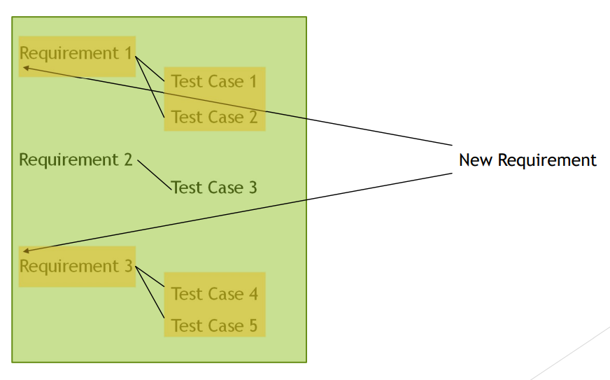

[🔙 Home](../home.md)

# Traceability
### Traceability between Test Basis & Test Work Products
* Traceability between each element of the test basis & testware associated with these elements is needed for effective test monitoring & control
* Traceability enables:
  * The evaluation of test coverage
    * Traceability of test cases & requirements – verify that requirement are covered by test cases
    * Traceability of test cases & risks – evaluate level of residual risk in a test object
  * Analysing the impact of changes
  * Facilitate test audits
  * Meeting IT governance criteria
  * Improved clarity of test progress reports & test summary reports
  * Communicating technical testing aspects to stakeholders in an understandable way
  * Providing information to assess product quality, product capability & project progress against business goals

### Traceability - Example
* Assume a highly complex, existing system with millions of lines of code
* 1 module (X) deals with complex algorithms, forecasting events on aircraft
* Executing the full regression suite for Module X takes 1 day, for all modules (A, B, C & X) it takes 5 days
* Information from the ‘base’ modules A, B & C is used in this module X
* Some information from Module X is used in the base modules
* Without traceability, with any change in any of these modules, all would need to be tested with the entire regression suite
* Traceability enables narrowing down the effect of a change so that no unnecessary tests are done.

### Traceability - Example 2 
