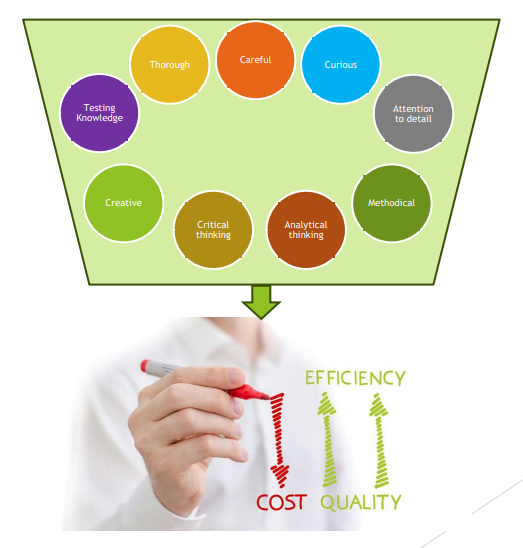
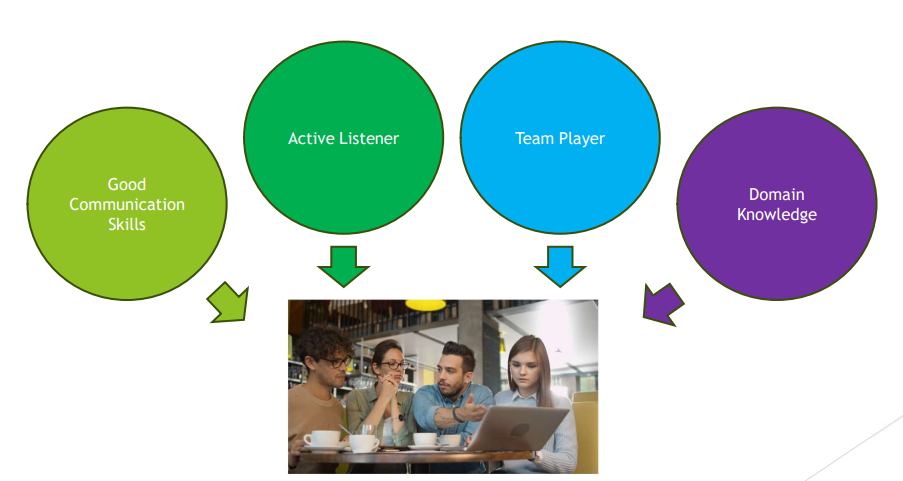

[🔙 Back to Index](../index.md)

# Generic Skills Required for Testing

### Increasing Effectiveness of Testing

### Increasing Efficiency of Testing

### Communication with Stakeholders

### (Don’t) Shoot the Messenger
Keep in mind:
* Confirmation bias
* Collaboration and teamwork instead of battles
* Stay objective and factual, not focused on the person
* Try to understand the way the other person feels and reacts
* Be sure the other person understood what you have said
* Clear test objectives influence plans and individual behaviour