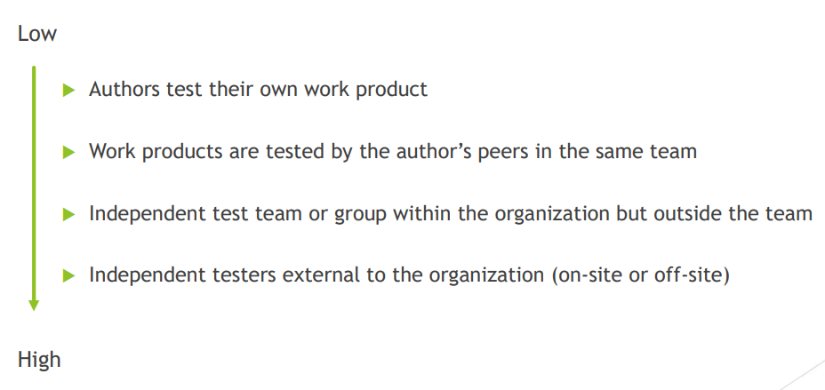

[🔙 Back to Index](../index.md)

[🔙 Back to Index](../index.md)

# Independence of Testing

### Points of Attention
* Usually best to test with multiple levels of independence. For example:
  * Developers perform component and component integration testing 
  * Test team performs system and system integration testing 
  * Business representative performs acceptance testing
* Testing can be done by testers or by people in other roles
* Independence often makes testers more efficient
* Independence should not be confused with familiarity
* Independence of testing can be implemented in many ways

### Benefits
* Likely to recognise different kind of failures compared to developers
* Independent tester can verify, challenge or disprove assumptions made by stakeholders in specification and implementation

### Risks
* Isolation from the development team
* Developers may lose sense of responsibility for the quality
* Independent testers may be seen as bottlenecks or blamed for delays in releases
* Independent testers may lack some important information about the test object