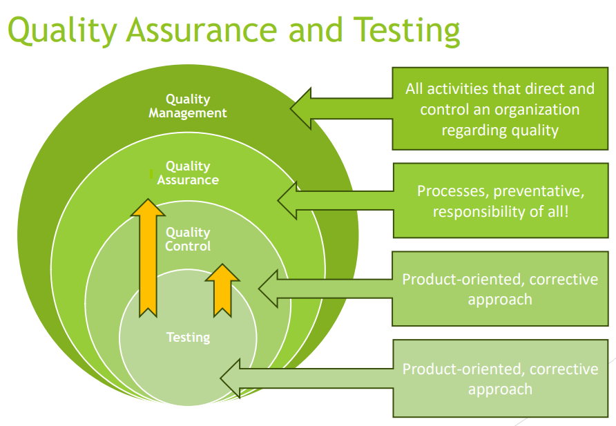
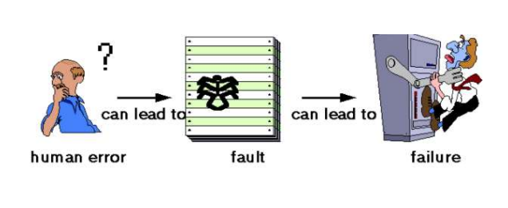
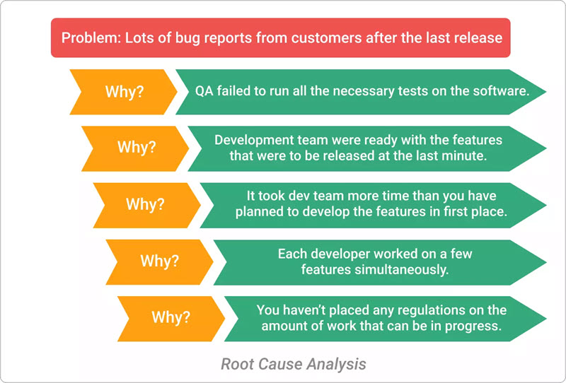

[🔙 Home](../home.md)

# Testing & Quality Assurance

## Errors, Defects, Failures & root causes
### Terms Explained
* **Error**: a human action that produces an incorrect result
* **Defect**: a manifestation of an error in a software work product
  * aka a fault or bug 
  * if executed, a defect _may_ cause a failure
* **Failure**: deviation of the software from its expected delivery or service

### Why do defects occur?
* Humans make mistakes
  * Time pressure
  * Complexity of products, processes, infrastructure, technologies
  * Miscommunication
  * Misunderstanding
  * Lack of experience
  * Lack of skill
* Bad assumptions & blind spots
  * We might make the same mistakes when we check our own work as we made when we did it.
    So we may not notice the flaws in what we have done - important to get someone else to review.

### Where do defects occur?
* Documentation
  * Requirements specs
  * Test scripts
* Source code
* Supporting Artifacts

Defects can be found in any stage of the SDLC in any work product.
**The earlier they are found, the cheaper they are to fix.**

### Reliability vs Faults
* Reliability: the probability that software will not cause failure of the system
  for a specified time under specified conditions

* Not each unexpected test result is a failure – the test itself can result in:
  * False negatives
  * False positives

### Root causes of defects & their impact
* Root cause
  * A fundamental reason for the occurrence of a problem
  * Earliest action / condition that created a defect
  * Should be identified to avoid similar defects
  * Root Cause Analysis can lead to process improvements to prevent defects
* Identifying Root Cause
  * 5 Why's
