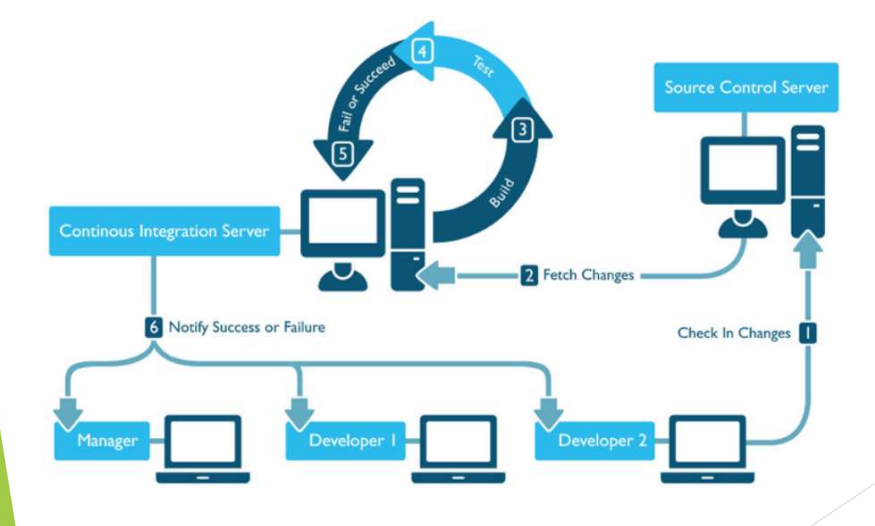
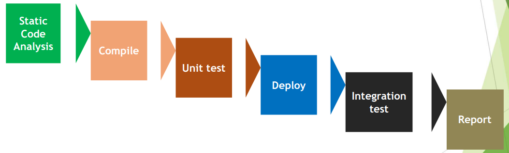

[🔙 Home](../home.md)

# Continuous Integration
### Continuous Integration - Visualised

### Continuous Integration Process
After coding, debugging & check-in of code in source control the automated CI process kicks off

### CI - Continuous Automated Testing 
* Build & test process – on daily basis – integration issues found early & quickly
* Tests run daily – feedback on code quality is sent to the team
* Test results are visible to all team members – especially with automated reports
* Regression testing can be continuous throughout the iteration
* Good coverage in regression tests helps to build large integrated systems
* Regression automation creates time for the testers to concentrate manual testing on:
  * New Features
  * Implemented Changes
  * Confirmation testing of defect fixes

### CI - Continuous Quality Control
Automated build tools are used to:
* Run Unit & Integration tests
* Run static & dynamic tests
* Measure & profile performance
* Extract & format documentation from the source code
* Facilitate manual quality assurance processes

Objectives are to:
* Improve the quality of the product
* Reduce the time to deliver (no longer quality control AFTER the development is done)

### CI – Automatic Deployments
Build tools are often linked to automatic deployment tools, which:
* Fetch the appropriate build from the CI or build server
* Deploy this build into one or more environments:
  * Development
  * Test
  * Staging
  * Production

This process reduces errors & delays associated with having to rely on
specialised staff or programmers to install releases.

### CI - Possible Benefits
* Allows earlier detection & root cause analysis of integration problems
* Gives the development team regular feedback on whether the code is working 
* Keeps the version of the software being tested within a day of the version being developed
* Reduces regression risk associated with developer code being refactored
* Provides confidence that each day’s development work is based on a solid foundation
* Makes progress toward the completion of the product increment visible
* Eliminates the schedule risks associated with big-bang integration 
* Provides constant availability of executable software throughout the sprint
* Reduces repetitive manual testing activities 
* Provides quick feedback on decisions made to improve quality & tests 

### CI - Risks & Challenges
* Continuous integration tools have to be introduced & maintained
* The continuous integration process must be defined & established
* Test automation requires additional resources & can be complex
* Thorough test coverage is essential to achieve automated testing advantages
* Teams sometimes over-rely on unit tests & perform too little system and
  acceptance testing 

Tools are needed for Continuous Integration:
* Testing
* Automating the build process
* Version control