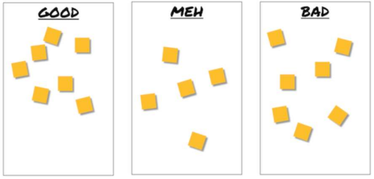

[🔙 Home](../home.md)

# Retrospectives and Process Improvements

### Retrospectives explained
* A meeting at the end of each project milestone
  * What went well?
  * What can be improved?
  * How to keep the good and improve the bad in the future?
* Timing and organization fully depends on the SDLC model
* Participants include developers, testers, architects, product owners, business analysts, etc
* Topics include:
  * Process
  * People
  * Organisations
  * Relationships
  * Tools

### Retrospectives - Benefits
* Better self-organisation
* Continuous improvement of development and testing
* Test-related improvements focused on:
  * Increased test effectiveness and efficiency
  * Increased quality of testware
  * Team bonding and learning
  * Improved quality of the test basis
  * Better cooperation between developers and testers
* Better testability of:
  * Applications
  * User stories
  * Features
  * System interfaces

### Retrospectives - Effectivity
* The number of improvements should be limited to allow for continuous improvement
* The results should be recorded and can be part of the test completion report
* Recommended improvements should be followed up
* The meeting is run by a facilitator
* Should occur in an environment based on trust
* All team-members can provide input on both testing and non-testing activities
* Testers play an important role in retrospectives due to:
  * Testers are part of the team
  * Testers have a unique perspective
  * Testing occurs in each sprint and contributes to success

### Retrospectives – Success Factors
* Defects found are welcomed and expressed objectively
* People issues and psychological aspects are dealt with
* Checklists or roles are used if appropriate
* Training is given in techniques used
* Management support