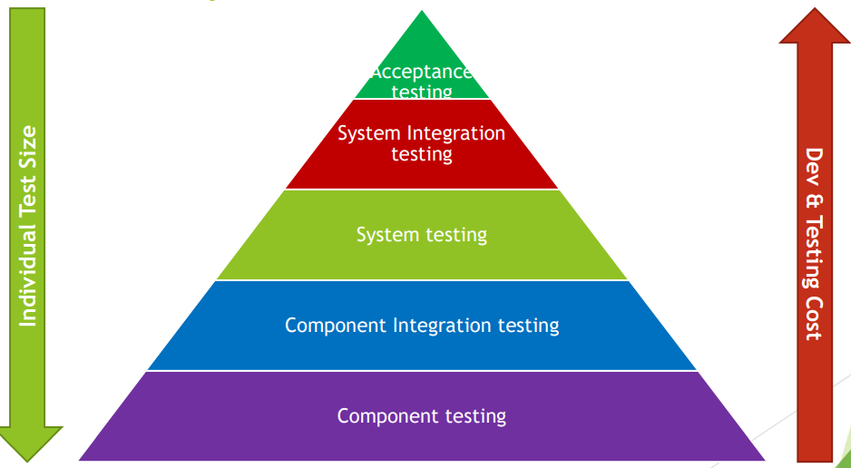

[🔙 Home](../home.md)

# Test Levels
* Groups of test activities that are organised and managed together
* Performed in relation to software at a given level of development
* Identify missing areas and prevent overlap and repetition of tests in the SDLC
* Implementation of Test levels depends on the SDLC
* Test levels described are:
  * Component testing
  * Component Integration testing
  * System testing
  * System Integration Testing
  * Acceptance testing
* Each test level requires a suitable test environment
* Each test level has certain attributes:
  * Specific Objectives **Why**
  * Test Basis **Deriving Test Cases**
  * Test Object **What**
  * Typical defects and failures **What to expect**
  * Specific approaches and responsibilities **How to achieve the objectives**

### The Test Pyramid
