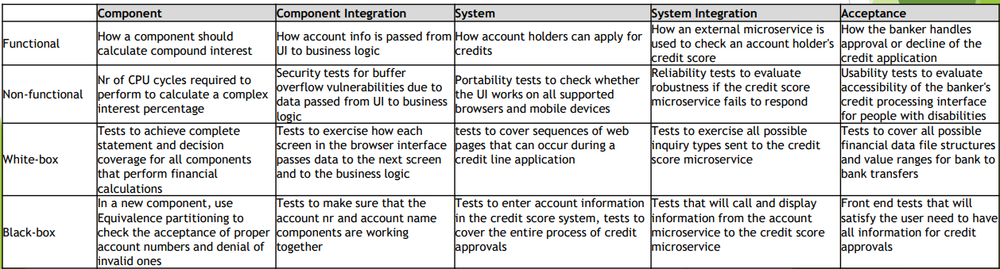

[🔙 Back to Index](../index.md)

# Test Types
A group of test activities aimed at specific characteristics of a software system or a part of the system. A test type is based on specific test objectives:
* Evaluating the functions the system or component should perform
* Evaluating non-functional quality characteristics
* Checking the system’s behaviour against its’ specifications
* Cover the underlying structure by the tests to an acceptable level

### Functional Testing
* Checking the functional completeness, functional correctness and functional appropriateness
* Evaluates the functions the system should perform
* The functions are ‘**what**’ the system does 
* Mostly described in business requirement specs, epics, user stories, use cases
* Thoroughness can be measured through functional coverage
* May involve specific skills or knowledge:
  * Domain
  * Particular role the software serves

### Non-Functional Testing
* Checking the non-functional software quality characteristics
* Non-functional testing tests ‘**how well**’ the system behaves
* Mainly derived from functional tests
* Thoroughness can be measured through non-functional coverage
* Includes the following classification: performance efficiency, compatibility, usability, reliability, security, maintainability, portability (amongst others)
* May involve specific skills or knowledge:
  * Weaknesses of a design or technology
  * Particular use base

### Black-box Testing
* Checking the system’s behaviour against its’ specifications
* Specification-based test type
* Tests are derived from documentation external to the test object (specification documents, user stories, etc)
* Considers the **external** behaviour of the software

### White-box Testing
* Cover the underlying structure by the tests to an acceptable level
* Structure-based test type
* Tests are derived from the system’s internal structure or implementation (code, architecture, work-flows, data flows, etc)
* Considers the **internal** behaviour of the software
* Measuring the thoroughness of testing through assessment of coverage of a type of structure – Code coverage
* Tools can be used to measure the code coverage of elements (like statements or decisions)

### Examples
