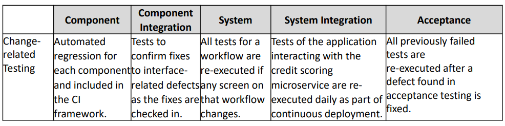

[🔙 Home](../home.md)

# Confirmation Testing & Regression testing

### Confirmation Testing
May include functional, non-functional & structural testing & is performed at all test levels

* Confirmation testing (re-testing)
  * Confirms that a defect has been successfully fixed
  * The software version (including the fix) can be tested in several ways (based on RISK)
    * Re-executing all test that failed before because of the fixed defect
    * Adding new tests to cover any needed changes that were needed to fix the defect
  * Might have introduced or uncovered different defects elsewhere in the software
  * Might only be following the steps to trigger the failure & checking it does not occur (time, money)

### Regression Testing
* Confirms that a change has not caused adverse consequences in others areas
* Re-testing previously passed tests to prevent changes having caused defects in the component, other components, different systems or even the environment; to prevent the system from ‘regressing’
* Impact Analysis needed to identify potentially impacted areas on all test levels
* Regression test suites are created & executed when the software or environment are changed
* As these tests evolve slowly, increase constantly & are run many times, they are a good candidate for automation
* Regression automation should start as early as possible – possibly in CI pipelines

### Change-Related Testing - Example
* System testing has started & Tester finds a failure halfway through the system test
* Developer fixes the underlying defect & deploys it to the test environment
* Activities that should be done include:
  *  **Impact Analysis** to identify affected areas
  * Decide whether to re-execute that previously failed tests or add new tests
  * A confirmation test to make sure that the failure was indeed fixed
  * Targeted regression tests on previously passed tests
