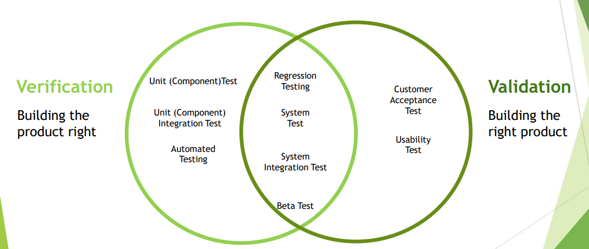

# Verification vs Validation

| Software Verification                                                                         | Software Validation                                                                                          |
|-----------------------------------------------------------------------------------------------|--------------------------------------------------------------------------------------------------------------|
| Evaluating a work product, component or system to determine whether it meets requirements set | Evaluating a work product, component or system to determine whether it meets the user needs and requirements |
| Is the product built according to specification?                                              | Is the product fit for the purpose (does it solve the problem?)                                              |

## Verification vs Validation - Visualized
