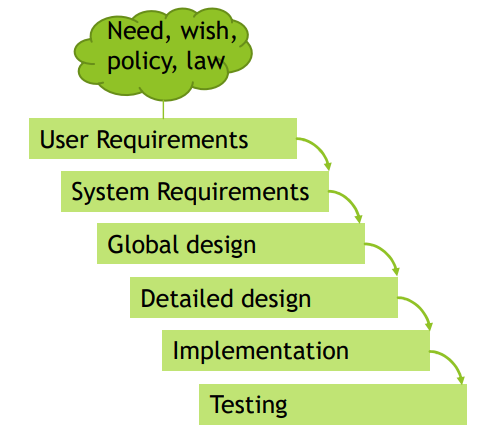
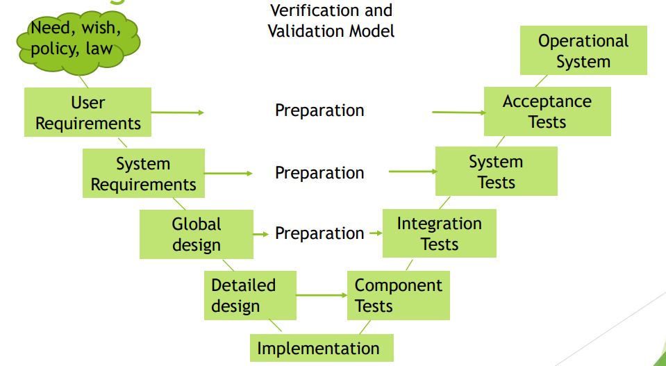
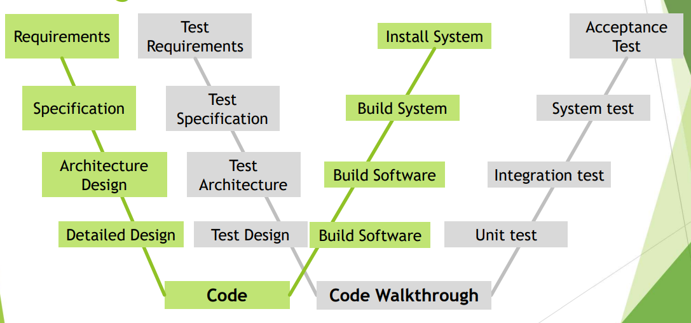

[🔙 Home](../home.md)

# Sequential Models

### Testing in Sequential Models

* Entire system is built at once
* Strict sequence of activities
  * Define
  * Implement
  * Test
* Each phase must be finished before the next phase starts
* Testers start participating in requirement reviews, test analysis and test
  design
* Dynamic testing cannot start early in the SDLC

## Testing in the Waterfall model

### Issues
* Testing at the end of the coding process
* Defects detected close to implementation
* Difficult to pass feedback up the waterfall

## Testing in the V-model

### Advantages of the V-model
* Simple and easy
* Systematic
* Easy to track
* Testing starts from requirement phase
* All the functional areas can be covered
* Instructions and recommendations included
* Detailed explanations of problems
* Defects can be found at an early stage
* Works well for small projects

### Disadvantages of the V-model
* Not flexible
* Regular updates required if the project changes
* Can’t be used in complex projects
* No scope for risk management and mitigation
* It ends when the project is over

## Testing in the W-model

### Advantages of the W-model
* Testing can run in parallel with development process
* No division between development and testing tasks – all are integrated
* Often developer are responsible for removing defects

### Disadvantages of the W-model
* Complex to implement
* Resource allocation might not be sufficient in most of the cases
* Testing has equal weight as many activities in the development process