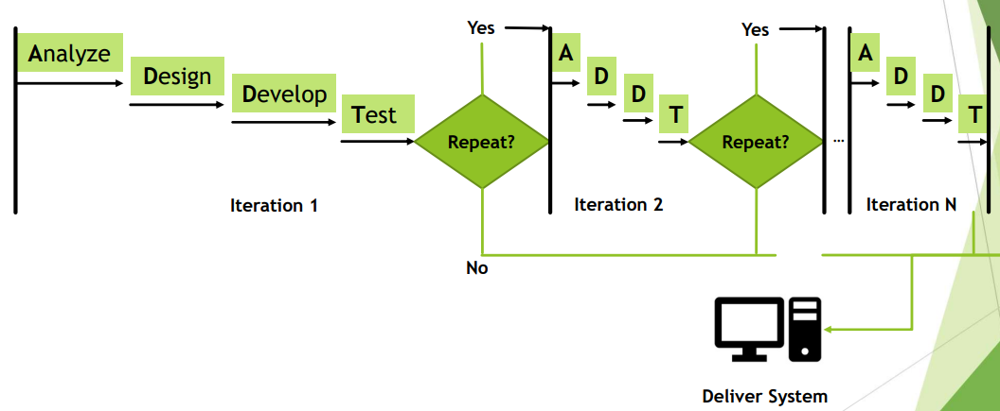
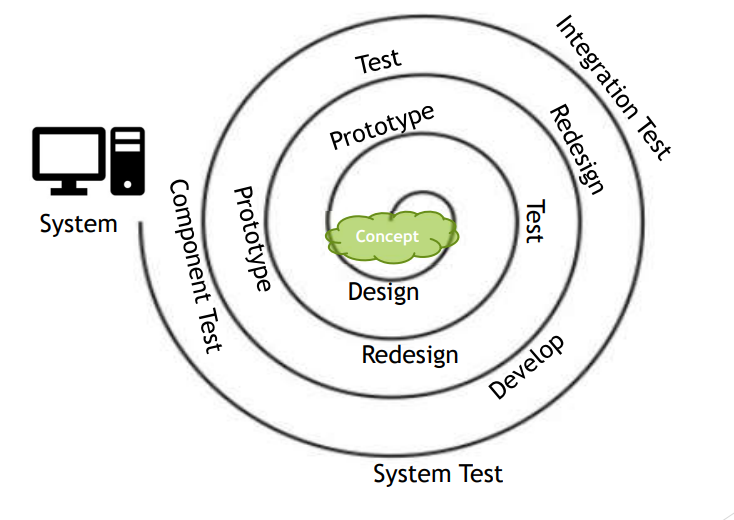

# Incremental and Iterative Models

## What is Incremental development?
* The system is not built in one go, but in pieces
* These pieces are called ‘product increments’
* Generally, after each iteration there should be an increment or working prototype delivered 
* The features in the software grow ‘incrementally’
* Each part of the process is done in pieces:
  * Establishing requirements
  * Designing
  * Building
  * Testing

### Incremental development visualized

## What is Iterative development?
* Builds are provided in iterations
* Each iteration involves cross-functional teams working simultaneously on the different phases
* End of each iteration is a shippable product
* In each iteration, static and dynamic testing may be done on ALL test levels
* Fast feedback and extensive regression testing is needed for frequent delivery of increments

### Iterative development visualized

## Testing in Spiral Models
* Early prototypes are used to design the system
* Development work passes through a sequence of prototypes that are:
  * Tested
  * Redesigned
  * Reprototyped
  * Retested
  * … 
  * Until all design decisions have been proven by testing
* Most useful on projects with a large number of unknowns

## Unified Process
