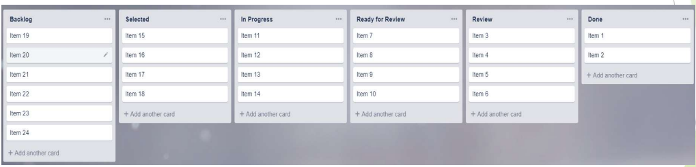

# Agile Software Development

## The Fundamentals of Agile Software Development 
### The Agile Manifesto
* **Individuals and interactions** _over_ processes and tools 
* **Working software** _over_ comprehensive documentation
* **Customer collaboration** _over_ contract negotiation
* **Responding to change** _over_ following a plan 

The Agile manifesto values the concepts on the right, but believes the ones on the left have greater value

### Individuals and Interactions
* Agile is people-centred
* Teams build software
* Continuous communication and interaction enable teams to work most effectively
* Processes and tools are important, but not as important as people and communication

### Working Software
* Customers do not care about detailed documentation
* Working software is more useful and valuable
* Enables rapid feedback to the development team
* Availability of working software can result in time-to-market advantage
* Agile development is especially useful in:
  * Fast-changing business environments
  * Environments where problems and solutions are unclear
  * Environments where the business wants to innovate in new problem domains

### Customer Collaboration
* Customer finds it difficult to specify requirements
* Working strictly on the original requirements might end up with useless software
* Collaboration results in better understanding of what the customer wants
* Contracts are important, working closely together with customers is more likely to bring success

### Responding to Change
* Change is inevitable and should be responded to
* Flexibility is more important than sticking to the plan
* Smart and flexible planning is needed
* Many factors can have a major influence on the project:
  * Environment
  * Business domain
  * Legislation
  * Technological advances

### Whole-Team Approach
* Involving everyone with the needed skills and knowledge to ensure success.
* The team includes customer and other business representatives
* Teams should be relatively small (3-9 people), larger teams to be split up
* Ideally the team shares the same workspace (for communication and interaction)
* Approach is supported through daily stand-up meetings with the entire team
* Promotes more effective and efficient team dynamics
* One of the main ideas behind Agile development

### Early & Frequent Feedback
* Short iterations enable early and continuous feedback on product quality
* If you have to fail, fail fast!
* Agile teams can better implement new changes into the development process
* The team can better focus on features with the highest business value and risk
* Team management is better as the capability is transparent to all:
  * How much work can we do?
  * What could help us go faster?
  * Why are we not doing that then?

### Agile Testing Specifics
* Changes will occur, so:
  * Use lightweight documentation
  * Implement extensive test automation
* Makes Regression testing easier and faster

* Use experience-based testing for manual test activities - not to waste time on extensive test analysis & design

### Agile Approaches – SCRUM

### Agile Approaches – Kanban
Kanban utilizes three instruments
- Kanban Board
- Work-in-Progress Limit
- Lead Time

### Agile Approaches – Kanban vs SCRUM
| **Similarities**                                             | **Differences**                                            |
|--------------------------------------------------------------|------------------------------------------------------------|
| Visualisation of active tasks                                | Iterations (sprints) are optional in Kanban                |
| Transparency on content & progress                           | Deliverables are related item by item instead of a release |
| Inactive tasks are in the backlog                            | Timeboxing is optional unlike in SCRUM                     |
| Tasks placed on the backlog where there's capacity available |                                                            |

### Agile & Testing
#### Benefits
* Focus on working software & good quality code
* Testing as starting point of development
* Business stakeholders accessible
* Whole team responsible for quality
* Simple design is easier to test

#### Challenges
* Less well-documented requirements
* Testers feel less needed as dev does more component testing
* More of a coaching role, can be difficult
* Constant time pressure and less time to think about testing new features
* Regression becomes extremely important and automation more beneficial

