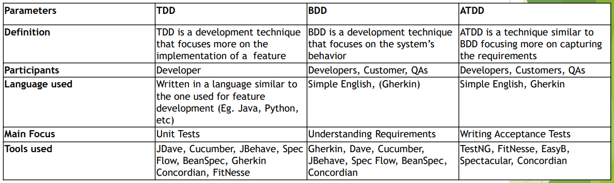

[🔙 Back to Index](../index.md)

# Testing as a Driver for Software Development

### Test-First Development Approaches
Approaches to produce quality products – introduce testing as early as possible:

* Writing tests in advance - before the code
* Focusing on early defect prevention, detection and removal
* Following a shift-left approach
* Ensuring the right types of tests are run at the right time as part of the right test level
* Use automated tests to ensure code quality in future adaptations or code refactoring

**Agile testers play a key role in guiding the use of these testing practises**

### Test-Driven Development (TDD)
* Develop code guided by automated test cases
* Mainly on unit level and code-focused - can also be on system/integration level
* Helps developers focus on clearly expected results
* Tests are automated and used in CI

### Acceptance Test-Driven Development (ATDD)
* Acceptance criteria and tests are defined during the creation of user stories
* Encourages collaboration amongst business, developer and tester
* Every stakeholder should understand how the software component has to behave and what is needed to ensure this behaviour
* ATDD creates reusable tests for regression testing
* Tools support creation and execution of tests (often in the CI process)
* Tools can connect to data and service layers of the application (enabling execution on system or acceptance levels)
* ATDD allows quick resolution of defects and validation of feature behaviour
* Helps determine if the acceptance criteria are met for the feature

**Is the code doing what it is supposed to do?**

### Behaviour-Driven Development (BDD)
* BDD helps developers collaborate with other stakeholders to define accurate tests focused on business needs
* Allows a developer to focus on testing the code based on the desired behaviour
* As tests are based on the desired behaviour, the tests are easier to understand
* Specific frameworks to define acceptance criteria based on the ‘given / when / then’
  format:
  * Given some initial context,
  * When an event occurs,
  * Then ensure some outcomes.
* From these requirements, test cases are automatically translated into executable tests

### TDD vs BDD vs ATDD

