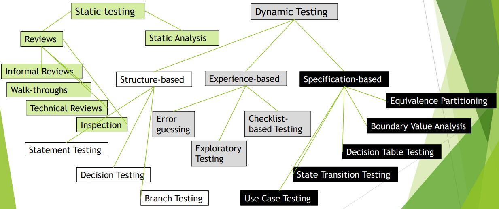
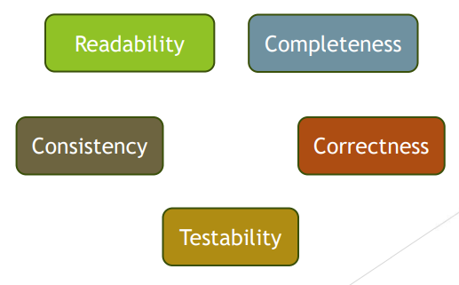

[🔙 Home](../home.md)

# Static Testing
### Testing Techniques - Visualised

### Overview
Testing the software under test **without** executing the software

* Relies on manual examination (reviews) & automated analysis (static analysis)
* Main Objectives:
  * Improving quality
  * Detecting defects
  * Preventing defects from being coded
* Assessing quality characteristics

### Static testing
* Testers, business reps & developers work together in evaluation of work products
* Ensure work products meet the **Definition of Ready**
* Review techniques can be applied to ensure:
  * User stories are complete & understandable & include testable acceptance criteria
  * By asking the right questions, testers explore, challenge & help improve the proposed
    user stories. 

### Work Products Examinable by Static Testing
#### Static testing
Can be used on almost any work product that can be **read** & **understood**:
* Specs & Requirements
* Epics, User Stories & Acceptance Criteria
* Architecture & Design Specs
* Source code
* Testware
* User guides
* Project documentation
* Contracts, project plans, schedules, budgets
* Models (such as activity diagrams)

### Static Testing – When can it NOT be used
* Work Products that can not be read or understood
* Work products that are difficult to interpret by human beings
* Work Products that should not be analysed by tools:
  * Code
  * Models

### Static Analysis
* The process of evaluating a component or system without executing it
* No tests are needed as tools as used
* Often implemented in the CI Framework
* Detect specific code defects
* Evaluate maintainability
* Evaluate security
* Static analysis can be used on any work product:
  * That has a formal structure (mainly code & models)
  * For which an appropriate static analysis tool exists
* Is ideally performed before formal reviews
* Goal is to find defects rather than failures

### Static Analysis by Tools
* Tools analyse program code (e.g. control flow & data flow) as well as generated output (e.g. html, xml)
* Typical defects found are:
  * Referencing a variable with an undefined value
  * Inconsistent interfaces between modules & components
  * Improper declaration of variables
  * Unreachable (dead) code
  * Missing or erroneous logic (e,g, infinite loops)
  * Syntax violations
  * Highly complex functions
  * Programming standards violations
  * Security vulnerabilities

### Static Testing - Benefits
* Early defect detection & correction - Reducing total cost of quality due to fewer failures later in the lifecycle
* More efficient defect detection & correction
* Find defects that are not (easily) found by dynamic testing
* Preventing defects in design or coding
* Increased development productivity
* Reduced development time & cost
* Reduced testing time & cost
* Evaluate the quality of & build confidence in work products
* Improved communication between team members