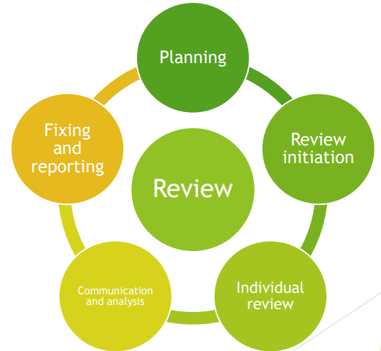
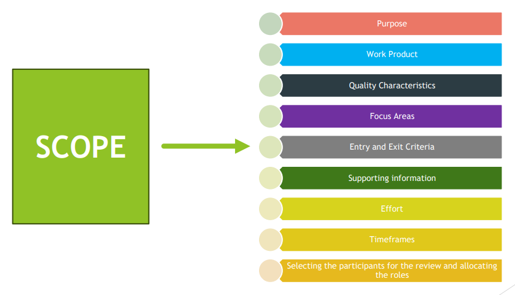
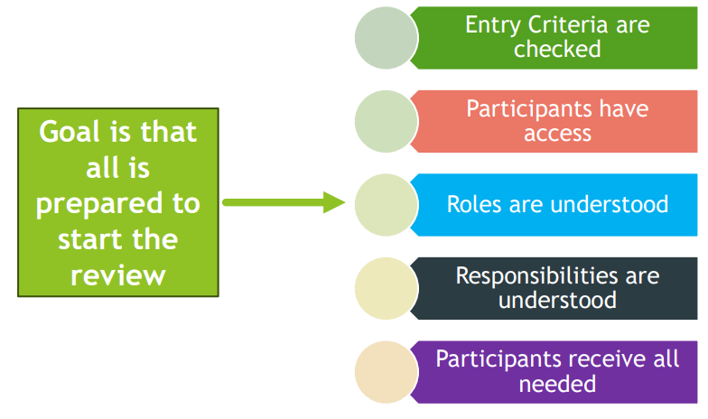
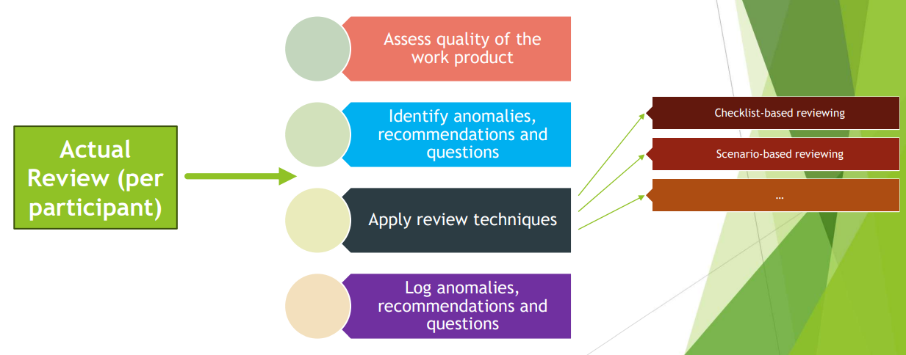
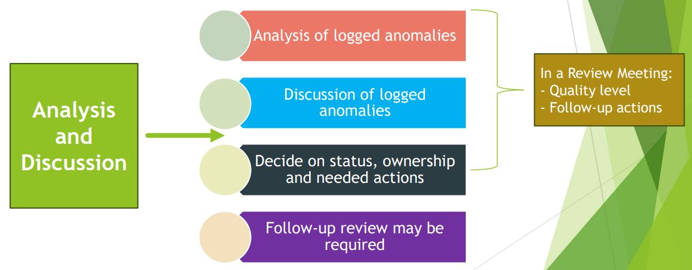
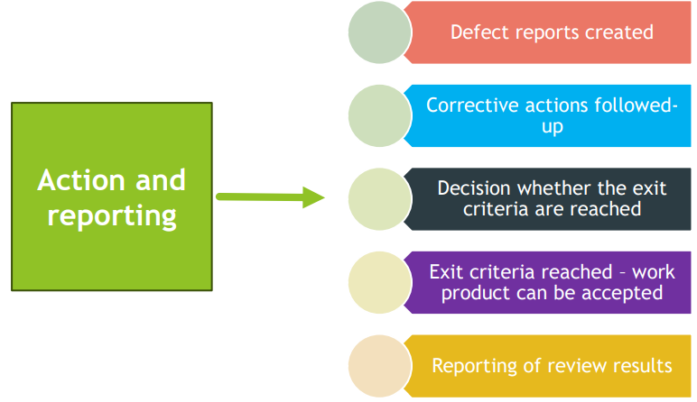
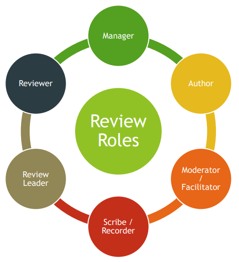

# Feedback and Review Process

## Early & Frequent Feedback
* One of the cornerstones of Agile software development
* ‘Early Testing saves Time and Money’
* The Shift-Left Approach
* Test First approaches
* Continuous Integration
* Continuous Deployment 

If you have to fail, **fail fast!**

### Benefits of Early and Frequent Stakeholder Feedback
* Build the right product through early communication of quality issues
  * Stakeholders have expectations on what will be delivered
  * Expectations based on stakeholder vision **will** change during the project
  * Early and Continuous feedback will identify whether the product meets these expectations
  * If the expectations are not met, this can result in:
    * Expensive reworks
    * Missed deadlines
    * Blame games
    * Project failure
* Focus on the right items by preventing misunderstandings in requirements and priorities
  * Requirements and changes to requirements are often misunderstood
  * The earlier feedback is received on requirements will prevent misunderstandings
  * The team can improve their understanding
  * Focus on the right features
    * Deliver most value to the stakeholders
    * Have the most positive impact on identified risks

## Review Process
* Generic process is structured and flexible
* Any specific review process should be tailored to that specific situation
* More formality results in more tasks per activity
* Not all work products can be covered in one review. Depends on:
  * Size
  * Complexity

### Review Process - Activities

#### Review Process - Planning

#### Review Process – Review initiation

#### Review Process – Individual review

#### Review Process - Communication and analysis

#### Review Process – Fixing and reporting

## Applying Review Techniques
### Types of Review Technique
* Review techniques can be applied in the individual review activity
* Can be used across all the review types 
* Effectiveness of any technique depends on the type of review used
* Review techniques can be:
  * Ad hoc
  * Checklist-based
  * Scenarios and dry runs
  * Role-based
  * Perspective-based

#### Review Techniques – Ad hoc
* Little or no guidance on how the task should be performed
* Review of the work product is done sequentially – identifying and documenting issues as they are encountered
* Needs little preparation
* Highly dependent on skills of the reviewer
* May lead to duplicate issues reported by different reviewers

#### Review Techniques – Checklist-based
* Systematic technique – detect issues based on checklists provided by the initiator
* Consists of a set of questions based on potential defects (derived from experience)
* Checklists should be specific to the type of work product being reviewed
* Checklists should be maintained regularly (learning from the past)
* Main advantage – systematic coverage of typical defect types

#### Review Techniques – Scenarios and dry runs
* Structured guidelines on how to read through the work product
* Supports reviewers to perform ‘dry runs’ based on the expected usage of the work product
* Above is only possible if the work product is documented appropriately (i.e. use cases)
* Scenarios provide better guidelines to the reviewers than checklists

#### Review Techniques – Role-based
* Reviewers evaluate the work product from the perspective of individual stakeholder roles
* Typical roles are specific end user types and roles in the organization such as:
  * Experienced, inexperienced
  * User administrator
  * System administrator
  * Performance tester

#### Review Techniques – Perspective-based
* Similar to the role-based technique – reviewers take on different stakeholder viewpoints
* Typical stakeholder viewpoints include end user, marketing, designer, tester, operations
* Leads to more depth in reviewing with less duplication
* Checklists are expected to be used
* Most effective technique for reviewing requirements and technical work products

### Reviews – Roles & Responsibilities

| Role    | Responsibility                                                                                         |
|---------|--------------------------------------------------------------------------------------------------------|
| Manager | Decides what is to be reviews Decides on planning of the review Allocates staff, budget & time |