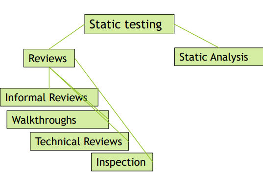

[🔙 Home](../home.md)

# Summary
## Static Testing

* **Formal Review** - A type of review that follows a defined process with a formally documented output
* **Informal Review** - A type of review that does not follow a defined process and has no formally documented output

## Keywords Explained
* **Static testing**: Testing that does not involve the execution of a test item.
* **Static analysis**: the process of evaluating a component or system without executing it, based on its form, structure, content, or documentation.
* **Review**: A type of static testing in which a work product or process is evaluated by one or more individuals to detect defects or to provide improvements.
* **Informal Review**: A type of review that does not follow a defined process and has no formally documented output.
* **Walkthrough**: A type of review in which an author leads members of the review through a work product and the members ask questions and make comments about possible issues.
* **Technical review**: A formal review by technical experts that examine the quality of a work product and identify discrepancies from specifications and standards.
* An **Inspection** is a type of formal review that uses defined team roles and measurement to identify defects in a work product and improve the review process and the software development process
* **Anomaly**: A condition that deviates from expectation
* **Static testing**: Testing that does not involve the execution of a test item
* **Dynamic testing**: Testing that involves the execution of the test item.