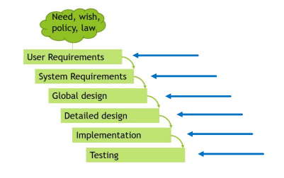
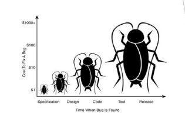

[🔙 Home](../home.md)

# Shift-Left Approach

### What is the Shift-Left Approach?
* Early Testing
* Don't wait until the code has been written

**The earlier a bug is found the cheaper it is to fix**

### Shift-Left Best Practices
* Static Testing (reviewing) of the specification
* Write test cases before the code is written
* Run the code in a test harness during implementation
* Implement CI & CD
* Complete static analysis before dynamic testing
* Non-Functional tests should also be done earlier (shift-left)

### Points of Attention
* All stakeholders need to buy-in to the idea
* Investments are needed in the earlier development phases:
  * Training 
  * Effort
  * Cost