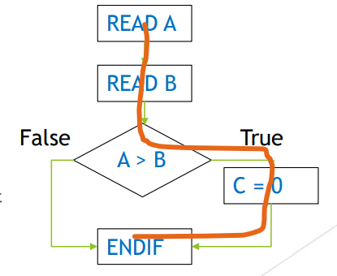
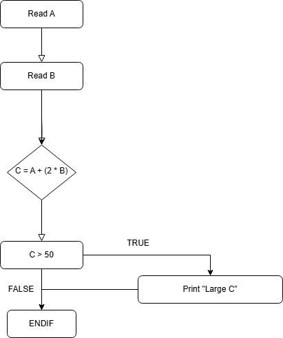

[🔙 Back to Index](../index.md)

# Statement Testing and Coverage

* Coverage items are executable statements
* Executable statements perform computations and control the output of the program
* Design test cases that exercise statement until an acceptable level of coverage

### Statement testing & coverage – Coverage

* Statement Coverage is the percentage of executable statements that have been executed by a test suite is calculated by:
  $$
  \frac{\textbf{No. of statements executed}}{\textbf{Total no. of executable statements}} \times 100\%
  $$

### Statement testing & coverage – Example

* Exercises the executable statements in the code
* Code:

````
READ A
READ B
IF A > B THEN C = 0
ENDIF
````



**Q: How many testcases are needed to achieve 100 % statement coverage?**
**A: 1**

### Statement testing & coverage – Example II




What is the statement coverage with the following tests?

1. A = 2, B = 3. C = 8 = (5/6) * 100 = 83% coverage
2. A = 0, B = 25, C = 50 = (5/6) * 100 = 83% coverage
3. A = 47, B = 1, C = 49 = (5/6) * 100 = 83% coverage

**Test for 100% coverage:** A = 30, B = 15

* 100% Statement Coverage means:
  * All executable statements in the code have been exercised
**BUT**
* Defects are not detected in all cases - Data dependent defects (division by ‘0’ for example)
* ONLY the statements are tested, not the logic (both sides of an IF statement for example)
* 100% Statement Coverage does **NOT** mean all decisions or branches are tested