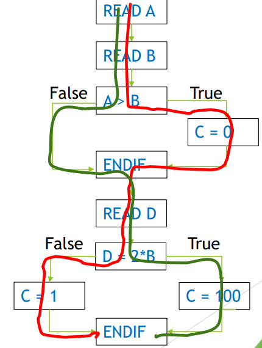

[🔙 Back to Index](../index.md)

# Branch Testing & Coverage
* A branch is transfer between two nodes in the control flow
* This transfer shows possible sequences in which statements are executed
* Each branch can be
  * Unconditional (i.e. straight line code) 
    **OR**
  * Conditional (i.e. a decision outcome, ‘IF, THEN’)
* Coverage items are branches
* Aim is to design tests to exercise branches in the code until an acceptable level of coverage is achieved
* Branch testing focuses on the percentage of branches that have been executed by a test suite 
* Difference with Decision testing is that where:
  * Decision testing focus **ONLY** on the conditional branches
  * Branch testing focuses on **BOTH** conditional and unconditional branches
* In practice Decision Testing and Branch Testing mostly give the same results
* Coverage Calculation:

$$
\frac{\textbf{No. of branches exercised by the test cases}}{\textbf{Total no. of branches}} \times 100\%
$$

### Branch Testing Coverage - Example
````
READ A
READ B
IF A > B THEN C = 0
ENDIF
READ D
IF D = 2*B THEN C = 100
ELSE C = 1
ENDIF
````


**Q: What is the decision coverage with A = 12, B = 10, D = 5?**
**A: 50 % - 2 of the 4 decision outcomes**

**Q: How many testcases are needed to achieve 100 % decision coverage?**
**A: 2 (extra could be A = 9, B = 10, D = 20)**

### The value of Branch testing
* 100 % Branch Coverage:
  * Ensures all branches in the code are exercised by tests
    * Conditional branches – typically
      * Decision outcomes (True – False from an ‘IF’ statement)
      * Outcome from a switch/case statement
      * Decision to exit or continue in a loop
  * Unconditional branches – Do NOT depend on a decision made in a statement
* Defects will not be found in ALL cases – Branch Coverage is not the same as path coverage
* 100 % Branch Coverage = 100% Decision Coverage = 100 % Statement Coverage – not vice versa