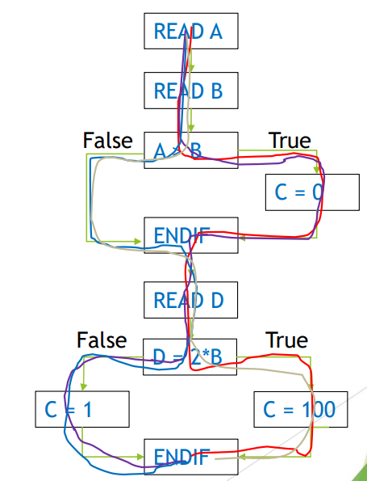

[🔙 Home](../home.md)

# Path Testing & Coverage
* Taking branch testing one step further
* Does not only execute each path, but ALSO each combination between different statements
* 100 % Path Coverage = 100 % Branch Coverage = 100% Decision Coverage = 100 % Statement Coverage – not vice versa

### Example 
* In the example from the previous section, 2 test cases will not cover it. 
* We need to cover all combinations between our True – False statements.
* **Result is 4 test cases needed**
