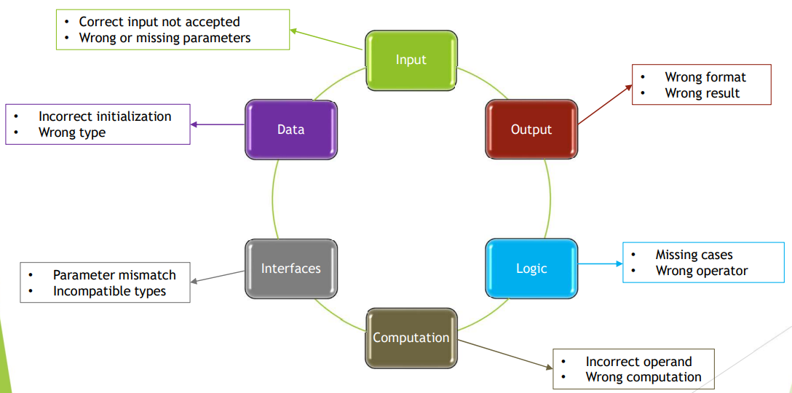
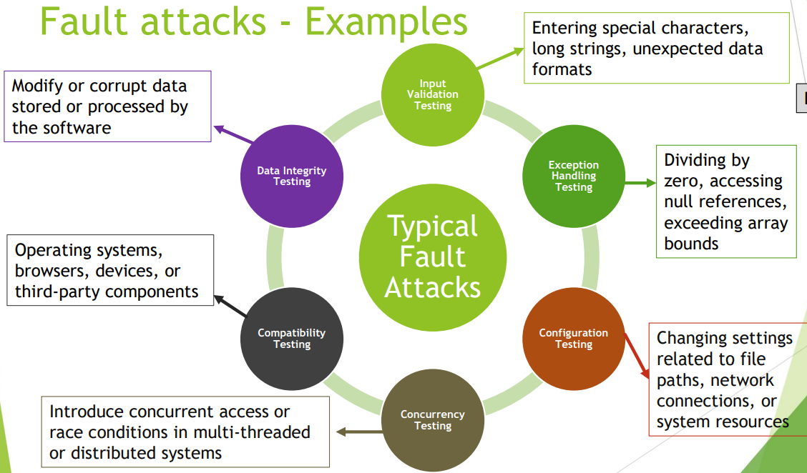

[🔙 Back to Index](../index.md)

[🔙 Back to Index](../index.md)

# Error Guessing

A technique that anticipates the occurrence of mistakes, defects and failures, based on the knowledge of the tester:
* How the application worked in the past
* What types of mistakes the developers tend to make
* The type of defects that result from these errors made by developers
* Failures that have occurred in other applications
* No rules, tester is encouraged to think of situations the software will not be able to cope with:
  * Division by zero
  * Empty files
  * Wrong kind of data or input
  * ’That should not happen’ or ‘There is no risk’ is a trigger to test that condition as assumption is the mother…

### Error Guessing – Typical Errors, Defects and Failures

### Error Guessing - Examples
* New date field:
  * Feb 29, European data format, US date format
* Division by zero
* Submitting a form without entering values
* Entering invalid values
* Replacing @ and dot(.) in email addresses (eg: matt.finn.hotmail@com)
* Last names with non-alphanumeric characters (eg: ronald.o’neil@testing.com)
* Ignoring the default maximum and minimum characters to be entered in some fields

### Fault Attacks
* Methodical and focused way of error guessing
* List possible errors, defects and failures based on experience
* These lists can be based on:
  * Experience
  * Defect and failure data
  * Knowledge on why software fails
* Design tests that will:
  * Identify associated defects associated with the errors
  * Expose the defects
          **OR**
  * Cause the failures
  

### The Process of Error Guessing
**Scenario**
Imagine you are testing a web application's login functionality. 
The application allows users to log in with their username and password to access their account dashboard.

1. **Identification of Potential Errors**
* Begin by identifying potential errors or faults that could occur in the login functionality based on your
experience and knowledge of common issues in authentication systems. 

* Some potential errors might include:
  * Invalid username/password combination
  * Empty username or password fields
  * Username or password containing special characters
  * Long username or password exceeding character limits
  * SQL injection attacks by entering special characters in the username or password fields

2. **Design Test Cases to Systematically Test Each Scenario**
* Examples:
  * Test Case 1: Attempt to login with a valid username and an incorrect password
  * Test Case 2: Attempt to login with a valid username and a valid password
  * Test Case 3: Attempt to login with an empty username and a valid password
  * Test Case 4: Attempt to login with a valid username and an empty password
  * Test Case 5: Attempt to login with a username containing special characters
  * Test Case 6: Attempt to login with a password containing special characters
  * Test Case 7: Attempt to login with a long username (exceeding character limit)
  * Test Case 8: Attempt to login with a long password (exceeding character limit)
  * Test Case 9: Attempt to login with SQL injection attempt in the username or password fields

3. **Execute Test Cases**
* Execute each test case against the login functionality of the web application 
* Record the actual results and any observed deviations from expected behaviour

4. **Analyse Results**
* Analyse the results of each test case to identify any errors or unexpected behaviour encountered during the testing process 
* Pay attention to any discrepancies between the expected and actual outcomes

5. **Report and Document Findings**
* Document the findings, including any errors or faults identified during the testing process
* Report the details of each issue, including steps to reproduce, observed behaviour, and potential impact on the application's functionality or security

6. **Retest and Verify Fixes**#
* After developers address the reported issues, retest the affected areas to ensure that the fixes have been successfully implemented and that no new errors have been introduced

**This way, testers can methodically and structurally identify and address potential errors or faults in software applications, helping to improve the overall quality, reliability, and security of the software**