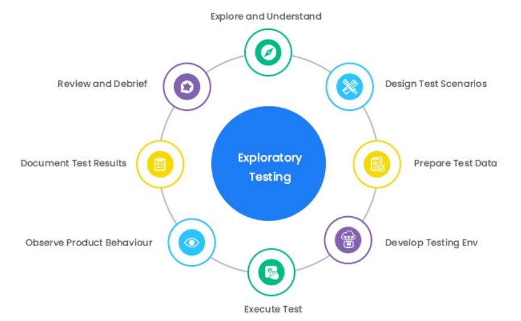

[🔙 Home](../home.md)

# Exploratory Testing
* Informal test technique
* During test execution, the tester designs, executes, logs and evaluates tests
* Used to:
  * Learn more about a component or system
  * Explore the test object with more focused tests
  * Create tests for untested areas
  * Identify and exercise coverage items
* Can be conducted using session-based testing:
  * Defined timebox
  * Tester uses a test charter containing test objectives to guide the testing
  * Test objectives may be treated as high level test conditions
  * Tester may use test session sheets to document the steps and the discoveries
  * Often concluded with a debriefing

### When and How to use Exploratory Testing
* Most useful when there are:
  * Few or inadequate specifications
  * Severe time pressure
  * As complement to more formal techniques
* Strongly associated with reactive testing strategies
* Effectiveness grows with the knowledge, skills and experience of the tester#
* Can include the use of black-box, white-box or other experience-based techniques

### Exploratory Testing - Example
* Shopping website – what do you expect?
* During this process, you might learn certain things
* As a tester, you need to:
  * Verify whether a system is working as expected
  * Check if that system is not behaving in a way which is not expected
* Success factors are:
  * Your mission should be clear
  * Create notes and report on what you are doing and how a system is behaving
  * Use your experience, knowledge and skills
  * Learn, observe and then come up with new test cases

### Myths about Exploratory Testing
* Exploratory Testing does not need planning or documentation
* Exploratory testing is the same as Ad-hoc testing
* Exploratory testing is not effective on complex systems
* Choose Exploratory Testing **OR** scripted testing

### Test Automation in Exploratory Testing
* Can **NOT** be replaced by test automation
* You **CAN NOT** automate:
  * Creativity
  * Human curiosity
  * Random inventions
* Combine Exploratory Testing and test automation
* You **CAN** automate:
  * The creation of random test data 
  * The execution of functional tests
  * Output logging and reporting

### Common pitfalls in Exploratory Testing
* Lack of Test Coverage
* Limited Time and Resources
* Documentation and Reporting
* Adapting to Agile
* Subjectivity in Testing
* Skill and Knowledge Gaps
* Defect Reproducibility
* Managing Test Data
* Collaboration and Communication