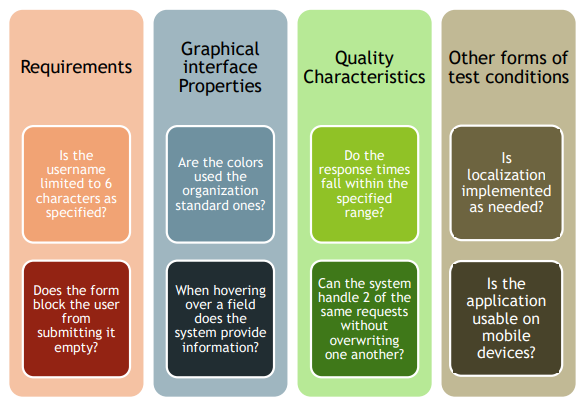

[🔙 Home](../home.md)

# Checklist-Based Testing
* Testers design, implement & execute tests to cover test conditions found in a checklist
* To create the checklist, the tester may:
  * Create a new checklist
  * Amend an existing checklist
  * Use an existing checklist without changes
* Checklists are based on
  * Experience
  * Knowledge about importance for the user
  * Understanding why & how software fails
* Checklist items are often phrased as questions
* Each item should be separately ‘checkable’
* Checklist items may refer to:

* Checklists can support different test types (Functional, Non-Functional)
* If there are no detailed test cases, checklists can provide guidelines & consistency
* If checklists are high level, variability will most likely occur, resulting in:
  * Greater coverage
  * Less repeatability
* Checklist should NOT contain:
  * Items that can be checked automatically
  * Items that should be entry or exit criteria
  * Items that are too general

### Checklist-Based testing - Examples
* A checklist to make sure none of the software modules are forgotten
* A checklist to make sure that none of the non-functional quality characteristics are forgotten:
  * Performance & stress
  * Usability
  * Portability
* A checklist to make sure all parts of a workflow have been tested:
  * Login, open record, close record, create record, save record, edit record, close record, delete record

### Checklist-Based testing - Benefits
* Structured approach to testing
* Promote consistency & repeatability
* Improve communication between team members
* Helps new testers test new products more confidently & more efficiently

### Checklist-Based testing - Risks
* Checklist become gradually less effective – developers learn from their mistakes
* Constant maintenance is needed:
  * To add newly found defects
  * To update based on defect analysis
* Checklists easily become too long
* Interpretation is subjective