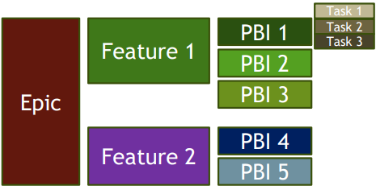

[🔙 Home](../home.md)

# Collaborative User Story Writing

### User Stories
**Definition**
‘A feature that will be valuable to either a user or purchaser of a system or software’

* Should be written in natural language, no jargon
* Should not be written too complex
* Are often broken up into smaller stories

PBI = Product Backlog Item

### User Story Writing – 3C Concept
**Card** – Simple card or other medium accurately describing the user story

**Conversation** – Explains how the software will be used and can be documented or verbal. 
Begins during release-planning and continue while the story is scheduled to be picked up.

**Confirmation** – Acceptance criteria are used to confirm whether a story is done and may concern multiple user stories. 
Tests should include positive and negative scenarios. Various participants play the role of tester (dev, specialists, testers, etc)

### User Story Writing - Issues
* Poor specifications (user stories) often result in failure
* Bad specs can result from:
  * Lack of insight of the user on what is needed
  * No global vision for the system
  * Redundant features
  * Contradictory features
  * Miscommunications
  * Misinterpretations

**How can you build a solution to a problem when the problem is not clear?**

### Collaborative User Story Writing
* Software development heavily depends on user stories
* User stories are captured and acceptance criteria defined from different perspectives:
  * Developers
  * Testers 
  * Business Representatives
* Shared vision through frequent informal reviews
* User stories should address functional and non-functional requirements
  * Acceptance criteria define when a feature is done

  As a [ROLE] I want [GOAL TO BE ACCOMPLISHED] so that I can
  [RESULTING BUSINESS VALUE FOR THE ROLE]
  Followed by the ‘Acceptance Criteria’

### User Story Creation – Tester perspective
* Identifying missing details
* Identifying non-functional requirements
* Asking open-ended questions to the business representatives about the story
* Proposing ways to test the story
* Confirming the acceptance criteria

### User Story Creation – Techniques
* Brainstorming
* Mind Mapping
* **INVEST**
  * Independent
  * Negotiable
  * Valuable
  * Estimatable
  * Small
  * Testable