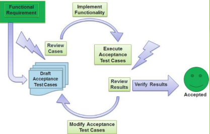
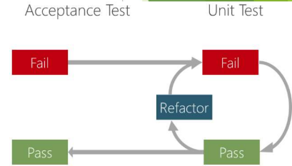

[🔙 Back to Index](../index.md)

# Use Acceptance Test-Driven Development to derive test cases
### Acceptance Test-Driven Development
* Acceptance criteria and tests are defined during the creation of the user stories
* Encourages collaboration amongst the business, developer and tester
* Every stakeholder should understand how the software component has to behave and what is needed to ensure this behaviour
* ATDD creates reusable tests for regression testing
* Tools support creation and execution of tests (often in the CI process)
* Tools can connect to data and service layers of the application (enabling execution on system or acceptance levels)
* ATDD allows quick resolution of defects and validation of feature behaviour
* Helps determine if the acceptance criteria are met for the feature

**Is the code doing what it is supposed to do?**

### Applying Acceptance Test-Driven Development 
* Test-first approach
* Tests (manual or automated) are written before coding
* Test cases are written by the team:
  * Developer
  * Tester
  * Business representative

### Acceptance Test-Driven Development - Process
1. First a specification workshop takes place
   * Workshop is a collaboration between developers, testers and the business
   * User stories are:
     * Analysed 
     * Discussed 
     * Written
   * Goal of the workshop is to fix any of the below in the user stories
     * Incompleteness
     * Ambiguities
     * Defects
     
2. Tests are created
      * By the team
          **OR**
      * By the tester
* An independent person (e.g. a business representative) will validate the tests
* The tests are based on the Acceptance Criteria
* Tests are examples that:
  * Describe the specific characteristics of the user story
  * Will help the team to implement the user story correctly
  * Start with basic examples and open questions
  * The tests can be created using black-box, white-box and experience-based test techniques

### Acceptance Test-Driven Development - Tests

1. Positive Tests
   * Confirm the correct behaviour without exception or error condition
   * Entail the sequence of activities executed if all goes as expected
2. Negative Path tests
3. Non-Functional attributes (e.g. performance, usability, etc)
* The tests should:
  * Cover all characteristics of the user story
  * NOT add to the user story (Acceptance Criteria may specify some of the issues described in the User Story)
  * Deal with unique characteristics of the user story (no two tests/examples for the same)

### Acceptance Test-Driven Development - Automation
* Test Cases can be captured in a format supported by a test automation framework
* In that way
  * The developer implements the feature described by a user story
  * The developer can automate the test cases at the same time
  * Like this, the Acceptance Tests become executable requirements