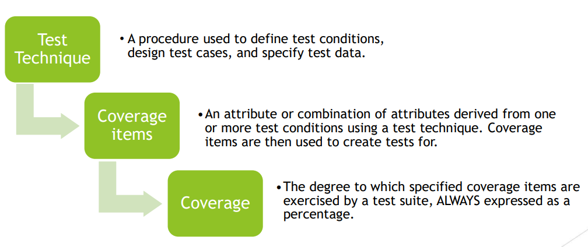
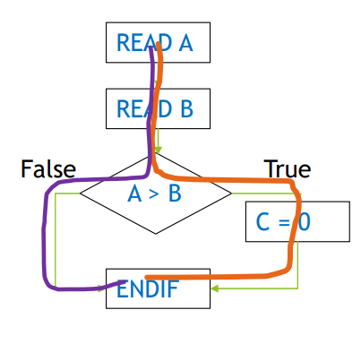

[🔙 Back to Index](../index.md)

[🔙 Back to Index](../index.md)

# Summary
### Test Analysis and Design Process

### Test Techniques – Visualised

### Black-Box Test Techniques
Several Black-Box (specification-based) test techniques have been discussed in this course:
* **Equivalence partitioning**
  * Test conditions are equivalence partitions exercised by one representative member of each partition
* **Boundary Value Analysis**
  * Test cases are designed based on boundary values
* **Decision table testing**
  * Test cases are designed to exercise the combinations of conditions and the resulting actions shown in a decision table
* **State transition testing**
  * Test cases are designed to exercise elements of a state transition model
* **Use case testing**
  * Test cases are designed to exercise use case behaviours.

### White-Box Test Techniques
Several White-Box (structure-based) test techniques have been discussed in this course:
* **Statement Testing**
  * In which test cases are designed to execute statements
* **Decision testing**
  * In which test cases are designed to execute decision outcomes
* **Branch testing**
  * In which the test conditions are branches

### Coverage in White-Box testing
* **Statement Coverage**
  * The coverage of executable statements.
* **Decision Coverage**
  * The coverage of decision outcomes.
* **Branch Coverage**
  * The coverage of branches in a control flow graph

### Experience-based Test Techniques
Several Experience-based test techniques have been discussed in this
course:
* **Error Guessing**
  * A test technique in which tests are derived on the basis of the tester's knowledge of past failures, or general knowledge of failure modes
* **Exploratory Testing**
  * An approach to testing in which the testers dynamically design and execute tests based on their knowledge, exploration of the test item and the results of previous tests
* **Checklist Based testing**
  * An experience-based test technique in which test cases are designed to exercise the items of a checklist

### Collaboration-based Test Approaches
‘An approach to testing that focuses on defect **avoidance** by collaborating among stakeholders.’

Think for example of collaborative user story writing.
* Acceptance Criteria are defined which are
  * The criteria that a component or system must satisfy in order to be accepted by a user, customer, or other authorised entity
* Acceptance criteria can be written in a lot of formats, the most common ones being:
  * Scenario-based or
  * Rule-based
* Acceptance criteria are used in **Acceptance-Test Driven Developement** for the creation of Acceptance Test Cases
* Acceptance Test Driven Development is a collaboration-based test-first approach that defines acceptance tests in the stakeholders' domain language

