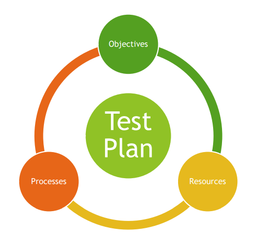
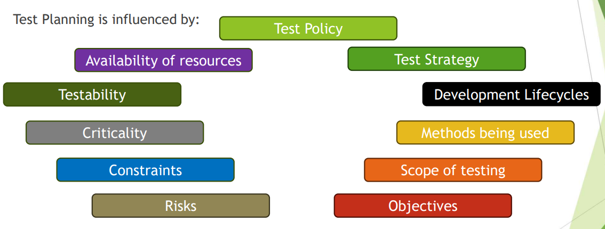
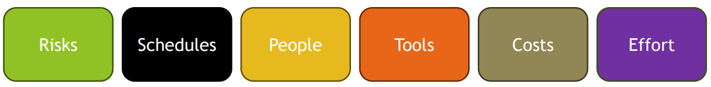

# Test Plan

## What is a Test Plan?

### The Purpose of a Test Plan
* Documents the means and the schedule for achieving the test objectives (how and when)
* Helps to ensure that the performed test activities will meet the established criteria
* Serves as a means of communication with team members and other stakeholders
* Demonstrates that testing will be in line with the test policy and test strategy (or explains where it will not be in line)

### The Test Planning Process

* Typical planning activities are:
  * Determining the scope, objectives and risks of testing
  * Defining the overall approach of testing
  * Integrating and coordinating the testing activities into the SDLC
  * Deciding on what, who, how, when
  * Scheduling test analysis, design, implementation, execution, evaluation and assigning resources
  * Selecting metrics for test monitoring and control
  * Budgeting for test activities
  * Determining the level of detail and structure for test documentation (templates, etc)

### The Benefits of Test Planning
* Test Planning
  * Guides the thinking process of the testers
  * Forces the testers to think about and confront future challenges
* The process of preparing a test plan helps in thinking through the efforts needed to achieve the objectives of the test project

### Test Planning Points of Attention
* Test planning is a continuous activity and is performed throughout the products lifecycle
* As the project progresses, more detail can be added into the test plan
* Feedback from test activities should be used to recognise changing risk and adjust the planning
* Planned may be documented in a master plan and in separate test plans per test level or test type

### Typical Contents of a Test Plan
* Context of testing:
  * Scope
  * Test objectives
  * Constraints
  * Test basis
* Assumptions and constraints
* Stakeholders
  * Roles
  * Responsibilities
  * Relevance to testing
  * Hiring and training needs
* Communication
  * Forms and frequency
  * Documentation templates
* Risk register
  * Project risks 
  * Product risks
* Test approach 
  * Test levels and test types
  * Test techniques
  * Test deliverables
  * Entry and Exit criteria
  * Independence of testing
  * Metrics to be collected 
  * Test data requirements
  * Test environment requirements
  * Deviations from strategy or policy
* Budget and Schedule

### Test Plan – ISO/IEC/IEEE 29119 Standard
* Context of testing
  * Type of Test Plan
  * Test Items
  * Test Scope
  * Assumptions and Constraints
  * Stakeholders
* Testing Lines of Communication
* Risk Register (Risks)
* Testing activities and estimates
* Staffing
  * Roles, tasks, responsibilities
  * Training needs
  * Hiring needs
* Schedule
* Test Strategy (of the project)
  * Test sub-Processes
  * Test Deliverables
  * Test Design Techniques
  * Test completion criteria
  * Metrics to be collected
  * Test Data Requirements
  * Test Environment Requirements
  * Retesting and regression testing
  * Suspension and resumption criteria
  * Deviations from the organizational test strategy