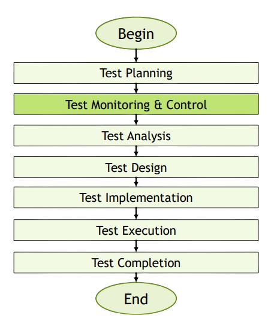
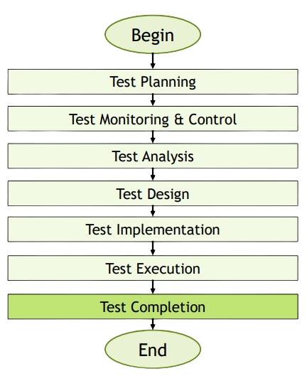

[🔙 Back to Index](../index.md)

[🔙 Back to Index](../index.md)

# Test Monitoring, Test Control & Test Completion

## Test Monitoring & Control

### Test Monitoring
* **ONGOING activity comparing progress with the test plan using metrics**
* **Concerned with gathering information** about testing, which is then used to:
  * Provide feedback and visibility about test activities
  * Assess Test Progress
  * Measure whether the test exit criteria or associated tasks are satisfied
    * Targets for:
      * Coverage of product risks
      * Requirements
      * Acceptance criteria

### Test Control
* Takes and uses the information from Test Monitoring to make testing more effective and efficient (using control directives)
  * Give guidance
  * Implement corrective actions

* Control directives can include
  * Reprioritising tests when an identified risk becomes an issue
  * Re-evaluating whether a test item meets entry or exit criteria due to rework
  * Adjusting the test schedule to address a delay in the delivery of the test
  environment
  * Adding more resources when and where needed

### Test Monitoring & Control
* Supported by the evaluation of exit criteria (the definition of done for testing), which may include:
  * Checking of test results and logs against coverage criteria (requirement coverage for example)
  * Assessing component or system quality based on the test results and logs
  * Determining if more tests are needed
* Progress, deviations and information needed to determine to stop testing is reported in **Test Progress Reports**
  * Test Progress Reports
  * Test Summary Reports

## Test Completion

* Collect data from completed test activities to consolidate experience, testware and other relevant information
* Can include the following major activities:
  * Checking whether all defect reports are closed, entering change requests or Product Backlog items for any unsolved defects
  * Creating a test summary report for the stakeholders
  * Finalising and archiving the test environment, test data, test infrastructure and other testware
  * Handing over the testware to the maintenance teams, other project teams or stakeholders
  * Analysing lessons learned from the completed test activities to determine changes needed
  * Using the information gathered to improve test process maturity

Activities occur at project milestones:
* Release
* Completion of the test project
* Cancellation of the test project
* An Agile project iteration is finished
* A test level that is completed
* A maintenance release that is completed