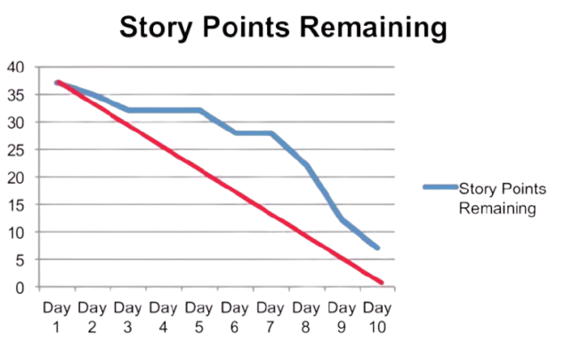
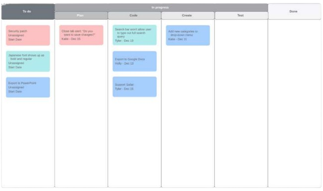
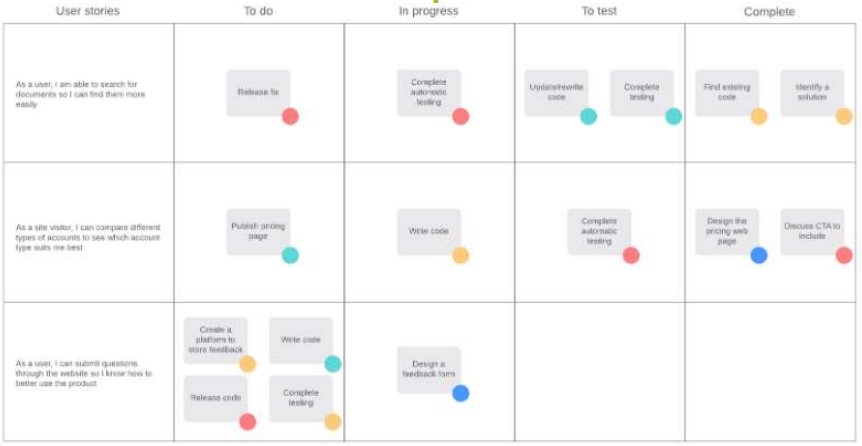
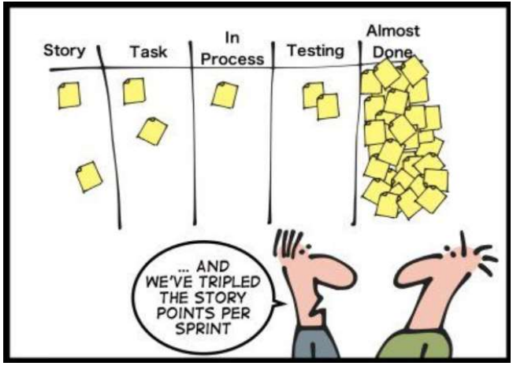

[🔙 Home](../home.md)

# Communicating the Status of Testing
There is no best way to communicate testing status to stakeholders.
* It depends on:
* Test management concerns
* Organisational test strategies
* Regulatory standards
* The team (in self-organising teams)

## Forms of Communication of the Test Status
* Verbal communication
* Dashboards
* Electronic communication channels
* Online documentation
* Formal test reports:
  * Test Progress Reports
  * Test Completion reports

Information reported & the degree of formality greatly depends on audience

## Monitoring & Communication in Agile
* Agile teams progress by having working software at the end of each iteration
  * Need to monitor the progress of all work items in the iteration & release
* Testers in Agile teams utilize various methods to record test progress & status:
  * Test automation results
  * Progression of test tasks & stories on the Agile task board
  * Burndown charts showing the team’s progress
  * These can then be communicated using media such as wiki dashboards & dashboard-style emails, as well as verbally
* Agile teams may use tools that automatically generate status reports based on test results & task progress, which in turn update wiki-style dashboards & emails. This method of communication also gathers metrics from the testing process, which can be used in process improvement.
* Communicating test status in an automated manner also frees testers’ time to focus on designing & executing more test cases

### Burndown Chart

### Task Boards – Example - KANBAN

### Task Boards – Example - SCRUM

### Task Boards

#### Task Boards – Testing Tasks
* Relate to the acceptance criteria of the user stories
* Testing task moves in the ‘Done’ column when the below pass:
  * Test automation script
  * Manual test
  * Exploratory tests

### Daily stand-up
* Daily meeting that includes all members of the Agile team
* In the meeting, the current status is communicated: 
  * What have you completed since the last meeting? 
  * What do you plan to complete by the next meeting? 
  * What is getting in your way? (impediments)