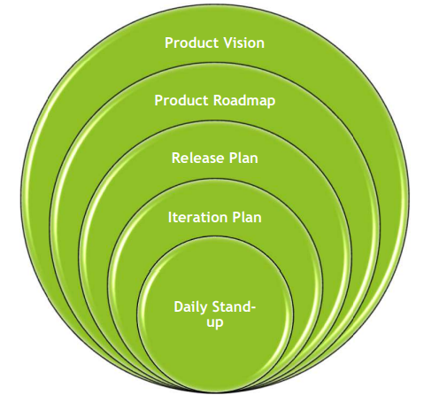
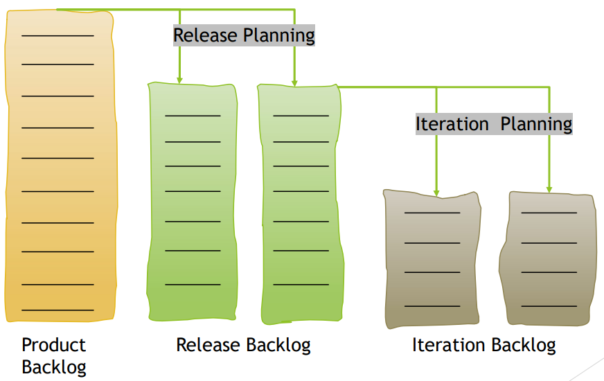
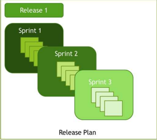

[🔙 Home](../home.md)

# Testers Contribution to Iteration and Release Planning

## Release and Iteration Planning

* Planning is an ongoing activity, in whichever lifecycle
* In Iterative lifecycles, two kinds of planning occur:
  * Release Planning
  * Iteration Planning

## Release Planning

* Looks ahead to the release of the product
* Often several months ahead of the project-start
* Defines and redefines the product backlog
* May involve refining larger user stories into smaller ones
* Provides the basis for a test approach and test planning for all iterations
* Release plans are high level

### Release Planning – The Process

* Business representatives, together with the team, establish and prioritise the user stories for the release
* Project and quality risks are identified and high-level effort estimation is performed
* Testers are involved in release planning and particularly add value in:
  * Writing testable user stories, including acceptance criteria
  * Participating in project and quality risk analysis
  * Estimating testing effort associated with the user stories
  * Determining the test approach
  * Planning the testing for the release

## Iteration Planning
* Takes place before each iteration
* Looks ahead to the end of a single iteration
* Is concerned with the iteration backlog

### Iteration Planning – The Process
* Team selects user stories from the prioritised release backlog
* Team elaborates the user stories
* Risk analysis for the user stories is performed
* Work needed for each user story is estimated
* All needs to be clear to the team or the team can refuse to accept it and take another item based on the priority
* Business representatives should answer any questions of the team about the user stories to clarify:
  * What should be implemented
  * How it should be tested
* Number of stories selected is based on the story size and the velocity of the
  team
* After the iteration content is final, the stories are broken up into tasks
* Testers are involved in iteration planning and particularly add value in:
  * Participating in the detailed risk analysis of user stories
  * Determining the testability of the user stories
  * Creating acceptance tests for the user stories
  * Breaking down user stories into tasks (particularly testing tasks)
  * Estimating testing effort for all testing tasks
  * Identifying and refining functional and non-functional aspects of the test object