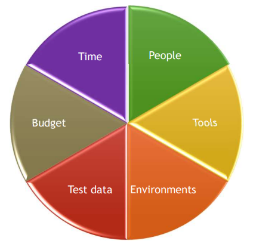

[🔙 Back to Index](../index.md)

# Entry & Exit Criteria

### Entry vs Exit Criteria
**Entry Criteria: ‘define the preconditions for starting a certain activity.’
Aka ‘Definition of Ready’**
* Entry Criteria not being defined or not met will make the activity:
  * More difficult
  * Time consuming
  * Most costly
  * Riskier

**Exit Criteria: ‘define what must be achieved to declare an activity completed’
Aka ‘Definition of Done’**

Both Entry and Exit criteria should be defined for:
* Each test level
* Each test type
* Differ based on the test objectives

### Typical Entry Criteria (Definition of Ready)
**When to safely start a test level or test phase?**
* Availability of Resources
* Availability of Testware
* Initial quality level of the test object satisfied

### Typical Exit Criteria (Definition of Done)
**When to safely stop testing, when to declare a certain test activity Done? 
Should be a balance of quality, budget, schedule and feature considerations.**
* Measures of thoroughness
  * Achieved level of coverage
  * Number of unresolved defects
  * Number of failed test cases
  * Defect density
* Completion Criteria

Even without the exit criteria satisfied, test activities can also stop due to:
* Testing budget being expended
* Scheduled time being complete
* Pressure to bring the product to market

### Benefits & Pitfalls

| Benefits                                           | Pitfalls                                    |
|----------------------------------------------------|---------------------------------------------|
| Checklist that guides discussion estimate & design | Can become the subject rather than the tool |
| Limits the cost of rework                          | The list easily grows too big               |
| Limits the risk of misunderstanding                | Not effective if not committed to           |

## Definition of Done – Test Levels – Unit Testing
* 100% decision coverage where possible
* Static analysis performed on all code
* No unresolved major defects (ranked based on priority and severity)
* No known unacceptable technical debt remaining in the design and the code
* All code, unit tests, and unit test results reviewed
* All unit tests automated
* Important characteristics are within agreed limits (e.g., performance)

## Definition of Done – Test Levels – Integration Testing
* All functional requirements tested, including both positive and negative, with the number of tests based on size, complexity, and risks
* All interfaces between units tested
* All quality risks covered according to the agreed extent of testing
* No unresolved major defects (prioritised according to risk and importance)
* All defects found are reported
* All regression tests automated, where possible, with all automated tests stored in a common repository

## Definition of Done – Test Levels – System Testing
* End-to-end tests of user stories, features, and functions
* All user personas covered
* The most important quality characteristics of the system covered (e.g., performance, robustness, reliability)
* Testing done in a production-like environment(s)
* All quality risks covered according to the agreed extent of testing
* All regression tests automated, where possible, with all automated tests stored in a common repository
* All defects found are reported and possibly fixed
* No unresolved major defects (prioritised according to risk and importance)

## Definition of Done – User Story
* The user stories selected for the iteration are complete, understood by the team, and have detailed, testable acceptance criteria
* All the elements of the user story are specified, reviewed (including the user story acceptance tests) and have been completed
* Tasks necessary to implement and test the selected user stories have been identified and estimated by the team 

## Definition of Done – Feature
* All user stories, with acceptance criteria, are defined and approved by the customer
* The design is complete, with no known technical debt
* The code is complete, with no known technical debt or unfinished refactoring
* Unit tests have been performed and have achieved the defined level of coverage
* Integration tests and system tests for the feature have been performed according to the defined coverage criteria
* No major defects remain to be corrected
* Feature documentation is complete, which may include release notes, user manuals, and on-line help functions 

## Definition of Done – Iteration
* All features for the iteration are ready and individually tested according to the feature level criteria
* Any non-critical defects that cannot be fixed within the constraints of the iteration added to the product backlog and prioritised
* Integration of all features for the iteration completed and tested
* Documentation written, reviewed, and approved 

## Definition of Done – Release
* Coverage
* Quality
* Time
* Cost