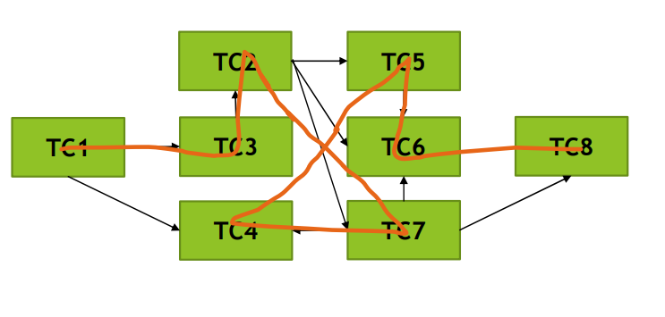

[🔙 Back to Index](../index.md)

# Test Case Prioritisation
## Test Execution Schedule
* Test cases and test procedures have been created and assembled into test suites
* Test suites are then arranged in a test execution schedule
* Test execution schedule should take into account priority, dependencies, confirmation tests, regression tests, the most efficient sequence and available resources
* Ideally the sequencing is done only on priority but this is not possible if there are dependencies:
  * On lower priority test cases
  * Across test cases
* Confirmation and regression tests should also be prioritised based on importance of rapid feedback, but dependencies may apply
* Various sequences of tests can have different levels of efficiency, so trade-offs between efficiency and prioritisation are needed

## How to Prioritise Test Cases
* Risk-based prioritisation
  * Based on the results from Risk Analysis
* Coverage-based prioritisation
  * Based on the coverage
  * Test cases achieving the highest coverage are executed first
  * There are different variants, one being ‘Additional Coverage prioritisation’
    * First execute the test case achieving the highest coverage
    * Each test after that is the one that achieves the highest additional coverage
* Requirements-based prioritisation
  * Based on the priority of the requirements
  * Test cases covering the highest priority requirements are executed first

## Test Execution Schedule – Example
* There are 8 test cases, TC1 has the highest priority, TC8 the lowest, with their dependencies (logical or technical)
* Arrow from TC1 to TC4 means that TC4 is dependent on TC1
* Please create the most efficient test execution schedule while taking the dependencies into account
