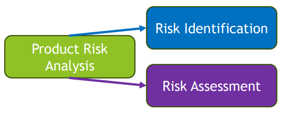
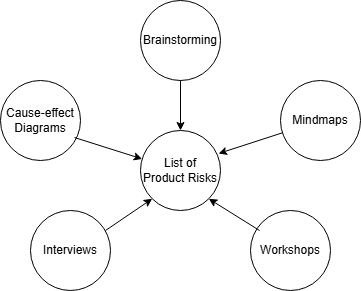
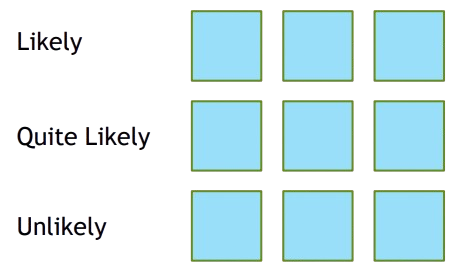
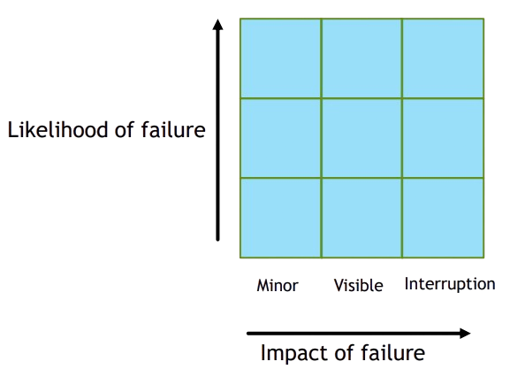
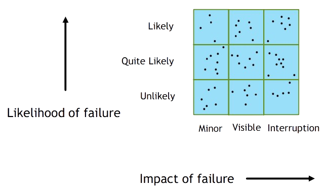
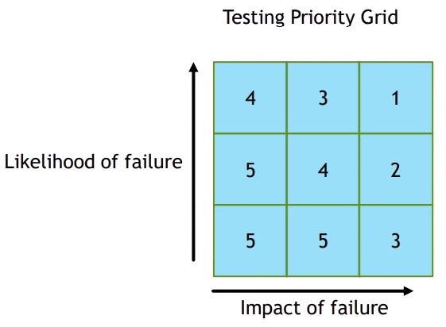
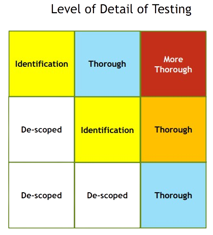

[🔙 Home](../home.md)

# Product Risk Analysis

## Risk-Based Testing & Product Quality

* Risk is used to focus effort required during testing
  * Where and when to start testing
  * Which areas need more attention
* Testing is used to:
  * Reduce the likelihood of a negative event occurring
  * Reduce the impact of a negative event occurring
  * Mitigate risk
  * Provide feedback about identified risks
  * Providing feedback on unresolved risks
* Risk-based testing:
  * Can reduce the levels of product risk in an early stage in the SDLC
  * Includes **product risk analysis**
    * Identifies product risks
    * Assesses the likelihood and impact of each risk
  * Product risk information is used to guide:
    * Test Planning
    * The specification, preparation and execution of test cases
    * Test monitoring and control
* Product Risk Analysis can influence the scope and the thoroughness of testing
* In **risk-based** testing, the results of **product risk analysis** are used to:
  * Determine the scope of testing to be carried out
  * Determine the particular test levels and propose test types to be performed
  * Determine the test techniques to be used and the coverage to be achieved
  * Estimate the test effort required for each task
  * Prioritise testing in an attempt to find critical defects as early as possible
  * Determine whether other activities besides testing should be carried out to reduce risk
* Collective knowledge and insight of the project stakeholders is used for product risk analysis
* Minimising the likelihood of a product failure, risk management provides a disciplined approach to:
  * Analyse risks
  * Determine which risks are important to deal with
  * Implement actions to mitigate those risks
  * Make contingency plans to deal with the risks should they become actual events
* Testing may
  * Identify new risks
  * Help to determine what risks should be mitigated
  * Lower uncertainty about risks

## Product Risk Analysis

* Goal – Provide awareness of product risks
  * Focus testing efforts to minimise the residual level of product risk.
* Should start early in the SDLC
* Consists of two main activities

### Risk Identification

* Generate a comprehensive list of risk
* Stakeholders use techniques to identify risks

* **Identification** of risk items for the basis of Product Risk Analysis can be:
  * Features
  * Functionalities
  * User Stories
  * Requirements
  * Use Cases
  * Test Cases
* Determining the **importance** of each risk item
  * This can be done in a lot of ways, including:
  * Project documentation.
  * Stakeholder’s knowledge about the product and existing product in the market.
  * Inputs on most used functionality.
  * Inputs from consulting a domain expert.
  * Data from the previous version of the product or similar product in the market.

### Risk Assessment

**Risk Assessment** involves:

* Categorizing identified risks (can help in assigning mitigation actions)
* Determining the risk likelihood
* Determining the risk impact
* Prioritizing the risks
* Proposing ways to handle the risks

Two approaches (or both mixed) can be used in **Risk Assessment:**

* **Quantitative approach** – Risk level is calculated by multiplying the risk likelihood and risk impact
* **Qualitative approach** – Risk level can be determined using a risk matrix

### Determining the Impact

* Determining the likelihood of risk occurrence
* Likelihood of risk occurrence can be due to:
  * Poor understanding of the feature by the product development team.
  * Improper architecture and design.
  * Insufficient time to design.
  * Incompetency of the team.
  * Inadequate resources – people, tools, and technology
* Use a 3x3 grid to execute the risk analysis
* Likelihood is on the Y axis and answers the question how likely a feature (for example) is to fail in live operation if no further testing is undertaken in this area
  * likely
  * quite likely
  * unlikely
* Executed by the **Technical team**

What is the **likelihood** of failure in live operation if no further testing is undertaken in this area?

* Determining the impact of the risk if it would occur
* Impact of the risk could be:
  * Cost impact, resulting in a loss.
    * Business impact resulting in losing business or losing market share, Law proceedings, Loss of licence
  * Quality impact, resulting in substandard or incompetent product release.
  * Bad user experience, resulting in dissatisfaction and loss of a customer.
* Impact is on the X axis and answers the question what is the impact of a failure in live operation as experienced by the customer (interruption, minor, visible or High, medium, low)
* Executed by the **Business Specialists**

What is the impact of a failure in live operation as experienced by the customer?

Create the combined likelihood – **Impact Grid**

### Focusing Testing Effort

### Impact on Testing

## Product Risk Control
* Includes all measures taken as response to the Product Risk Analysis
* Consists of:
  * Risk mitigation:
    * Implement the actions proposed in risk assessment to reduce the risk level
  * Risk monitoring aims to:
    * Ensure that the mitigation actions are effective
    * Obtain further information to improve risk assessment
    * Identify emerging risks

### Responding to Risk
Analyzed risks can be responded to with:
* Risk mitigation by testing
* Risk acceptance
* Risk transfer
* Contingency plan

### Mitigating Product Risks by Testing
* Select the testers with the right level of experience and skill for a given risk type
* Apply an appropriate level of independence of testing
* Conduct reviews and static analysis
* Apply the correct test techniques and coverage levels
* Apply the appropriate test types addressing the affected quality characteristics
* Perform dynamic testing, including regression testing

### Independence of Testing

  
  <ul>
     
    <li>Authors test their own work product</li>
    <li>Work products are tested by the author’s peers in the same team</li>
    <li>Independent test team or group within the organization but outside the team</li>
    <li>Independent testers external to the organization (on-site or off-site)</li>
  </ul>

