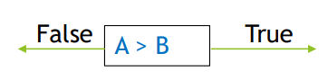
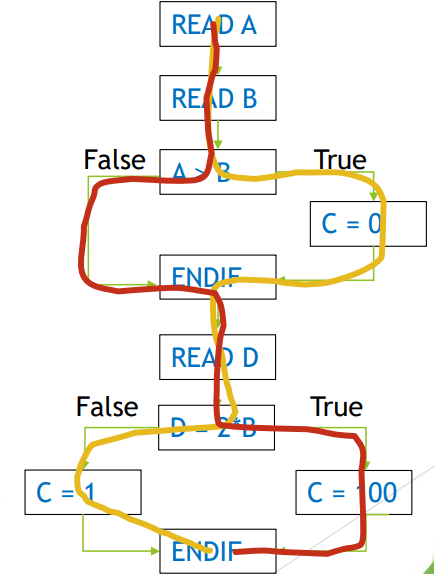

[🔙 Home](../home.md)

# Decision Testing & Coverage

* Decision is an IF, loop control (DO-WHILE, REPEAT-UNTIL) or a CASE statement with two or more possible outcomes (True – False)
* A decision is both sides of a statement

* Decision testing exercises the decisions in the code & tests the executed code based on decision outcomes
* Decision & branch coverage are **NOT** the same thing
  * Decision testing – considers **ONLY CONDITIONAL** branches in the code
  * Branch testing – considers **BOTH CONDITIONAL & UNCONDITIONAL** branches in the code
* 100% Decision Coverage implies 100% statement coverage

### Decision Testing Coverage
$$
\frac{\textbf{No. of decision outcomes executed}}{\textbf{Total no. of decision outcomes}} \times 100\%
$$


### Decision Testing Coverage - Example
````
READ A
READ B
IF A > B THEN C = 0
ENDIF
READ D
IF D = 2*B THEN C = 100
ELSE C = 1
ENDIF
````


**Q: What is the decision coverage with A = 12, B = 10, D = 5?**
**A: 50 % - 2 of the 4 decision outcomes**

**Q: How many testcases are needed to achieve 100 % decision coverage?**
**A: 2 (extra could be A = 9, B = 10, D = 20)**

### The Value of Statement & Decision coverage
* **100 % Statement Coverage:**
  * Ensures all executable statements have been tested at least once
  * Does **NOT** ensure all decision logic has been tested
  * Provides less coverage than Decision testing
  * Helps to find defects in code that was not exercised by other tests
  
* **100 % Decision Coverage:**
  * Ensures all decision outcomes (all conditional branches) & all executable statements
  * Includes all True & False outcomes, even if implied
  * Helps to find defects in code where other tests have not taken all outcomes into account
  * **100 % Decision Coverage = 100 % Statement Coverage – not vice versa**