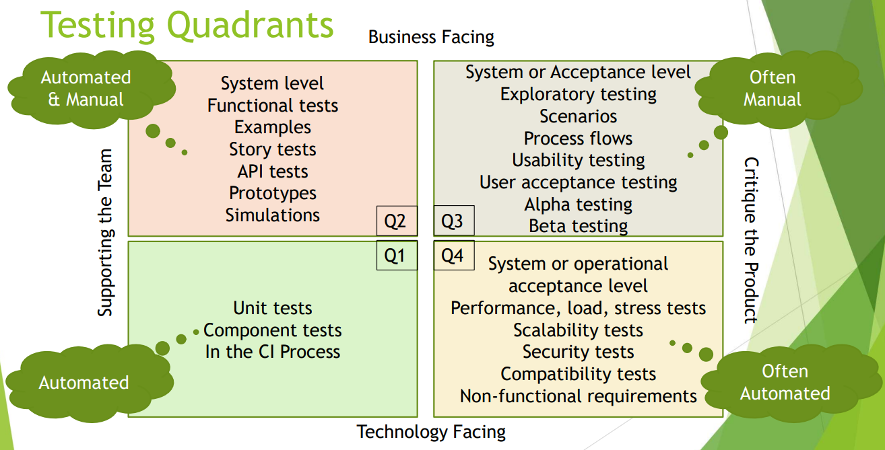

[🔙 Home](../home.md)

# Testing Quadrants
* Group the test levels with the appropriate:
  * Test Types
  * Test Levels
  * Activities
  * Test techniques
  * Work Products
* Support test management with visualisation to:
  * Ensure that the appropriate test types & test levels are included in the SDLC
  * Understand that some test types are more relevant to certain test levels than others
* Provide a way to differentiate & describe the types of tests to stakeholders
