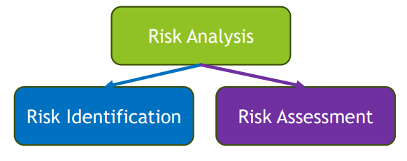
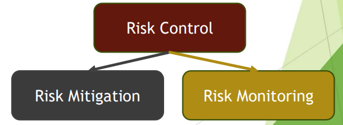
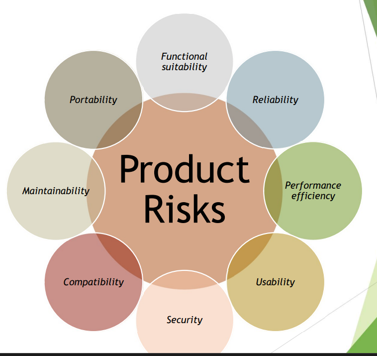

[🔙 Home](../home.md)

# Risk Management

* Allows an organization to:

  * Increase the likelihood of achieving objectives
  * Improve the quality of the products
  * Increase stakeholders trust & confidence
* Main risk management activities are:

  * Risk Analysis
  * Risk Control

### Risk Analysis

### Risk Control

## Risk-Based Testing

* Test approach
* Risk Analysis & Risk Control are used to:
  * Select test activities
  * Prioritise test activities
  * Manage test activities

## Risk Definition & Risk Attributes

### What is Risk?

**‘A potential event, hazard, threat or situation whose occurrence causes an adverse effect’**

Risk is characterised by two factors:

* Risk **likelihood**
  * ‘The probability of the risk occurrence’ (greater than zero & less than 1)
* Risk **impact**
  * ‘The consequences of this occurrence’ – the harm

### Risk Level

* A measure for the risk
  * The higher the risk level, the more important the treatment
* A calculated result from the combination of:
  * Risk Likelihood (greater than zero & smaller than one)
  * Risk Impact

### Risk Likelihood

**‘The probability of the risk occurrence’**

Factors that influence the likelihood include:

<table>
   <tr>
      <td>Complexity</td>
      <td>Weak leadership</td>
   </tr>
   <tr>
      <td>Personnel & training issues</td>
      <td>Pressure</td>
   </tr>
   <tr>
      <td>Conflict within the team</td>
      <td>Lack of earlier QA activities</td>
   </tr>
   <tr>
      <td>Contractual problems with suppliers</td>
      <td>High change rates</td>
   </tr>
   <tr>
      <td>Geographically distributed team</td>
      <td>High earlier defect rates</td>
   </tr>
   <tr>
      <td>Legacy vs new approaches</td>
      <td>Interfacing & integration issues</td>
   </tr>
   <tr>
      <td>Tools & technology</td>
      <td>Etc.</td>
   </tr>
</table>

### Risk Impact

**‘The consequences of this occurrence’**

Factors that influence the likelihood include:

<table>
   <tr>
      <td>Frequency of use of the affected feature</td>
      <td>Civil or criminal legal sanctions</td>
   </tr>
   <tr>
      <td>Criticality of the feature for a business goal</td>
      <td>Loss of license </td>
   </tr>
   <tr>
      <td>Damage to reputation</td>
      <td>Lack of reasonable workarounds</td>
   </tr>
   <tr>
      <td>Loss of business </td>
      <td>Visibility of failure leading to negative publicity</td>
   </tr>
   <tr>
      <td>Potential losses or liability </td>
      <td>Safety</td>
   </tr>
</table>

## Project Risk
### Definition
* Are related to the Management & Control of the project
* If project risks occur, this may have a negative effect on:
  * Project Schedule
  * Budget
  * Scope

**Impacts the project’s ability to achieve its objectives**

### Examples
* **Organizational issues**
  * Delays in work product deliveries, inaccurate estimates, cost-cutting, etc
* **People issues**
  * Insufficient skill, training needs, staff shortage, personnel issues, conflicts, communication issues, etc.
* **Technical issues**
  * Problems in defining the right requirements, requirements not met due to constraints, scope creep (increasing requirements), poor tool support, etc.
* **Supplier issues**
  * Delivery failure of a third party, bankruptcy of a third party, contractual issues, etc

## Product Risk

### Definition
* The possibility that the system or software might fail to satisfy the legitimate needs of the users and/or stakeholders
* Related to the product quality characteristics - A risk to the quality of the product

### Examples
* Missing or wrong functionality
* Incorrect calculations
* Runtime errors
* Poor architecture
* Inefficient algorithms
* Inadequate response time
* Poor user experience
* Security vulnerabilities

### What If?
May result in negative consequences, for example:
* User dissatisfaction
* Loss of revenue, trust, reputation
* Damage to third parties
* High maintenance costs, overload of the helpdesk
* Criminal penalties
* Physical damage, injuries or death