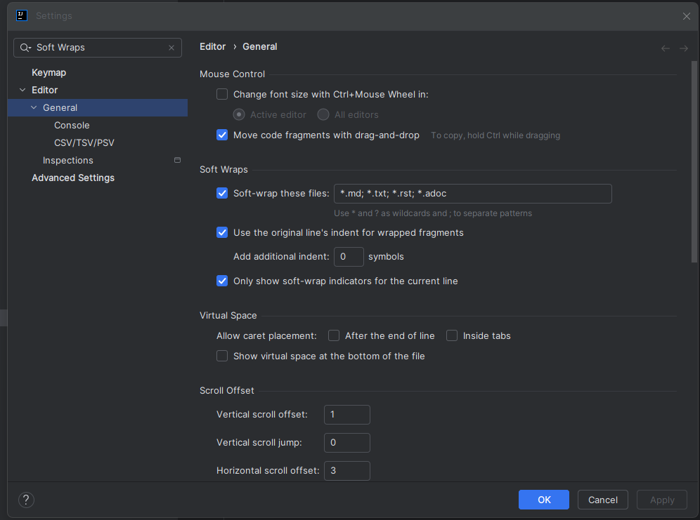

# Tips & Tricks for IntelliJ

### Enable Software Wrap for particular file types

### Shortcuts
Find an action = `CTRL + Shift + A`

Replace in files = `CTRL + Shift + R`

Find  in files = `CTRL + Shift + F`
## Extensions
### CSV Editor
[csv-editor](https://plugins.jetbrains.com/plugin/10037-csv-editor)

### Markdown Editor
[markdown-editor](https://plugins.jetbrains.com/plugin/17254-markdown-editor)

