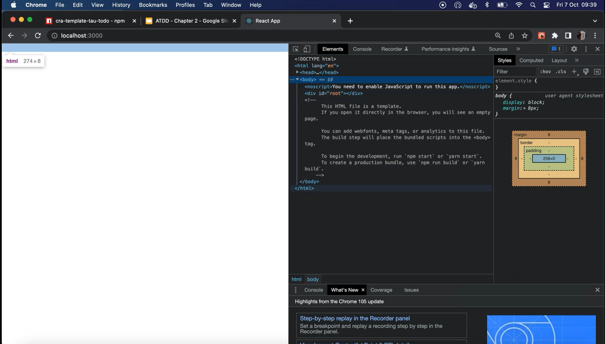
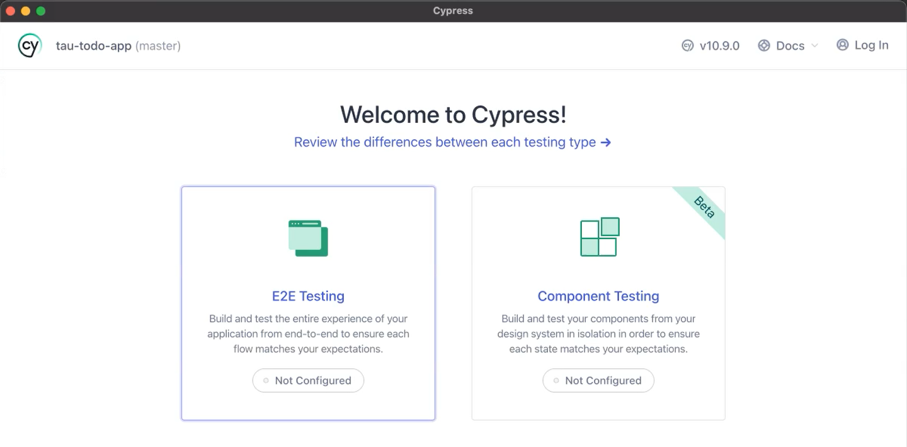
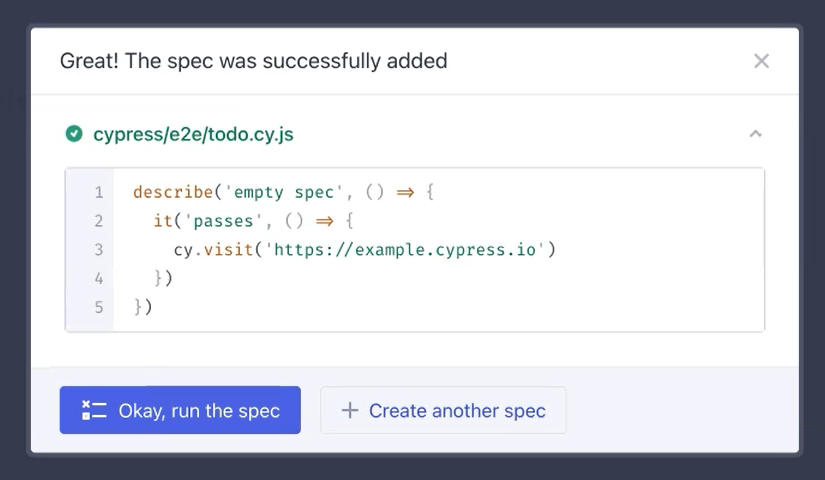
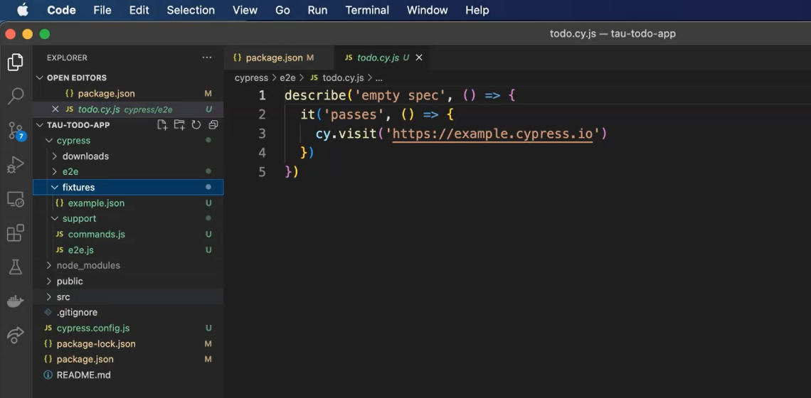

# Setting Up The Project

## Create Reach App
````shell
npx create-react-app tau-todo-app --template cra-template-tau-todo 
````
or if there issues with version deprecation you can use
````shell
npx create-react-app@latest tau-todo-app --template cra-template-tau-todo --use-npm
````

Commands 
````shell

  npm start
    Starts the development server.

  npm run build
    Bundles the app into static files for production.

  npm test
    Starts the test runner.

  npm run eject
    Removes this tool and copies build dependencies, configuration files
    and scripts into the app directory. If you do this, you can’t go back!

````

## Start the app
`npm start`
It'll be empty as we've not implemented anything.
But as you can see, it's got a body ready for us to implement some code.


## Dependencies
````json
  "dependencies": {
    "react": "^18.3.1",
    "react-dom": "^18.3.1",
    "react-scripts": "^5.0.1"
  },
````
We've got our `react`, we've got our `react-dom` and we've got our `react-scripts`.
This allows us to run our React App, and Jest is hidden in the background.
React Scripts has the Jest command, so we just run `react-scripts test`.

We need to install some additional packages in order to have React Testing Library, Cypress, and some additional packages, as well to configure everything nicely with Jest.
We're going to save them as `devDependencies` as these won't make it into the app.
We've got @`testing-library/jest-dom, @testing-library/react, @testing-library/user-event`, and we've got `cypress`.

Installation command:
`npm install --save-dev @testing-library/jest-dom@5.16.5 @testing-library/react@13.4.0 @testing-library/user-event@14.4.3 cypress@10.9.0`

### What are these packages doing?
`testing-library/react` - This allows us to render our application within our tests and render our components so we can test those components easily.
`user-event` - Allows us to have certain commands which make it much easier for us to interact with the application as if we were the user.
`jest-dom` - Adds that additional functionality so that we can interact with the Jest library.
`cypresss` - Which is going to do our acceptance testing and test from the browser interactions.

### We need to add our scripts for Cypress, so that we can run those within our tests.
cy:open which will launch the Cypress window and cy:run which will run our Cypress tests headlessly for running in CI, for example.

````json
  "scripts": {
    "start": "react-scripts start",
    "build": "react-scripts build",
    "test": "react-scripts test",
    "ci:test": "cross-env CI=true react-scripts test --coverage",
    "eject": "react-scripts eject",
    "cy:open": "cypress open",
    "cy:run": "cypress run"
  },
````
Once Cypress is installed you need to run it to create the Cypress folder
`npm run cy:open`

We're going to be using the end-to-end testing solution (E2E Testing).


Create a new empty spec, you can just call it “todo” for now.


And now we've got our Cypress folder, which has our test scaffolded for us and all our support files.


## Resources
[Git Repo for Course Code](https://github.com/lewisP707/acceptance-test-driven-development-for-front-end)
[Create React App website](https://create-react-app.dev/)
[Create React App-template](https://www.npmjs.com/package/cra-template-tau-todo)
[Create React App Docs](https://reactjs.org/docs/create-a-new-react-app.html#create-react-app)
[Cypress Docs](https://docs.cypress.io/guides/overview/why-cypress)
[Testing Library Docs](https://testing-library.com/docs/react-testing-library/intro)
[Jest Docs](https://jestjs.io/docs/getting-started)
[TAU Course: Jest JavaScript Testing Framework](https://testautomationu.applitools.com/jest-testing-tutorial/)
[TAU Course: Introduction to Cypress](https://testautomationu.applitools.com/cypress-tutorial/)