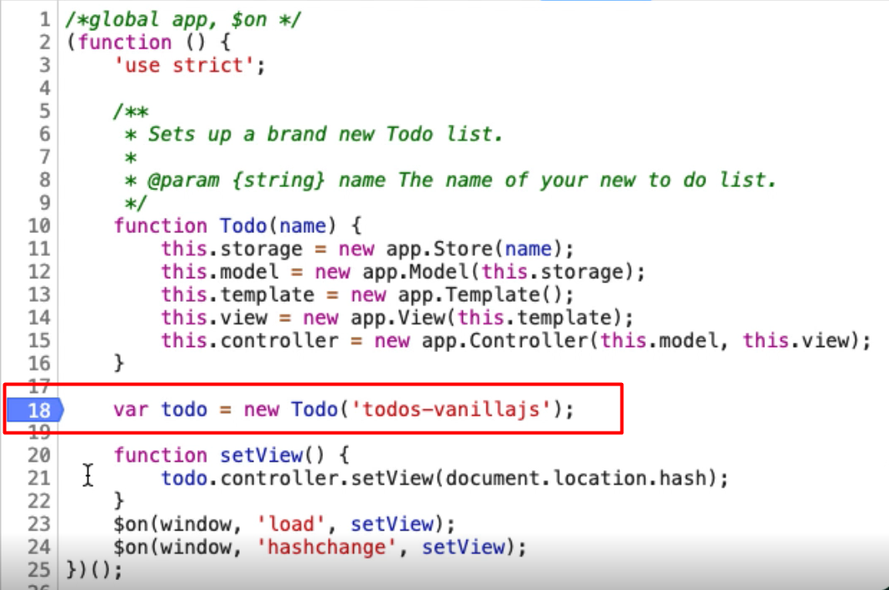
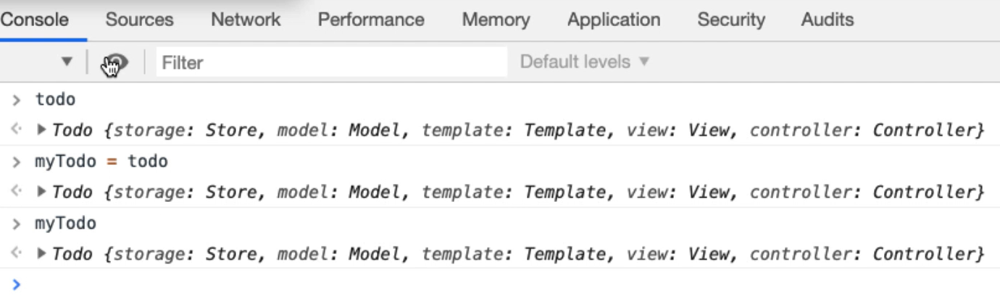
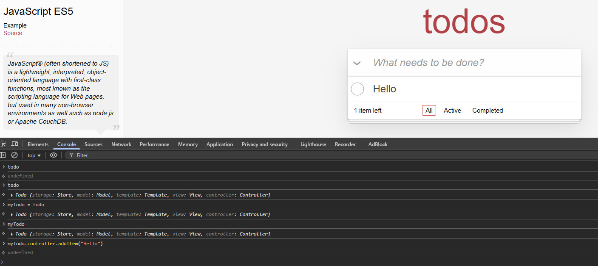
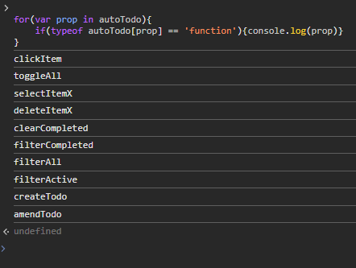

# Chapter 12 - Advanced
## 12.1 - The Innards



I'm going to create a variable, myTodo and just assign todo to it, and let's have a quick look, myTodo.



We've essentially hijacked the object in mid-loading which can make things a little bit easier, 
because all of these objects within the todo object have functionality.



**You just have to understand that there's a risk because we're no longer triggering the GUI events, we're now working at the application itself.**

So, it may be useful for setting up lots of data, but it might not be the same as the user interacting with it. But this is a technique that I use a lot when I'm hacking JavaScript games and writing bots to execute those.

And it also demonstrates that nothing in the front end is safe or immune to manipulation by a user.

People very often use this pattern because they think, "Well, no one has access to it," but clearly, we can get access to it if we are determined.

## 12.2 & 12.3 Bots

What we're going to do is we're going to learn how to write code using setInterval, so it's going to keep going, that actually interacts with the application.

`Math.floor(Math.random()*10)`
This will now give me a number between 0 and 10, not including 10.

````javascript
var autoTodo = new function() {

    this.clickItem = function(item) {
        item.click();
    }

    this.toggleAll = function() {
        document.querySelector('#toggle-all').click();
    }

    this.selectItemX = function(x) {
        document.querySelector("ul.todo-list > li:nth-child(" + x + ") input.toggle").click()
    }

    this.deleteItemX = function(x) {
        document.querySelector('ul.todo-list > li:nth-child(' + x + ') button.destroy').click()
    }

    this.clearCompleted = function() {
        document.querySelector('button.clear-completed').click();
    }

    this.filterCompleted = function() {
        location.hash = "/completed";
    }

    this.filterAll = function() {
        location.hash = "/";
    }

    this.filterActive = function() {
        location.hash = "/active";
    }

    this.createTodo = function(name) {
        document.querySelector('input.new-todo').value = name;
        document.querySelector('input.new-todo').dispatchEvent(new Event('change',{
            'bubbles': true
        }));
    }

    this.amendTodo = function(x, amendedValue) {
        document.querySelector('ul.todo-list > li:nth-child(' + x + ') > div > label').dispatchEvent(new Event('dblclick',{
            'bubbles': true
        }));
        document.querySelector('ul.todo-list > li:nth-child(' + x + ') .edit').value = amendedValue;
        document.querySelector('ul.todo-list > li:nth-child(' + x + ') .edit').dispatchEvent(new Event('blur'));
    }

}
````

Setup `autoTodo` object by running the above snippet so it'll then be available in the console.

To find out what functions `autoTodo` has we can run the code below.
```javascript 
for(var prop in autoTodo){
    if(typeof autoTodo[prop] == 'function'){console.log(prop)}
}
```
Result:


A bot to randomly execute functions on an interval
````javascript
var randomBot = setInterval(function(){

var theFunctions = [];

// push to functions array
for (var prop in rando) {
    if (typeof rando[prop] == 'function') {
        theFunctions.push(prop);
    }
}

// get a random index
randomFnIdx = Math.floor(Math.random() * theFunctions.length);

// call the function in rando with the index/key of the function name
rando[theFunctions[randomFnIdx]]();
}, 100);

//clearInterval(randomBot); to be run in the console to cancel execution
````
## Quiz
**1. With JavaScript applications which of the following is true?**
   
   if an application makes objects public then we can use those to automate the application

**2. When a JavaScript application makes its objects private:**
   
   we can use debug mode to gain access to the internal objects

**3. Making JavaScript application objects guarantees security on the client side:**

   false nothing on client side is secure

**4. Which of the following is true about JavaScript applications in the browser?**

   All JavaScript code is loaded into the browser so the user can read it

**5. Which of the following is true?**

   we can use `setInterval` to have code that runs in the background and automates the application
   we can randomly choose functions to execute
   we can have multiple `setInterval` bots running at the same time
   all of the above

**6. The `Math.floor` function:**
   returns the largest integer less than or equal to a given number

**7. The `Math.random` function:**

   returns a number between 0 and 1

**8. To add an item to an array in JavaScript we use which function?**
   push

**9. The `Date.now()` function returns:**

   current date and time represented in milliseconds

**10. Which of the following creates an empty array in JavaScript?**

    var theFunctions = [];
    
**11. The `randoBot` in the video is an example of:**
    Model Based Automation

**12. Which of the following is true for the randoBot?**
    it will run until clearInterval is used or the page is refreshed
